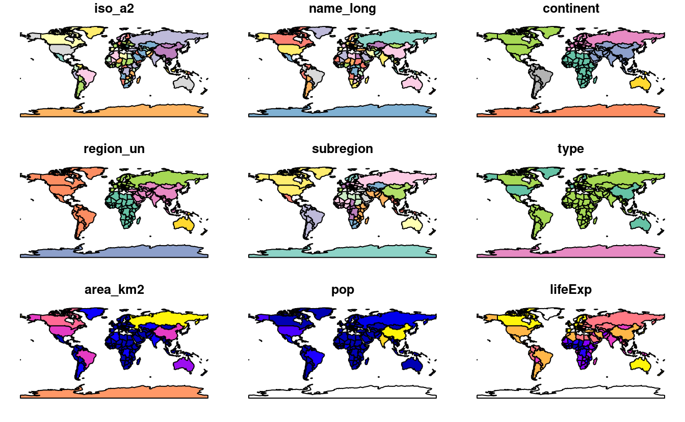
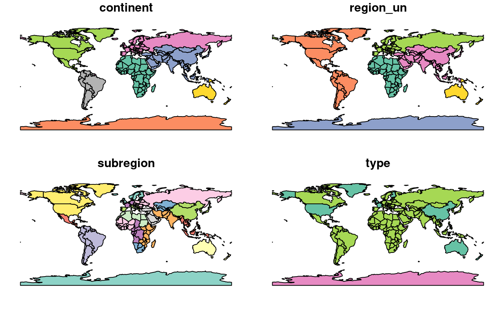
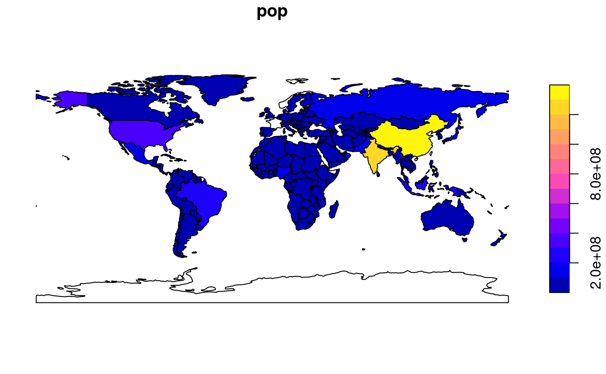
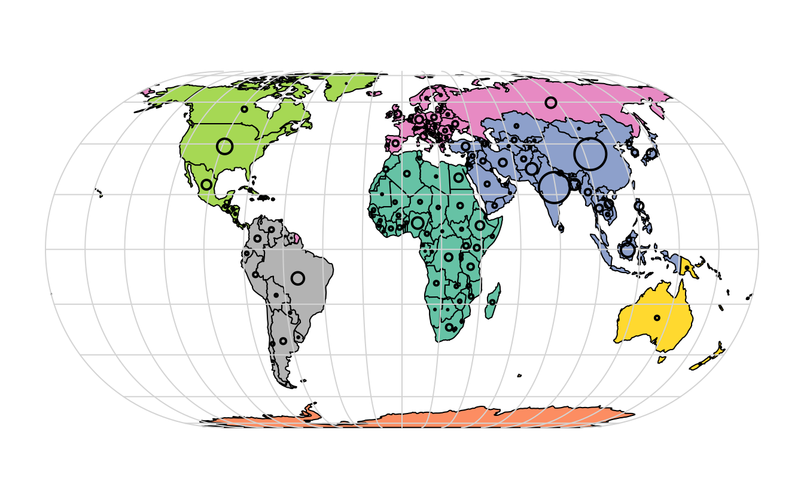
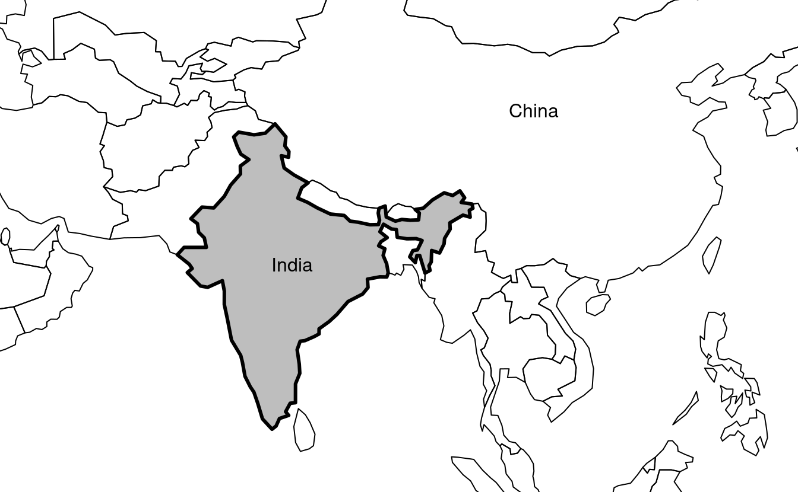
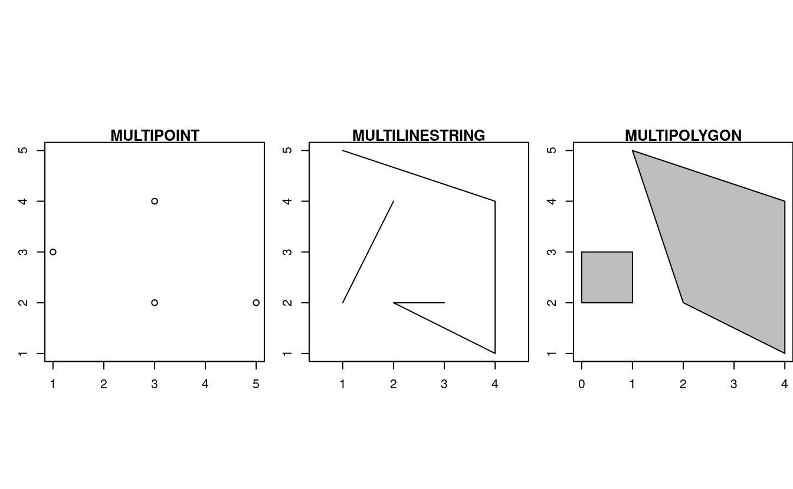
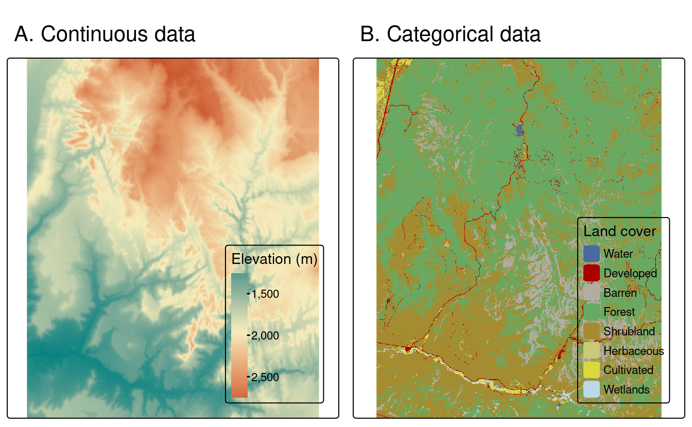

# (PART) Foundations {-}

# La donnée géographique dans R {#spatial-class}

## Prérequis {-}

C'est le premier chapitre pratique du livre. Il faut donc installer certains logiciels et les avoir un peu pratiqué. 
Nous supposons que vous avez installé une version à jour de R et que vous êtes à l'aise avec les logiciels dotés d'une interface de ligne de commande, comme l'environnement de développement intégré (IDE) RStudio.
<!--or VSCode?-->

<!-- Should we update these references to more up-to-date resources? -->
Si vous débutez avec R, nous vous recommandons de lire le chapitre 2 du livre en ligne *Efficient R Programming* de @gillespie_efficient_2016 et d'apprendre les bases du langage en vous référant à des ressources telles que @grolemund_r_2016.
Organisez votre travail (par exemple, avec des projets RStudio) et donnez aux scripts des noms judicieux tels que `02-chapter.R` pour documenter le code que vous écrivez au fur et à mesure de votre apprentissage.
\index{R!pre-requisites}

Les paquets utilisés dans ce chapitre peuvent être installés à l'aide des commandes suivantes :^[
**spDataLarge** n'est pas sur le CRAN\index{CRAN}, ce qui signifie qu'il doit être installé via *r-universe* ou avec la commande suivante : `remotes::install_github("Nowosad/spDataLarge")`.
]


```r
install.packages("sf")
install.packages("terra")
install.packages("spData")
install.packages("spDataLarge", repos = "https://nowosad.r-universe.dev")
```

\index{R!installation}
\BeginKnitrBlock{rmdnote}<div class="rmdnote">Sur Mac ou Linux, la commande précédente d´installation de **sf** peut ne pas fonctionner du premier coup.
Ces systèmes d´exploitation (OS) ont une "configuration requise" décrite dans la notice du paquets.[README](https://github.com/r-spatial/sf). 
Des instructions spécifiques pour chaque système d´exploitation sont disponibles en ligne, comme l´article *Installation de R 4.0 sur Ubuntu 20.04* sur le blog [rtask.thinkr.fr](https://rtask.thinkr.fr/installation-of-r-4-0-on-ubuntu-20-04-lts-and-tips-for-spatial-packages/).</div>\EndKnitrBlock{rmdnote}

Tous les paquets nécessaires pour reproduire le contenu du livre peuvent être installés via la commande suivante : `remotes::install_github("geocompr/geocompkg")`.
Les paquets nécessaires peuvent être "chargés" (techniquement, ils sont attachés) avec la fonction `library()` :


```r
library(sf)          # classes et fonctions pour les données vectorielles
#> Linking to GEOS 3.8.0, GDAL 3.0.4, PROJ 6.3.1; sf_use_s2() is TRUE
```

Conformemant à la section \@ref(intro-sf), la sortie de `library(sf)` mentionne les versions des bibliothèques géographiques clés, comme GEOS, utilisées par ce paquet.


```r
library(terra)      # classes et fonctions pour les données rasters
```

Les autres paquets installés contiennent des données qui seront utilisées dans le livre:


```r
library(spData)        # chargement de données geographiques
library(spDataLarge)   # chargement de données geographiques plus volumineuses
```

## Introduction {#intro-spatial-class}

Ce chapitre fournit de brèves explications sur les modèles fondamentaux des données géographiques : vecteur et raster.
Nous présenterons la théorie qui sous-tend chaque modèle de données et les disciplines dans lesquelles ils prédominent, avant de démontrer leur mise en œuvre dans R.

Le *modèle de données vectoriel* représente le monde à l'aide de points, de lignes et de polygones.
Ceux-ci ont des frontières discrètes et bien définies, ce qui signifie que les ensembles de données vectorielles ont généralement un haut niveau de précision (mais pas nécessairement d'exactitude, comme nous le verrons dans la section \@ref(unités)).
Le *modèle de données raster* divise la surface en pixel de taille constante.
Les données rasters sont la base des images d'arrière-plan utilisées dans les cartes Web et constituent une source essentielle de données géographiques depuis les débuts de la photographie aérienne et des dispositifs de télédétection par satellite.
Les rasters agrègent spatialement des informations à une résolution donnée. Ils maintiennent aisni une consistance temporelle sur de grandes superficies (de nombreux jeux de données rasters sont disponibles à l'echelle planetaire).

Que faut-il utiliser ?
La réponse dépend probablement de votre domaine d'application :

- Les données vectorielles ont tendance à dominer les sciences sociales parce que les constructions humains ont tendance à avoir des frontières discrètes.
- Les données rasters dominent de nombreuses sciences de l'environnement en raison de la dépendance aux données de télédétection.

Il y a beaucoup de chevauchement dans certains domaines et les ensembles de données rasters et vectorielles peuvent être utilisés conjointement :
les écologistes et les démographes, par exemple, utilisent couramment les deux.
En outre, il est possible de le convertir (voir la section \@ref(raster-vector)).
Que votre travail mobilise plus un type de jeux de données, vectorielles ou rasters, il reste utile de comprendre leurs modèles de données sous-jacents pour bien les utiliser, comme nous le verrons dans les chapitres suivants.
Ce livre utilise les paquets **sf** et **terra** pour travailler, respectivement, avec des données vectorielles et des jeux de données raster.

## Données vectorielles 

\BeginKnitrBlock{rmdnote}<div class="rmdnote">Attention lorsque vous utilisez le mot 'vecteur' car il peut avoir deux significations dans ce livre :
les données vectorielles géographiques et la classe `vector` (notez la police `monospace`) dans R.
Le premier est un modèle de données, le second est une classe informatique de R tout comme le sont `data.frame` et `matrix`.
Il existe néanmoins un lien entre les deux : les coordonnées spatiales qui sont au cœur du modèle de données vectorielles géographiques peuvent être représentées en R à l´aide d´objets `vector`.</div>\EndKnitrBlock{rmdnote}

Le modèle de données géographiques vectorielles est basé sur des points situés dans un système de coordonnées  et de référence (SCR).
Les points peuvent représenter des caractéristiques propres (par exemple, l'emplacement d'un arrêt de bus) ou être reliés entre eux pour former des géométries plus complexes telles que des lignes et des polygones.
La plupart des géométries construites avec des points ne sont qu'en deux dimensions (les CRS tridimensionnels contiennent une valeur supplémentaire $z$, représentant généralement la hauteur au-dessus du niveau de la mer).

Dans ce système, Londres, par exemple, peut être représentée par les coordonnées `c(-0,1, 51,5)`.
Cela signifie que sa position est  -0,1 degré est et 51,5 degrés nord par rapport au point d'origine.
Ce dernier se situe à 0 degré de longitude (le méridien d'origine) et à 0 degré de latitude (l'équateur) dans un SCR géographique ('long/lat') (Figure \@ref(fig:vectorplots), panneau de gauche).
Cette même localisation pourrait également être approximé dans un SCR projeté avec des valeurs "Est/Nord" de `c(530000, 180000)` dans le [*British National Grid*] (https://en.wikipedia.org/wiki/Ordnance_Survey_National_Grid), ce qui signifie que Londres est située à 530 km *Est* et 180 km *Nord* de l'origine du SCR.
Ceci peut être vérifié visuellement : un peu plus de 5 "boîtes" --- des zones carrées délimitées par les lignes de grille grises de 100 km de large --- séparent le point représentant Londres de l'origine (Figure \@ref(fig:vectorplots), panneau de droite).

L'emplacement de l'origine de la grille Nationale, dans la mer au-delà de la péninsule du sud-ouest de l’Angleterre, garantit que la plupart des lieux du Royaume-Uni auront des valeurs positives en abscisse et ordonnée.^[ 
L'origine à laquelle nous faisons référence, représentée en bleu sur la figure \@ref(fig:vectorplots), est en fait la "fausse" origine.
L'origine " réelle ", c'est-à-dire l'endroit où les distorsions sont minimales, est située à 2° W et 49° N. 
Cette origine a été choisie par l'*Ordnance Survey of the United States* afin de se situer approximativement au centre de la masse continentale britannique dans le sens longitudinal.
]
Les SCR sont plus complexes, et seront abordées plus en détail dans les sections \@ref(crs-intro) et \@ref(reproj-geo-data). Cependant pour les besoins de cette section, il suffit de savoir que les coordonnées consistent en deux nombres représentant la distance par rapport à un point d'origine, généralement dans les dimensions $x$ puis $y$.


<div class="figure" style="text-align: center">

<p class="caption">(\#fig:vectorplots)Représentation de données vectorielles (ponctuelles) dans laquelle l'emplacement de Londres (X rouge) est représenté par rapport à une origine (le cercle bleu). La carte de gauche représente un SCR géographique dont l'origine se situe à 0° de longitude et de latitude. Le graphique de droite représente un SCR projeté dont l'origine est située dans la mer à l'ouest de la péninsule du sud-ouest anglaise.</p>
</div>

**sf** fournis des classes informatiques pour les données géographiques vectorielles ainsi qu'une interface en ligne de commande pour des bibliothèques de géocomputation de bas niveau : 

- GDAL\index{GDAL}, pour la lecture, l'écriture et la manipulation d'une large gamme de formats de données géographiques, couverte dans le chapitre \@ref(read-write)
- PROJ, une puissante bibliothèque pour les transformations de systèmes de coordonnées, qui sous-tend le chapitre \@ref(reproj-geo-data)
- GEOS\index{GEOS}, un moteur de géométrie éuclidienne pour les opérations telles que le calcul des tampons et des centroïdes sur les données avec un SCR projeté, couvert dans le chapitre \@ref(geometric-operations)
- [S2](https://s2geometry.io/), un moteur de géométrie sphérique écrit en C++ développé par Google, via le paquet [**s2**](https://r-spatial.github.io/s2/), couvert dans la section \@ref(s2) ci-dessous et dans le chapitre \@ref(reproj-geo-data).
<!-- - [liblwgeom](https://github.com/postgis/postgis/tree/master/liblwgeom), a geometry engine used by PostGIS, via the [**lwgeom**](https://r-spatial.github.io/lwgeom/) package -->

Les informations concernant ces interfaces sont indiquées par *sf* lorsque que celui ci est chargé pour la première fois: via le message `Linking to GEOS 3.8.0, GDAL 3.0.4, PROJ 6.3.1; sf_use_s2() is TRUE` apparue en dessous de ;a commande `library(sf)` au tout début de ce chapitre. Ce message indique les versions des bibliothèques liées GEOS, GDAL et PROJ (chiffre pouvant varier au cours du temps et entre les ordinateurs) et si oui ou non l'interface avec S2 est activée. 
Aujourd'hui, nous considérons que c'est un acquis, cependant, c'est grâce à l’intégration étroite entre les différentes bibliothèques géographiques qu'un travail de géocomputation reproductible est possible.

Une fonctionnalité intéressante de **sf** est que vous pouvez changer le moteur de géométrie par défaut utilisé sur les données non projetées : "Désactiver" S2 peut être fait avec la commande `sf::sf_use_s2("FALSE")`, ce qui signifie que le moteur de géométrie euclidienne GEOS sera utilisé par défaut pour toutes les opérations de géométrie, y compris celles sur les données non projetées.
Comme nous le verrons dans la Section \@ref(s2), la géométrie euclidienne, ou plane, est basée sur un espace à 2 dimensions.
Les moteurs de géométrie euclidienne tels que GEOS supposent des coordonnées "plates" (projetées), tandis que les moteurs de géométrie sphérique tels que S2 supposent des coordonnées non projetées (lon/lat).

Cette section présente les classes **sf** en préparation des chapitres suivants (les chapitres \@ref(geometric-operations) et \@ref(read-write) couvrent respectivement l'interface GEOS et GDAL)

### Une introduction aux *Simple Features*

*Simple features* est un [Format ouvert](http://portal.opengeospatial.org/files/?artifact_id=25355) développé et approuvé par l'Open Geospatial Consortium (OGC), une organisation à but non lucratif dont nous reviendrons sur les activités dans un chapitre ultérieur (section \@ref(file-formats)).
\index{simple features |cf. {sf}}
*Simple Features* est un modèle de données hiérarchique qui représente un large éventail de types géométriques.
Sur les 18 types géométriques pris en charge par la spécification, seuls 7 sont utilisés dans la grande majorité des recherches géographiques (voir Figure \@ref(fig:sf-ogc)) ;
ces types géométriques de base sont entièrement pris en charge par le paquet R **sf** [@pebesma_simple_2018].^[
Le format OGC complet comprend des types de géométrie plutôt exotiques, notamment les types de géométrie "surface" et "courbe", qui ont actuellement une application limitée dans le monde réel.
Les 18 types peuvent être manipulés avec le package **sf**, bien que (à partir de l'été 2018) leur représentation ne fonctionne plus que pour les "7 principaux".
]  

<div class="figure" style="text-align: center">

<p class="caption">(\#fig:sf-ogc)Les types de *Simple features* pleinement disponibles dans sf.</p>
</div>

**sf** peut représenter tous les types de géométrie vectorielle courants (les classes de données raster ne sont pas prises en charge par **sf**) : points, lignes, polygones et leurs versions "multi" respectives (qui regroupent les caractéristiques du même type en une seule caractéristique).
\index{sf}
\index{sf (package)|voir {sf}}
**sf** prend également en charge les collections de géométrie, qui peuvent contenir plusieurs types de géométrie dans un seul objet.
**sf** fournit la même fonctionnalité (et plus) que celle fournie précédemment dans trois packages --- **sp** pour les classes de données [@R-sp], **rgdal** pour la lecture/écriture de données via une interface avec GDAL et PROJ [@R-rgdal] et **rgeos** pour les opérations spatiales via une interface avec GEOS [@R-rgeos].


Pour réitérer le message du chapitre 1, les paquets géographiques de Ront une longue histoire d'interfaçage avec des bibliothèques de plus bas inférieur, et **sf** poursuit cette tradition avec une interface unifiée vers les versions récentes de GEOS pour les opérations de géométrie, la bibliothèque GDAL pour la lecture et l'écriture de fichiers de données géographiques, et la bibliothèque PROJ pour la représentation et la transformation des systèmes de référence de coordonnées projetées.
Grâce à **s2**,
<!-- **s2** functions have replaced **lwgeom** ones (Bivand 2021). -->
<!-- and **lwgeom**, **sf** also has an inter to PostGIS's [`liblwgeom`](https://github.com/postgis/postgis/tree/master/liblwgeom) library  -->
"une interface avec la bibliothèque de géométrie sphérique de Google [`s2`] (https://s2geometry.io/), **sf** a également accès à des "mesures et opérations sur des géométries non planes" rapides et précises" [@bivand_progress_2021].
Depuis la version 1.0.0 de **sf**, lancée en [juin 2021](https://cran.r-project.org/src/contrib/Archive/sf/), la fonctionnalité **s2** est maintenant utilisée par [défaut](https://r-spatial.org/r/2020/06/17/s2.html) sur les géométries avec des systèmes de coordonnées géographiques (longitude/latitude), une caractéristique unique de **sf** qui diffère des bibliothèques spatiales ne prenant en charge que GEOS pour les opérations de géométrie, comme le paquet Python [GeoPandas](geopandas/geopandas/issues/2098).
Nous aborderons **s2** dans les chapitres suivants.
<!-- Todo: link to them, e.g. (RL 2021-11) -->
<!-- See sections \@ref(s2) and \@ref(buffers) for further details. -->

La capacité de **sf** à intégrer plusieurs bibliothèques puissantes pour la géoinformatique dans un seul cadre est une réalisation remarquable qui réduit le "coût d'entrée" dans le monde de l'analyse reproductible des données géographiques avec des bibliothèques performantes.
La fonctionnalité de **sf** est bien documentée sur son site web à l'adresse [r-spatial.github.io/sf/] (https://r-spatial.github.io/sf/index.html) qui contient 7 vignettes.
Celles-ci peuvent être visualisées hors ligne comme suit :


```r
vignette(package = "sf") # Qu'elles sont les vignettes disponibles
vignette("sf1")          # Une introduction à la bibliothèque 
```


Comme l'explique la première vignette, les objets de type *simples features* dans R sont stockés dans un tableau de données, les données géographiques occupant une colonne spéciale, généralement nommée "geom" ou "geometry".
Nous allons utiliser le jeu de données `world` fourni par la bibliothèque **spData**, chargé au début de ce chapitre, pour montrer ce que sont les objets `sf` et comment ils fonctionnent.
`world` est un "tableau de données `sf`" contenant des colonnes spatiales et attributaires, dont les noms sont retournés par la fonction `names()` (la dernière colonne dans cet exemple contient les informations géographiques) :


```r
class(world)
#> [1] "sf"         "tbl_df"     "tbl"        "data.frame"
names(world)
#>  [1] "iso_a2"    "name_long" "continent" "region_un" "subregion" "type"     
#>  [7] "area_km2"  "pop"       "lifeExp"   "gdpPercap" "geom"
```

Le contenu de cette colonne `geom` donne aux objets `sf` leurs proprités spatialles : `world$geom` est une '[colonne de type liste](https://adv-r.hadley.nz/vectors-chap.html#list-columns)' qui contient toutes les coordonnées des polygones du pays.
\index{list column}
Les objets `sf` peuvent être tracés rapidement avec la fonction de base de R, `plot()` ;
la commande suivante crée la figure \@ref(fig:world-all).


```r
plot(world)
```

<div class="figure" style="text-align: center">

<p class="caption">(\#fig:world-all)Cartes du monde utilisant le paquet sf, avec une dimension pour chaque attribut.</p>
</div>

Notez qu'au lieu de créer une seule carte par défaut pour les objets géographiques, comme le font la plupart des programmes SIG,  la fonction `plot()` sur des objets `sf` retourne une carte pour chaque variable du jeux de données.
Ce comportement peut être utile pour explorer la distribution spatiale de différentes variables et est abordé plus en détail dans la section \@ref(basic-map).

Plus largement, traiter les objets géographiques comme des tableaux de données classiques avec des propriétés spatiales présente de nombreux avantages, surtout si vous avez déjà l'habitude de travailler avec des tableaux de données.
Par exemple, la fonction très pratique `summary()`, fournit un aperçu utile des variables de l'objet `world`.


```r
summary(world["lifeExp"])
#>     lifeExp                geom    
#>  Min.   :50.6   MULTIPOLYGON :177  
#>  1st Qu.:65.0   epsg:4326    :  0  
#>  Median :72.9   +proj=long...:  0  
#>  Mean   :70.9                      
#>  3rd Qu.:76.8                      
#>  Max.   :83.6                      
#>  NA's   :10
```

Bien que nous n'ayons sélectionné qu'une seule variable pour la commande `summary()`, elle produit également un rapport sur la géométrie.
Cela démontre le comportement "permanent" des colonnes de type géométrie des objets **sf**, cela signifie que la géométrie est conservée à moins que l'utilisateur ne la supprime délibérément, comme nous le verrons dans la Section \@ref(vector-attribute-manipulation).
Le résultat fournit un résumé rapide des données spatiales et non spatiales contenues dans `world` : l'espérance de vie moyenne est de 71 ans (allant de moins de 51 ans à plus de 83 ans avec une médiane de 73 ans) pour tous les pays.

\BeginKnitrBlock{rmdnote}<div class="rmdnote">Le mot `MULTIPOLYGON` dans le résumé ci-dessus fait référence au type de géométrie des éléments (pays) dans l´objet `world`.
Cette représentation est nécessaire pour les pays comportant des îles comme l´Indonésie et la Grèce.
Les autres types de géométrie sont décrits dans la section \@ref(geometry).</div>\EndKnitrBlock{rmdnote}

Il est important d'examiner de plus près le comportement de base et le contenu de cet objet *simple feature*, que l'on peut utilement considérer comme un "**s**patial data **f**rames".

Les objets `sf` sont faciles à extraire: le code ci-dessous extrait ses deux premières lignes et trois premières colonnes de `world`.
La sortie montre deux différences majeures par rapport à un `data.frame` standard : l'inclusion de données géographiques supplémentaires (`geometry type`, `dimension`, `bbox` et les informatio`ns SCR - `epsg (SRID)`, `proj4string`) ainsi que la présence d'une colonne `geometry`, ici nommée `geom` :


```r
world_mini = world[1:2, 1:3]
world_mini
#> Simple feature collection with 2 features and 3 fields
#> Geometry type: MULTIPOLYGON
#> Dimension:     XY
#> Bounding box:  xmin: -180 ymin: -18.3 xmax: 180 ymax: -0.95
#> Geodetic CRS:  WGS 84
#> # A tibble: 2 × 4
#>   iso_a2 name_long continent                                                geom
#>   <chr>  <chr>     <chr>                                      <MULTIPOLYGON [°]>
#> 1 FJ     Fiji      Oceania   (((-180 -16.6, -180 -16.5, -180 -16, -180 -16.1, -…
#> 2 TZ     Tanzania  Africa    (((33.9 -0.95, 31.9 -1.03, 30.8 -1.01, 30.4 -1.13,…
```

Tout cela peut sembler assez complexe, surtout pour un système de classes qui est censé être simple.
Cependant, il y a de bonnes raisons d'organiser les choses de cette façon et d'utiliser **sf**.

Avant de décrire chaque type de géométrie géré par le paquet **sf**, il est utile de prendre un peu de recul pour comprendre les éléments constitutifs des objets de type `sf`. 
La section \@ref(sf) montre comment les objets *simples features* sont des tableau de données, avec des colonnes géométriques spéciales.
Ces colonnes spatiales sont souvent appelées `geom` ou `geometry` : ainsi `world$geom` fait référence à l'élément spatial de l'objet `world` décrit plus haut.
Ces colonnes géométriques sont des "colonnes de type liste" de la classe `sfc` (voir la section \@ref(sfc)).
Puis, à leur tour, les objets `sfc` sont composés d'un ou plusieurs objets de la classe `sfg` : des géométries *simples features* que nous décriverons dans la section \@ref(sfg).
\index{sf!sfc}
\index{simple feature columns|see {sf!sfc}}

Pour comprendre comment fonctionnent les composantes spatiales des *simples features*, il est essentiel de comprendre comment leurs géométries sont prises en comptes.
C'est pourquoi nous couvrirons chacun des types de géométrie *simples features* actuellement pris en charge dans la section \@ref(geometry) puis nous continuerons en montrant comment ils peuvent être représentés dans R en utilisant avec des objets `sf`, formés à la base d'objets `sfg` et `sfc`.


```bloc2
Le morceau de code précédent utilise `=` pour créer un nouvel objet appelé `world_mini` dans la commande `world_mini = world[1:2, 1:3]`.
C´est ce qu´on appelle une affectation.
Une commande équivalente pour obtenir le même résultat est `world_mini <- world[1:2, 1:3]`.
Bien que l´affectation par flèche soit plus couramment utilisée, nous utilisons l´affectation par égalité parce qu´elle est légèrement plus rapide à taper et plus facile à enseigner en raison de sa compatibilité avec les langages couramment utilisés tels que Python et JavaScript.
L´utilisation de l´un ou l´autre est une question de préférence, tant que vous êtes cohérent (des paquets tels que **styler** peuvent être utilisés pour changer de style).
```

### Pourquoi *simple features*?

Les *simple features* sont un modèle de données largement utilisé qui sous-tend les structures de données de nombreuses applications SIG, notamment QGIS\index{QGIS} et PostGIS\index{PostGIS}.
L'un des principaux avantages de cette approche est que l'utilisation du modèle de données garantit que votre travail est transférable à d'autres configurations, par exemple l'importation et l'exportation vers des bases de données spatiales.
\index{sf!why simple features}

Une question plus spécifique du point de vue de R est "pourquoi utiliser le paquet **sf** alors que **sp** est déjà éprouvé" ?
Il existe de nombreuses raisons (liées notamment aux avantages du modèle des *simple features*) :

- Lecture et écriture rapides des données  
- Amélioration des performances de représentation graphique  
- Les objets **sf** peuvent être traités comme des tableau de données dans la plupart des opérations.  
- Les noms des fonctions **sf** sont relativement cohérents et intuitifs (tous commencent par `st_`)  
- Les fonctions **sf** peuvent être combinées à l'aide de l'opérateur `%>%` et fonctionnent bien avec la collection [tidyverse](http://tidyverse.org/) des paquets R\index{tidyverse}.  

L'intégration de **sf** pour les paquets **tidyverse** est illustré avec la fonction de lecture des données géographiques vectorisées: `read_sf()`.
Au contraire de la fonction `st_read()` qui va retourner les attributs dans les classes de base R `data.frame` (et affiche un message de compte rendu plus complet qui dans l'extrait de code ci dessous a été omis) la fonction `read_sf()` va retourner un **tidyverse** `tibble`.
Vous en trouvez la démonstration ci-dessous (voir la section \@ref(iovec) sur la lecture et l'écriture des données géographiques vectorielles avec R) : 


```r
nc_dfr = st_read(system.file("shape/nc.shp", package = "sf"))
#> Reading layer `nc' from data source 
#>   `/usr/local/lib/R/site-library/sf/shape/nc.shp' using driver `ESRI Shapefile'
#> Simple feature collection with 100 features and 14 fields
#> Geometry type: MULTIPOLYGON
#> Dimension:     XY
#> Bounding box:  xmin: -84.3 ymin: 33.9 xmax: -75.5 ymax: 36.6
#> Geodetic CRS:  NAD27
nc_tbl = read_sf(system.file("shape/nc.shp", package = "sf"))
class(nc_dfr)
#> [1] "sf"         "data.frame"
class(nc_tbl)
#> [1] "sf"         "tbl_df"     "tbl"        "data.frame"
```

Comme illusté dans le Chapitre \@ref(attr), montrant la manipulation d'objet `sf avec le **tidyverse**,  **sf** est désormais la bibliothèquee de référence pour l'analyse des données vectorielles spatiales dans R (sans oublier l'écosystème des pacquets **spatstat** qui fournit de nombreuses fonctions pour les statistiques spatiales).
De nombreux paquets populaires reposent sur **sf**, comme le montre l'augmentation de sa popularité en termes de nombre de téléchargements par jour, comme indiqué dans la section \@ref(r-ecosystem) du chapitre précédent.
La transition de paquets et de chaîne de processus reposant sur les anciens paquets **rgeos** et **rgdal** prends du temps [@bivand_progress_2021], mais le processus a été acceleré par le sentiments d'urgence par les messages indiquant qu'ils "seraient indisponible à partir de fin 2023".
Cela signifie que quiconque utilisant encore ces paquets se doit de "**passer aux fonctions de sf/stars/terra pour utiliser GDAL et PROJ le plus rapidement possible.**".

En d'autres termes, **sf** est à l'épreuve du futur mais **sp** ne l'est pas.
Pour les *workflow*  qui dépendent de l'ancienne classe `Spatial`, les objets `sf` peuvent être convertis depuis et vers la classe `Spatial` du paquet **sp** comme suit :


```r
library(sp)
world_sp = as(world, "Spatial") # de sf à sp
# sp functions ...
world_sf = st_as_sf(world_sp)           # de sp à sf
```

### Réalisation rapide de cartes {#basic-map}

Des premiers jets de cartes peuvent être crées dans **sf** avec `plot()`.
Par défaut, cela crée un graphique avec de multiple encarts (comme `spplot()` de **sp**), un encart pour chaque variable de l'objet, comme illustré dans le panneau de gauche de la Figure \@ref(fig:sfplot).
Une légende ou "clé" avec une couleur continue est produite si l'objet à tracer a une seule variable (voir l'encart de droite).
Les couleurs peuvent également être définies avec l'argument `col = `, bien que cela ne permette pas de créer une palette continue ou une légende. 
\index{map making!basic}


```r
plot(world[3:6])
plot(world["pop"])
```

<div class="figure" style="text-align: center">

<p class="caption">(\#fig:sfplot)Cartographie avec sf, avec plusieurs variables (gauche) ou une seule (droite).</p>
</div>

Les graphiques sont ajoutés en tant que couches aux images existantes en ajoutant dans la fonction l'argument `add = TRUE`.^[
L'appel de la fonction `plot()` sur un objet **sf** va en réalité appeler `sf::::plot.sf()`. 
La fonction `plot()` est une méthode géneique qui se comporte différemment selon la classe de l'objet en entré.
]
Pour illustrer cela et donner un avant-goût du contenu des chapitres \@ref(attr) et \@ref(spatial-operations) sur les attributs et les opérations sur les données spatiales, l'extrait de code suivant combine des pays d'Asie :


```r
world_asia = world[world$continent == "Asia", ]
asia = st_union(world_asia)
```

Ainsi pouvons maintenant dessiner le continent asiatique sur une carte du monde.
Notez que le premier graphe ne doit avoir qu'un seul encart pour que `add = TRUE` fonctionne.
Si le premier graphe a une légende, `reset = FALSE` doit être utilisé (résultat non montré) :


```r
plot(world["pop"], reset = FALSE)
plot(asia, add = TRUE, col = "red")
```

L'ajout de couches de cette manière peut être utilisé pour vérifier la correspondance géographique entre les couches : 
la fonction `plot()` est rapide à exécuter et nécessite peu de lignes de code, mais ne permet pas de créer des cartes interactives avec une large gamme d'options.
Pour la réalisation de cartes plus poussées, nous recommandons l'utilisation de paquets de visualisation spécifiques tels que **tmap** (voir le chapitre \@ref(adv-map)).

Il y a plusieurs façons de modifier les cartes avec la méthode `plot()` de **sf**.
Comme **sf** étend les méthodes de base de R, les arguments de `plot()` tels que `main =` (qui spécifie le titre de la carte) fonctionnent avec les objets `sf` (voir `?graphics::plot` et `?par`).^[
Remarque : de nombreux arguments de `plot()` sont ignorés dans les cartes à facettes, lorsque plus d'une colonne `sf` est utilisée.
]
\index{base plot|see {map making}}
\index{map making!base plotting}

La figure \@ref(fig:contpop) illustre cette flexibilité en superposant sur une carte du monde des cercles dont les diamètres (définis avec l'argument `cex =`) représentent les populations des pays.
Une version non projetée de cette figure peut être créée avec les commandes suivantes (voir les exercices à la fin de ce chapitre et le script [`02-contplot.R`](https://github.com/Robinlovelace/geocompr/blob/main/code/02-contpop.R)  \@ref(fig:contpop)):


```r
plot(world["continent"], reset = FALSE)
cex = sqrt(world$pop) / 10000
world_cents = st_centroid(world, of_largest = TRUE)
plot(st_geometry(world_cents), add = TRUE, cex = cex)
```

<div class="figure" style="text-align: center">

<p class="caption">(\#fig:contpop)Pays coloriés par continents et leurs populations en  2015 populations (cercles proportionnels à la population).</p>
</div>

Le code ci-dessus utilise la fonction `st_centroid()` pour convertir un type de géométrie (polygones) en un autre (points) (voir chapitre \@ref(geometric-operations)), dont la représentation varie en fonction de  l'argument `cex`.

\index{bounding box}
La méthode plot de **sf** possède également des arguments spécifiques aux données géographiques. `expandBB`, par exemple, peut être utilisé pour dessiner un objet `sf` dans son contexte :
elle prend un vecteur de quatre nombres qui étend la boîte de délimitation de la carte par rapport à zéro en  lsuivant l'ordre : bas, gauche, haut, droite.
C'est ce que nous avons utilisé dans le morceau de code suivant pour représenter l'Inde et les pays avoisinants de ses gigantesques voisins asiatiques, en mettant l'accent sur la Chine à l'est \@ref(fig:china) (voir les \exercices ci-dessous sur l'ajout de texte aux graphiques) :


```r
india = world[world$name_long == "India", ]
plot(st_geometry(india), expandBB = c(0, 0.2, 0.1, 1), col = "gray", lwd = 3)
plot(world_asia[0], add = TRUE)
```

<div class="figure" style="text-align: center">

<p class="caption">(\#fig:china)L'Inde et les pays avoisinants, demonstration de l'argument the expandBB.</p>
</div>

Notez l'utilisation de `[0]` pour ne garder que la colonne de géométrie et de `lwd` pour mettre l'accent sur l'Inde.
La prochaine section \@ref(other-mapping-packages) présente d'autres techniques de visualisation permettant de représenter une gamme de types de géométrie.

### Les types de geométries {#geometry}

Les géométries sont les éléments de base de *simples features*.
Ils peuvent prendre dans R l'un des 18 types de géométrie pris en charge par le paquet **sf**.
\index{geometry types|see {sf!geometry types}}
\index{sf!geometry types}
Dans ce chapitre, nous nous concentrerons sur les sept types les plus couramment utilisés : `POINT`, `LINESTRING`, `POLYGON`, `MULTIPOINT`, `MULTILINESTRING`, `MULTIPOLYGON` et `GEOMETRYCOLLECTION`.
La liste complète des types d'éléments possibles est disponible dans [le manuel de PostGIS](http://postgis.net/docs/using_postgis_dbmanagement.html).

En général, le *well-known binary* (WKB) ou le *well-known text*  (WKT) sont les codages standard pour les géométries simples. 
\index{well-known text}
\index{WKT|see {well-known text}}
\index{well-known binary}
Les WKB sont généralement représentés par des chaînes hexadécimales facilement lisibles par les ordinateurs.
C'est pourquoi les SIG et les bases de données spatiales l'utilisent pour transférer et stocker des objets géométriques.
Le WKT, quant à lui, est une description de balisage textuel lisible par l'homme pour des *simples features*. 
Les deux formats sont échangeables, et si nous en présentons un, nous choisirons naturellement la représentation WKT.

La base de chaque type de géométrie est le point. 
Un point est simplement une coordonnée dans un espace 2D, 3D ou 4D (cf. `vignette("sf1")` pour plus d'information). Un exemple est disponible sur le second panneau de la figure \@ref(fig:sfcs):
\index{sf!point}

- `POINT (5 2)`

\index{sf!linestring}
Une *linestring*, ligne, est une séquence de points avec une ligne droite reliant ces points, par exemple (cf. le panneau central de la figure \@ref(fig:sfcs)) :

- `LINESTRING (1 5, 4 4, 4 1, 2 2, 3 2)`

Un polygone est une séquence de points qui forment un anneau fermé, sans intersection.
Fermé signifie que le premier et le dernier point d'un polygone ont les mêmes coordonnées (cf. le panneau de droite de la figure \@ref(fig:sfcs)).^[
Par définition, un polygone a une limite extérieure (anneau extérieur) et peut avoir zéro ou plusieurs limites intérieures (anneaux intérieurs), également appelées "trous".
Un polygone avec un trou serait, par exemple, `POLYGON ((1 5, 2 2, 4 1, 4 4, 1 5), (2 4, 3 4, 3 3, 2 3, 2 4))`.
]
\index{sf!hole}

- Polygone sans anneau intérieur: `POLYGON ((1 5, 2 2, 4 1, 4 4, 1 5))`

<div class="figure" style="text-align: center">

<p class="caption">(\#fig:sfcs)Exemple de géometries de point, ligne et polygone.</p>
</div>


Jusqu'à présent, nous avons créé des géométries avec une seule entité géométrique par élément.
Toutefois, **sf** permet également l'existence de plusieurs géométries au sein d'une même entité (d'où le terme "collection de géométries") en utilisant la version "multi" de chaque type de géométrie :
\index{sf!multi features}

- Multipoint: `MULTIPOINT (5 2, 1 3, 3 4, 3 2)`
- Multilinestring: `MULTILINESTRING ((1 5, 4 4, 4 1, 2 2, 3 2), (1 2, 2 4))`
- Multipolygon: `MULTIPOLYGON (((1 5, 2 2, 4 1, 4 4, 1 5), (0 2, 1 2, 1 3, 0 3, 0 2)))`

<div class="figure" style="text-align: center">

<p class="caption">(\#fig:multis)Examples de multi* geometries.</p>
</div>

Enfin, une collection de géométries peut contenir n'importe quelle combinaison de géométries, y compris des (multi)points et des lignes (voir figure \@ref(fig:geomcollection)) :
\index{sf!collection géométrique}

- Geometry collection: `GEOMETRYCOLLECTION (MULTIPOINT (5 2, 1 3, 3 4, 3 2), LINESTRING (1 5, 4 4, 4 1, 2 2, 3 2))`

<div class="figure" style="text-align: center">

<p class="caption">(\#fig:geomcollection)Exemple de collection de géometrie.</p>
</div>

### The sf class {#sf}

Les *Simple features* sont composés de deux parties principales : les géométries et les attributs non géographiques.
La figure \@ref(fig:02-sfdiagram) montre comment un objet sf est créé -- les géométries proviennent d'un objet `sfc`, tandis que les attributs sont pris dans un `data.frame` ou un `tibble`.
Les sections \@ref(sfg) et \@ref(sfc) reprennent la création de géometries sf à partir de rien.

<div class="figure" style="text-align: center">

<p class="caption">(\#fig:02-sfdiagram)Building blocks of sf objects.</p>
</div>

Les attributs non géographiques permettent la représentation du nom de l'entité ou d'autres attributs, mesures, appartenance à des groupes et autres.
\index{sf!class}
Pour l'illustrer nous allons représenter une température de 25°C à Londres le 21 juin 2017.
Cet exemple à une géométrie (les coordonnées) et trois attributs de trois classes différentes (le nom, la température et la data).^[
D'autres attributs pourraient être des types de villes (grandes, moyennes), ou une remarque indiquant si la mesure est produit par une station automatique.
]
Les objets de la classe `sf` représentent de telles données en combinant les attributs (`data.frame`) avec la colonne de géométrie *simple feature* (`sfc`).
Ils sont créés avec `st_sf()`, comme l'illustre le code ci-dessous, créant l'exemple londonien :


```r
lnd_point = st_point(c(0.1, 51.5))                 # objet sfg
lnd_geom = st_sfc(lnd_point, crs = 4326)           # objet sfc
lnd_attrib = data.frame(                           # objet data.frame
  name = "London",
  temperature = 25,
  date = as.Date("2017-06-21")
  )
lnd_sf = st_sf(lnd_attrib, geometry = lnd_geom)    # objet sf
```

Que s'est-il passé ? Premièrement, les coordonnés ont été utilisé pour créer la *simple feature geometry* (`sfg`).
Deuxièmement, la géométrie a été convertie en une colonne de type *simple feature* (`sfc`), avec un SCR.
Troisièmement, les attributs ont été stockés dans un `data.frame`, qui a été combiné avec l'objet `sfc` avec `st_sf()`.
Le résultat est un objet `sf`, comme démontré ci-dessous (une partie de la sortie de code est omise) :


```r
lnd_sf
#> Simple feature collection with 1 features and 3 fields
#> ...
#>     name temperature       date         geometry
#> 1 London          25 2017-06-21 POINT (0.1 51.5)
```


```r
class(lnd_sf)
#> [1] "sf"         "data.frame"
```

Le résultat montre que les objets `sf` ont en fait deux classes informatiques, `sf` et `data.frame`.
Les *Simple features* sont simplement des tableau de données mais avec un attribut spatial stocké dans une colonne de type liste, souvent nommée `geometry`, comme décrit dans la section \@ref(intro-sf).
Cette dualité est au coeur du concept de *Simple features*: 
la plupart du temps un objet `sf` peut être traité comme un `data.frame` et se comporté comme tel.
Les *Simple features* sont, par essence, des tableaux de données avec une extension spatiale.


### Simple feature geometries (sfg) {#sfg}

La classe `sfg` représente les différents types de géométrie *simple feature* dans R : point, ligne, polygone (et leurs équivalents "multi", comme les multipoints) ou collection de géométries.
\index{géométries d'entités simples|voir {sf!sfg}}

En général, la tâche fastidieuse de création de géométries vous est épargnée car vous pouvez simplement importer un fichier spatial déjà existant.
Cependant, il existe un ensemble de fonctions permettant de créer des objets géométriques *simple feature* (`sfg`) à partir de zéro si nécessaire.
Les noms de ces fonctions sont simples et cohérents, ils commencent tous par le préfixe `st_` et se terminent par le nom du type de géométrie en lettres minuscules :

- Un point : `st_point()`
- Une ligne : `st_linestring()`
- Un polygone: `st_polygon()`
- Un multipoint: `st_multipoint()`
- Une multiligne : `st_multilinestring()`
- Un multipolygone : `st_multipolygon()`
- Une collection de géométries : `st_geometrycollection()`

Les objets `sfg` peuvent être créer à partir de trois de types de données de R:

1. Un vecteur numérique: un point unique  
2. Un matrice: un ensemble de points, où chaque ligne représente un point, un multipoint ou une ligne
3. Une liste: une collection d'objets comme des matrices, des multilignes ou des collections de géométries.

La fonction `st_point()` créée un point à partir de vecteurs numériques :


```r
st_point(c(5, 2))                 # point en XY
#> POINT (5 2)
st_point(c(5, 2, 3))              # point en XYZ
#> POINT Z (5 2 3)
st_point(c(5, 2, 1), dim = "XYM") # point en XYM
#> POINT M (5 2 1)
st_point(c(5, 2, 3, 1))           # point en XYZM
#> POINT ZM (5 2 3 1)
```

Les sorties montrent que les types de points XY (coordonnées 2D), XYZ (coordonnées 3D) et XYZM (3D avec une variable supplémentaire, généralement la précision de mesure) sont créés à partir de vecteurs de longueur 2, 3 et 4, respectivement. 
Le type XYM doit être spécifié en utilisant l'argument `dim` (qui est l'abréviation de dimension).

En revanche, vous devez utiliser des matrices dans le cas des objets multipoints (`st_multipoint()`) et ligne (`st_linestring()`) :


```r
# la fonction rbind simplifie la création de matrices
## MULTIPOINT
multipoint_matrix = rbind(c(5, 2), c(1, 3), c(3, 4), c(3, 2))
st_multipoint(multipoint_matrix)
#> MULTIPOINT ((5 2), (1 3), (3 4), (3 2))
## LIGNE
linestring_matrix = rbind(c(1, 5), c(4, 4), c(4, 1), c(2, 2), c(3, 2))
st_linestring(linestring_matrix)
#> LINESTRING (1 5, 4 4, 4 1, 2 2, 3 2)
```

Enfin, vous devez utiliser les listes pour la création de multilignes, de (multi-)polygones et de collections de géométries :


```r
## POLYGONE
polygon_list = list(rbind(c(1, 5), c(2, 2), c(4, 1), c(4, 4), c(1, 5)))
st_polygon(polygon_list)
#> POLYGON ((1 5, 2 2, 4 1, 4 4, 1 5))
```


```r
## POLYGONE avec un trou
polygon_border = rbind(c(1, 5), c(2, 2), c(4, 1), c(4, 4), c(1, 5))
polygon_hole = rbind(c(2, 4), c(3, 4), c(3, 3), c(2, 3), c(2, 4))
polygon_with_hole_list = list(polygon_border, polygon_hole)
st_polygon(polygon_with_hole_list)
#> POLYGON ((1 5, 2 2, 4 1, 4 4, 1 5), (2 4, 3 4, 3 3, 2 3, 2 4))
```


```r
## MULTILIGNE
multilinestring_list = list(rbind(c(1, 5), c(4, 4), c(4, 1), c(2, 2), c(3, 2)), 
                            rbind(c(1, 2), c(2, 4)))
st_multilinestring((multilinestring_list))
#> MULTILINESTRING ((1 5, 4 4, 4 1, 2 2, 3 2), (1 2, 2 4))
```


```r
## MULTIPOLYGONE
multipolygon_list = list(list(rbind(c(1, 5), c(2, 2), c(4, 1), c(4, 4), c(1, 5))),
                         list(rbind(c(0, 2), c(1, 2), c(1, 3), c(0, 3), c(0, 2))))
st_multipolygon(multipolygon_list)
#> MULTIPOLYGON (((1 5, 2 2, 4 1, 4 4, 1 5)), ((0 2, 1 2, 1 3, 0 3, 0 2)))
```


```r
## COLLECTIONS DE GEOMETRIES
gemetrycollection_list = list(st_multipoint(multipoint_matrix),
                              st_linestring(linestring_matrix))
st_geometrycollection(gemetrycollection_list)
#> GEOMETRYCOLLECTION (MULTIPOINT (5 2, 1 3, 3 4, 3 2),
#>   LINESTRING (1 5, 4 4, 4 1, 2 2, 3 2))
```

### Simple feature columns (sfc) {#sfc}

Un objet `sfg` ne contient qu'un seul élément géométrique *simple feature*.
Une colonne de géométrie *simple feature** (`sfc`) est une liste d'objets `sfg`, qui peut en outre contenir des informations sur le système de référence des coordonnées utilisé.
Par exemple, pour combiner deux *simples features* en un seul objet avec deux entités, nous pouvons utiliser la fonction `st_sfc()`.
\index{sf!simple feature columns (sfc)}
C'est important car `sfc` va correspondre à la colonne de géométrie dans les tableaux de données **sf** :


```r
# POINT sfc
point1 = st_point(c(5, 2))
point2 = st_point(c(1, 3))
points_sfc = st_sfc(point1, point2)
points_sfc
#> Geometry set for 2 features 
#> Geometry type: POINT
#> Dimension:     XY
#> Bounding box:  xmin: 1 ymin: 2 xmax: 5 ymax: 3
#> CRS:           NA
#> POINT (5 2)
#> POINT (1 3)
```

Dans la plupart des cas, un objet `sfc` contient des objets du même type géométrique.
Par conséquent, lorsque nous convertissons des objets `sfg` de type polygone en une colonne géométrique *simple feature*, nous obtenons également un objet `sfc` de type polygone, ce qui peut être vérifié avec `st_geometry_type()`. 
De même, une colonne géométrique de multilignes donnera un objet `sfc` de type multiligne :


```r
# sfc POLYGON
polygon_list1 = list(rbind(c(1, 5), c(2, 2), c(4, 1), c(4, 4), c(1, 5)))
polygon1 = st_polygon(polygon_list1)
polygon_list2 = list(rbind(c(0, 2), c(1, 2), c(1, 3), c(0, 3), c(0, 2)))
polygon2 = st_polygon(polygon_list2)
polygon_sfc = st_sfc(polygon1, polygon2)
st_geometry_type(polygon_sfc)
#> [1] POLYGON POLYGON
#> 18 Levels: GEOMETRY POINT LINESTRING POLYGON MULTIPOINT ... TRIANGLE
```


```r
# sfc MULTILINESTRING
multilinestring_list1 = list(rbind(c(1, 5), c(4, 4), c(4, 1), c(2, 2), c(3, 2)), 
                            rbind(c(1, 2), c(2, 4)))
multilinestring1 = st_multilinestring((multilinestring_list1))
multilinestring_list2 = list(rbind(c(2, 9), c(7, 9), c(5, 6), c(4, 7), c(2, 7)), 
                            rbind(c(1, 7), c(3, 8)))
multilinestring2 = st_multilinestring((multilinestring_list2))
multilinestring_sfc = st_sfc(multilinestring1, multilinestring2)
st_geometry_type(multilinestring_sfc)
#> [1] MULTILINESTRING MULTILINESTRING
#> 18 Levels: GEOMETRY POINT LINESTRING POLYGON MULTIPOINT ... TRIANGLE
```

C'est aussi possible de créer un objet `sfc` à partir d'objets `sfg` de géométries différentes.  


```r
# GEOMETRIE sfc 
point_multilinestring_sfc = st_sfc(point1, multilinestring1)
st_geometry_type(point_multilinestring_sfc)
#> [1] POINT           MULTILINESTRING
#> 18 Levels: GEOMETRY POINT LINESTRING POLYGON MULTIPOINT ... TRIANGLE
```

Comme indiqué précédemment, les objets `sfc` peuvent également stocker de l'information sur le système de coordonnées et de référence (SCR).
La valeur par défaut est `NA` (*Not Available*) et elle peut être vérifiée avec `st_crs()` :


```r
st_crs(points_sfc)
#> Coordinate Reference System: NA
```

Toutes les géométries des objets `sfc` doivent avoir le même SCR.
Un SCR peut être spécifié avec l'argument `crs` de `st_sfc()` (ou `st_sf()`), il prend un **identifiant SCR** fourni sous forme de chaîne de texte, comme `crs = "EPSG:4326"` (voir la section \@ref(crs-in-r) pour détails et mieux comprendre ce que cela signifie)


```r
# Paramètrer le SCR avec un identifiant 'EPSG':
points_sfc_wgs = st_sfc(point1, point2, crs = "EPSG:4326")
st_crs(points_sfc_wgs) # indique le SCR (seulement les 4 premières lignes sont montrées)
#> Coordinate Reference System:
#>   User input: EPSG:4326 
#>   wkt:
#> GEOGCRS["WGS 84",
#> ...
```

### le pacquet sfheaders


**sfheaders** est un paquet pour R qui accélère la construction, la conversion et la manipulation d'objets `sf` [@cooley_sfheaders_2020].
Il se focalise sur la construction rapide d'objets `sf` à partir de vecteurs, matrices et tableaux de données,  sans dépendre de la bibliothèque **sf** ;  en exposant son code C++ sous-jacent à travers des fichiers d'en-tête (d'où le nom, **sfheaders**).
Cette approche permet à d'autres de l'étendre en utilisant un code compilé et rapide.
Chaque fonction de base de **sfheaders** a une implémentation C++ correspondante, comme décrit dans [la vignette `Cpp`](https://dcooley.github.io/sfheaders/articles/Cpp.html).
Pour la plupart des gens, les fonctions R seront plus que suffisantes pour bénéficier de la vitesse de calcul du paquet.
**sfheaders** a été développé séparément de **sf**, mais vise à être totalement compatible, en créant des objets `sf` valides du type décrit dans les sections précédentes.

Les cas le plus simple d'utilisation de **sfheaders** sont présentés dans les morceaux de code ci-dessous avec des exemples de construction d'objets `sfg`, `sfc`, et `sf` :

- Un vecteur converti en `sfg_POINT`.
- Une matrice convertie en `sfg_LINESTRING`.
- Un cadre de données converti en `sfg_POLYGON`.

Nous allons commencer par créer l'objet `sfg` le plus simple possible, une seule paire de coordonnées, assignée à un vecteur nommé `v` :


```r
v = c(1, 1)
v_sfg_sfh = sfheaders::sfg_point(obj = v)
```


```r
v_sfg_sfh # affichage sans sf chargé
#>      [,1] [,2]
#> [1,]    1    1
#> attr(,"class")
#> [1] "XY"    "POINT" "sfg" 
```


L'exemple ci-dessus montre comment l'objet `sfg` `v_sfg_sfh` est affiché lorsque **sf** n'est pas chargé, démontrant ainsi sa structure sous-jacente.
Lorsque **sf** est chargé (comme c'est le cas ici), le résultat de la commande ci-dessus est indiscernable des objets `sf` :


```r
v_sfg_sf = sf::st_point(v, c(1, 2))
print(v_sfg_sf) == print(v_sfg_sfh)
#> POINT (1 1)
#> POINT (1 1)
#> [1] TRUE
```


Les exemples suivants montrent comment **sfheaders** crée des objets `sfg` à partir de matrices et de tableau de données :


```r
# matrices
m = matrix(1:8, ncol = 2)
sfheaders::sfg_linestring(obj = m)
#> LINESTRING (1 5, 2 6, 3 7, 4 8)
# data.frames
df = data.frame(x = 1:4, y = 4:1)
sfheaders::sfg_polygon(obj = df)
#> POLYGON ((1 4, 2 3, 3 2, 4 1, 1 4))
```

En réutilisant les objets `v`, `m`, et `df`, nous pouvons également construire des colonnes de géométrie *simple feature* (`sfc`) comme suit (sorties non montrées) :


```r
sfheaders::sfc_point(obj = v)
sfheaders::sfc_linestring(obj = m)
sfheaders::sfc_polygon(obj = df)
```

De même, les objets `sf` sont crées comme suis: 


```r
sfheaders::sf_point(obj = v)
sfheaders::sf_linestring(obj = m)
sfheaders::sf_polygon(obj = df)
```

Dans chacun de ces exemples, le SCR (système de coordonnées et de référence) n'est pas défini.
Si vous prévoyez d'effectuer des calculs ou des opérations géométriques à l'aide des fonctions **sf**, nous vous recommandons de définir le SCR (voir le chapitre \@ref(reproj-geo-data) pour plus de détails) :


```r
df_sf = sfheaders::sf_polygon(obj = df)
st_crs(df_sf) = "EPSG:4326"
```

**sfheaders** est aussi une bonne option pour "déconstruire" et "reconstruire" les objets `sf`, c'est-à-dire convertir les colonnes géométriques en tableaux de données contenant les coordonnées de chaque sommet (vertex) et les identifiants de chaque éléments géométriques (et d'éventuels géométrie multiples).
Il est rapide et fiable pour "passer" des colonnes géométriques vers différents types, un sujet traité dans le chapitre \@ref(geometric-operations).
Des tests, dans la [documentation](https://dcooley.github.io/sfheaders/articles/examples.html#performance) du paquet et dans le code de test développé pour ce livre, montrent qu'il est beaucoup plus rapide que le paquet `sf` pour de telles opérations.

### géométrie sphérique avec S2 {#s2}

Les moteurs de géométrie sphérique sont basés sur le fait que la terre est ronde alors que les procédures mathématiques simples de géocomputation, telles que le calcul d'une ligne droite entre deux points ou de l'aire délimitée par un polygone, supposent des géométries planes (projetées).
Depuis la version 1.0.0 de **sf**, R prend en charge les opérations de géométrie sphérique "d'emblée", grâce à son interface avec le moteur de géométrie sphérique S2 de Google, via le paquet l’interfaçant **s2**.
S2 est peut-être mieux connu comme un exemple de système de grille globale discrète (DGGS).
Un autre exemple est l'indice spatial hiérarchique hexagonal global [H3](https://eng.uber.com/h3/) [@bondaruk_assessing_2020].

Bien que potentiellement utile pour décrire des lieux n'importe où sur la Terre en utilisant des chaînes de caractères telles que [e66ef376f790adf8a5af7fca9e6e422c03c9143f](https://developers.google.com/maps/documentation/gaming/concepts_playable_locations), le principal avantage de l'interface de **sf** avec S2 est l'intégration de fonctions de calculs tels que les calculs de distance, de tampon (buffer) et de surface. Ils sont décrit dans la documentation intégrée de **sf** qui peut être ouverte avec la commande [`vignette("sf7")`](https://r-spatial.github.io/sf/articles/sf7.html).

**sf** peut fonctionner sur deux modes par rapport à S2 : activé et désactivé.
Par défaut, le moteur de géométrie S2 est activé, comme on peut le vérifier avec la commande suivante :


```r
sf_use_s2()
#> [1] TRUE
```

Un exemple des conséquences de la désactivation du moteur de géométrie est montré ci-dessous, en créant des tampons autour de l'objet `india` créé plus tôt dans le chapitre (notez les avertissements émis lorsque S2 est désactivé) 


```r
india_buffer_with_s2 = st_buffer(india, 1)
sf_use_s2(FALSE)
#> Spherical geometry (s2) switched off
india_buffer_without_s2 = st_buffer(india, 1)
#> Warning in st_buffer.sfc(st_geometry(x), dist, nQuadSegs, endCapStyle =
#> endCapStyle, : st_buffer does not correctly buffer longitude/latitude data
#> dist is assumed to be in decimal degrees (arc_degrees).
```

<div class="figure" style="text-align: center">

<p class="caption">(\#fig:s2example)Exemple des conséquences de la désactivation du moteur géométrique S2. Les deux représentations d'un tampon autour de l'Inde ont été créées avec la même commande, mais l'objet polygone violet a été créé avec S2 activé, ce qui a donné un tampon de 1 m. Le polygone vert clair, plus grand, a été créé avec S2 désactivé, ce qui a donné un tampon inexacte avec des degrés en longitude/latitude.</p>
</div>

Dans ce livre, nous supposerons que S2 est activé, sauf indication contraire.
Activez-le à nouveau avec la commande suivante.


```r
sf_use_s2(TRUE)
#> Spherical geometry (s2) switched on
```

\BeginKnitrBlock{rmdnote}<div class="rmdnote">Bien que l'utilisation de S2 par **sf** ait du sens dans de nombreux cas, dans certains cas, il y a de bonnes raisons de désactiver S2 pour la durée d'une session R ou même pour un projet entier.
Comme documenté dans la question [1771](https://github.com/r-spatial/sf/issues/1771) dans le repo GitHub de **sf**, le comportement par défaut peut faire échouer du code qui fonctionnerait avec S2 désactivé (et avec des versions plus anciennes de **sf**).
Ces cas limites incluent des opérations sur des polygones qui ne sont pas valides selon la définition plus stricte de S2.
Si vous voyez un message d'erreur tel que `#> Error in s2_geography_from_wkb ...`, il peut être utile de réessayer la commande qui a généré le message d'erreur, après avoir désactivé S2. 
Pour désactiver S2 pour la totalité d'un projet, vous pouvez créer un fichier appelé .Rprofile dans le répertoire racine (le dossier principal) de votre projet contenant la commande `sf::sf_use_s2(FALSE)`.</div>\EndKnitrBlock{rmdnote}

## Données Raster

Le modèle de données raster représente le monde à l'aide d'une grille continue de cellules (souvent aussi appelées pixels ; Figure \@ref(fig:raster-intro-plot):A).
Ce modèle de données fait souvent référence à des grilles dites régulières, dans lesquelles chaque cellule a une taille identique et constante - et nous nous concentrerons uniquement sur les grilles régulières dans cet ouvrage.
Cependant, plusieurs autres types de grilles existent, notamment les grilles tournées, cisaillées, rectilignes et curvilignes (voir le chapitre 1 de @pebesma_spatial_2022 ou le chapitre 2 de @tennekes_elegant_2022).

Un raster se compose généralement d'un en-tête \index{raster!header}
et d'une matrice (avec des lignes et des colonnes) représentant des cellules équidistantes (souvent aussi nommées pixels; Figure \@ref(fig:raster-intro-plot):A).)^[
Selon le format de fichier, l'en-tête fait partie du fichier de données d'image proprement dit, par exemple GeoTIFF, ou peut-être stocké dans un fichier d'en-tête supplémentaire un *world file*, par exemple dans les formats de grille ASCII. 
Il existe également le format raster binaire sans en-tête (plat) qui devrait faciliter l'importation dans divers logiciels.]
L'en-tête du raster \index{raster!header} définit le système de coordonnées et références, l'étendue et l'origine.
\index{raster}
\index{modèle de données matricielles}
L'origine (ou point de départ) est souvent la coordonnée du coin inférieur gauche de la matrice (LE paquet **terra** utilise toutefois le coin supérieur gauche, par défaut (Figure \@ref(fig:raster-intro-plot):B)).
L'en-tête définit l'étendue via le nombre de colonnes, le nombre de lignes et la résolution de la taille des cellules.
Ainsi, en partant de l'origine, nous pouvons facilement accéder à chaque cellule et la modifier, soit en utilisant l'ID d'une cellule (Figure \@ref(fig:raster-intro-plot):B), soit en spécifiant explicitement les lignes et les colonnes.
Cette représentation matricielle évite de stocker explicitement les coordonnées des quatre points d'angle (en fait, elle ne stocke qu'une seule coordonnée, à savoir l'origine) de chaque coin de cellule, comme ce serait le cas pour les polygones vectoriels rectangulaires.
Grâce à cela et à l'algèbre matricielle (section \@ref(map-algebra)), le traitement raster est beaucoup plus efficace et rapide que le traitement des données vectorielles.
Cependant, contrairement aux données vectorielles, la cellule d'une couche raster ne peut contenir qu'une seule valeur.
Cette valeur peut être numérique ou catégorique (Figure \@ref(fig:raster-intro-plot):C).

<div class="figure" style="text-align: center">

<p class="caption">(\#fig:raster-intro-plot)Données raster types: (A) identifiant des pixels, (B) Valeur des pixels, (C) une carte raster colorisée.</p>
</div>

Les rasters représentent généralement des phénomènes continus tels que l'élévation, la température, la densité de population ou des données spectrales.
Les variables discrètes telles que les classes de sol ou de couverture terrestre peuvent également être représentées dans le modèle de données raster.
Ces deux utilisations sont illustrées dans la figure \@ref(fig:raster-intro-plot2), elle montre comment les limites des caractéristiques discrètes peuvent devenir floues dans les ensembles de données matricielles.
Selon la nature de l'application, les représentations vectorielles des caractéristiques discrètes peuvent être plus adaptées.

<div class="figure" style="text-align: center">

<p class="caption">(\#fig:raster-intro-plot2)Exemples de rasters pour des variables continues et catégorielles.</p>
</div>

### Les paquets de R pour travailler avec des rasters

Au cours des deux dernières décennies, plusieurs paquets permettant de lire et de traiter des ensembles de données matricielles ont été développés.
Comme indiqué dans la section \@ref(the-history-of-r-spatial), le principal d'entre eux était **raster**. Il a conduit à un changement radical dans les capacités de traitement des rasters avec R lorsqu'il a été lancé en 2010 et il a dominé ce segment jusqu'au développement de **terra** et **stars**.
Les deux paquets développés plus récemment offrent des fonctions puissantes et performantes pour travailler avec des jeux de données raster et ils ont d'important recoupement entre leurs cas d'usages.
Dans ce livre, nous nous concentrons sur **terra**, qui remplace **raster**, plus ancien et (dans la plupart des cas) plus lent.
Avant de découvrir le fonctionnement du système de classes de **terra**, cette section décrit les similitudes et les différences entre **terra** et **stars** ; ces connaissances aideront à décider lequel est le plus approprié dans différentes situations.

Tout d'abord, **terra** se concentre sur le modèle de données raster le plus courant (grilles régulières), tandis que **stars** permet également de stocker des modèles moins populaires (notamment des grilles régulières, tournées, cisaillées, rectilignes et curvilignes).
Alors que **terra** gère généralement des rasters à une ou plusieurs couches^[Il possède également une classe supplémentaire `SpatRasterDataset` pour stocker de nombreuses collections de jeux de données], le paquet **stars** fournit des moyens de stocker des cubes de données raster -- un objet raster avec de nombreuses couches (par exemple, des bandes), pour de nombreux moments dans le temps (par exemple, des mois), et de nombreux attributs (par exemple, le type de capteur A et le type de capteur B).
Premièrement, il est important de noter que dans les deux paquets, toutes les couches ou éléments d'un cube de données doivent avoir les mêmes dimensions spatiales et la même étendue.
Deuxièmement, les deux paquets permettent soit de lire toutes les données raster en mémoire, soit de lire uniquement leurs métadonnées, ce qui est généralement effectué automatiquement en fonction de la taille du fichier d'entrée.
Cependant, ils stockent raster  de manière très différente. 
**terra** est basé sur du code C++ et utilise principalement des pointeurs C++.
**stars** stocke les valeurs sous forme de listes de tableaux pour les plus petits rasters ou juste un chemin de fichier pour les plus grands.
Troisièmement, les fonctions de **stars** sont étroitement liées aux objets et fonctions vectorielles de **sf**, alors que **terra** utilise sa propre classe d'objets pour les données vectorielles, à savoir `SpatVector`.
Quatrièmement, les deux paquets approchent différemment la façon dont leurs fonctions agissent sur leurs objets.
Le paquet **terra** s'appuie principalement sur un grand nombre de fonctions intégrées, où chaque fonction a un but spécifique (par exemple, le rééchantillonnage ou le recadrage).
De son coté **stars** utilise quelques fonctions intégrées (généralement avec des noms commençant par `st_`) avec en complément de ses propres méthodes pour les fonctions de R existantes (par exemple, `split()` ou `aggregate()`), et des méthodes pour les fonctions de **dplyr** (par exemple, `filter()` ou `slice()`).

Il est important de noter qu'il est facile de convertir des objets de **terra** en **stars** (en utilisant `st_as_stars()`) et inversement (en utilisant `rast()`).
Nous vous encourageons également à lire @pebesma_spatial_2022 pour l'introduction la plus complète au paquet **stars**.

### Une introduction à terra

Le paquet **terra** prend en charge les objets raster dans R.
Comme son prédécesseur **raster** (créé par le même développeur, Robert Hijmans), il fournit un ensemble complet de fonctions pour créer, lire, exporter, manipuler et traiter des jeux de données rasters.
Les fonctionnalités de **terra** sont en grande partie les mêmes que celles du paquetage **raster**, plus mature, mais il existe quelques différences : Les fonctions **terra** sont généralement plus efficientes en calcul que les équivalents **raster**.
<!-- todo : ajouter des preuves (RL 2021-11) -->
D'autre part, le système de classes de **raster** est populaire et utilisé par de nombreux autres paquets.
Vous pouvez passer sans problème d'un type d'objet à l'autre pour assurer la compatibilité avec les anciens scripts et paquets, par exemple avec les fonctions [`raster()`](https://rspatial.github.io/raster/reference/raster.html), [`stack()`](https://rspatial.github.io/raster/reference/stack.html) et `brick()` du paquet **raster** (cf. le chapitre précédent pour en savoir plus sur l'évolution des paquets R pour travailler avec des données géographiques).


En plus des fonctions de manipulation des données matricielles, **terra** fournit de nombreuses fonctions de bas niveau pouvant servir de base au développement de nouveaux outils pour travailler avec des jeux de données raster.
\index{terra (package)|see {terra}}
**terra** vous permet également de travailler sur de grands jeux de données raster qui sont trop volumineux pour tenir dans la RAM.
Dans ce cas, **terra** offre la possibilité de diviser l'image raster en petits morceaux et de les traiter de manière itérative au lieu de charger un fichier entier dans la RAM.

Pour l'illustration des concepts **terra**, nous utiliserons des jeux de données de la **spDataLarge**.
Il s'agit de quelques objets raster et d'un objet vectoriel couvrant une zone du parc national de Zion (Utah, USA).
Par exemple, `srtm.tif` est un modèle numérique d'élévation de cette zone (pour plus de détails, voir sa documentation `?srtm`).
Tout d'abord, créons un objet `SpatRaster` nommé `my_rast` :


```r
raster_filepath = system.file("raster/srtm.tif", package = "spDataLarge")
my_rast = rast(raster_filepath)
class(my_rast)
#> [1] "SpatRaster"
#> attr(,"package")
#> [1] "terra"
```

En tapant le nom du raster dans la console, on obtient l'en-tête du raster (dimensions, résolution, étendue, CRS) et quelques informations supplémentaires (classe, source de données, résumé des valeurs du raster) :


```r
my_rast
#> class       : SpatRaster 
#> dimensions  : 457, 465, 1  (nrow, ncol, nlyr)
#> resolution  : 0.000833, 0.000833  (x, y)
#> extent      : -113, -113, 37.1, 37.5  (xmin, xmax, ymin, ymax)
#> coord. ref. : lon/lat WGS 84 (EPSG:4326) 
#> source      : srtm.tif 
#> name        : srtm 
#> min value   : 1024 
#> max value   : 2892
```

Des fonctions dédiées renseignent chaque composant : `dim(my_rast)` renvoie le nombre de lignes, de colonnes et de couches ; `ncell()` le nombre de cellules (pixels) ; `res()` la résolution spatiale ; `ext()` son étendue spatiale ; et `crs()` son système de référence de coordonnées (la reprojection matricielle est traitée dans la section \@ref(reproj-ras)).
`inMemory()` indique si le raster est stocké en mémoire vive ou sur disque.

`help("terra-package")` renvoie une liste complète de toutes les fonctions **terra** disponibles.

### Réalisation de cartes de base {#basic-map-raster}

Comme le paquet **sf**, **terra** fournit également des méthodes `plot()` pour ses propres classes.
\index{création de cartes!raster de base}


```r
plot(my_rast)
```

<div class="figure" style="text-align: center">

<p class="caption">(\#fig:basic-new-raster-plot)Basic raster plot.</p>
</div>

Il existe plusieurs autres approches pour représenter des données raster dans R qui sortent du cadre de cette section, notamment :

- la fonction `plotRGB()` du paquet **terra** pour créer *une composition colorée rouge-vert-bleu (RGB)* basée sur trois couches dans un objet `SpatRaster`.
- Des paquets tels que **tmap** pour créer des cartes statiques et interactives d'objets rasters et vectoriels (voir le chapitre \@ref(adv-map)) 
- D'autres fonctions, par exemple `levelplot()` du paquet **rasterVis**, pour créer des vignettes, une technique courante pour visualiser les changements dans le temps.

### Les classes Raster {#raster-classes}

La classe `SpatRaster` représente les rasters dans **terra**.
La façon la plus simple de créer un objet raster dans R est de lire un fichier raster à partir du disque ou d'un serveur (Section \@ref(raster-data-read).
\index{raster!class}


```r
single_raster_file = system.file("raster/srtm.tif", package = "spDataLarge")
single_rast = rast(raster_filepath)
```

Le paquet **terra** supporte de nombreux pilotes à l'aide de la bibliothèque GDAL.
Les rasters provenant de fichiers ne sont généralement pas lus entièrement en RAM, à l'exception de leur en-tête et d'un pointeur vers le fichier lui-même.

Les rasters peuvent aussi être créés à partir de zéro en utilisant la même fonction `rast()`.
Ceci est illustré dans l'extrait de code suivant produisant en un nouvel objet `SpatRaster`.
Ce raster consiste en 36 cellules (6 colonnes et 6 lignes spécifiées par `nrows` et `ncols`) centrées autour du Méridien d'origine et de l’Équateur (voir les paramètres `xmin`, `xmax`, `ymin` et `ymax`).
Le SCR par défaut des objets rasters est WGS84, mais peut être changé avec l'argument `crs`.
Cela signifie que l'unité de résolution est en degrés, que nous fixons à 0.5 (`resolution`). 
Des valeurs (`vals`) sont assignées à chaque cellule : 1 à la cellule 1, 2 à la cellule 2, et ainsi de suite.
Rappelez-vous : `rast()` remplit les cellules par rangées (contrairement à `matrix()`) en commençant par le coin supérieur gauche, ce qui signifie que la première rangée contient les valeurs 1 à 6, la seconde 7 à 12, etc.


```r
new_raster = rast(nrows = 6, ncols = 6, resolution = 0.5, 
                  xmin = -1.5, xmax = 1.5, ymin = -1.5, ymax = 1.5,
                  vals = 1:36)
```

`?rast` permet de découvrir d'autre facons de créer des objets rasters.

La classe `SpatRaster` gère également les couches multiples, qui correspondent généralement à un seul fichier satellite multispectral ou à une série temporelle de rasters.


```r
multi_raster_file = system.file("raster/landsat.tif", package = "spDataLarge")
multi_rast = rast(multi_raster_file)
multi_rast
#> class       : SpatRaster 
#> dimensions  : 1428, 1128, 4  (nrow, ncol, nlyr)
#> resolution  : 30, 30  (x, y)
#> extent      : 301905, 335745, 4111245, 4154085  (xmin, xmax, ymin, ymax)
#> coord. ref. : WGS 84 / UTM zone 12N (EPSG:32612) 
#> source      : landsat.tif 
#> names       : landsat_1, landsat_2, landsat_3, landsat_4 
#> min values  :      7550,      6404,      5678,      5252 
#> max values  :     19071,     22051,     25780,     31961
```

`nlyr()` fournit le nombre de couches stockées dans un objet `SpatRaster` :


```r
nlyr(multi_rast)
#> [1] 4
```

Pour les objets raster multi-couches, les couches peuvent être sélectionnées avec `terra::subset()`.^[Les opérateurs `[[` et `$` peuvent également être utilisés pour la sélection des couches].
Elle accepte un numéro de couche ou son nom comme second argument :


```r
multi_rast3 = subset(multi_rast, 3)
multi_rast4 = subset(multi_rast, 4)
```

L'opération inverse, qui consiste à combiner plusieurs objets `SpatRaster` en un seul, peut être réalisée à l'aide de la fonction `c` :


```r
multi_rast34 = c(multi_rast3, multi_rast4)
```

\BeginKnitrBlock{rmdnote}<div class="rmdnote">La plupart des objets `SpatRaster` ne stockent pas des rasters, mais plutôt un pointeur vers le fichier lui-même.
Cela a un effet secondaire important : ils ne peuvent pas être directement sauvegardés dans des fichiers `".rds"` ou `".rda"` ou utilisés dans le calcul en grappe.
Dans ces cas, il y a deux solutions possibles : (1) l´utilisation de la fonction `wrap()` qui crée un type spécial d´objet temporaire qui peut être sauvegardé comme un objet R ou utilisé dans des grappe de serveurs, ou (2) sauvegarder l´objet comme un raster régulier avec `writeRaster()`.</div>\EndKnitrBlock{rmdnote}

<!--jn:toDo-->
<!--consider new section with other data models-->
<!-- e.g. point clouds, data cubes, meshes, etc. -->

## Système de Coordonnés et de Réferences géographiques et projetés {#crs-intro}

\index{CRS!introduction}
Les types de données spatiales vectorielles et rasters partagent des concepts intrinsèques aux données spatiales.
Le plus fondamental d'entre eux est peut-être le système de référence des coordonnées (SCR), qui définit la manière dont les éléments spatiaux des données se rapportent à la surface de la Terre (ou d'autres corps).
Les CRS sont soit géographiques, soit projetés, comme nous l'avons présenté au début de ce chapitre (voir Figure \@ref(fig:vectorplots)).
Cette section reprend chaque type, posant ainsi les bases du chapitre \@ref(reproj-geo-data), qui offre une plongée en profondeur dans la configuration, la transformation et l'interrogation des SCR.

### Système de référence des coordonnées 

\index{CRS!geographic}
Les systèmes de coordonnées géographiques identifient tout emplacement sur la surface de la Terre à l'aide de deux valeurs --- la longitude et la latitude (voir le panneau gauche de la figure \@ref(fig:vector-crs)). 
*La longitude* est la position dans la direction est-ouest en distance angulaire par rapport au plan du méridien d'origine.
*La latitude* est la distance angulaire au nord ou au sud du plan équatorial.
Les distances dans les SCR géographiques ne sont donc pas mesurées en mètres.
Cela a des conséquences importantes, comme le montre la section \@ref(reproj-geo-data).

La surface de la Terre dans les systèmes de coordonnées géographiques est représentée par une surface sphérique ou ellipsoïdale.
Les modèles sphériques supposent que la Terre est une sphère parfaite d'un rayon donné. Ils ont l'avantage de la simplicité mais, en même temps, ils sont inexacts : la Terre n'est pas une sphère !
Les modèles ellipsoïdaux sont définis par deux paramètres : le rayon équatorial et le rayon polaire.
Ils sont adaptés car la Terre est comprimée : le rayon équatorial est environ 11,5 km plus long que le rayon polaire [@maling_coordinate_1992].^[
Le degré de compression est souvent appelé *aplatissement*, défini en fonction du rayon équatorial ($a$) et du rayon polaire ($b$) comme suit : $f = (a - b) / a$. Les termes *ellipticité* et *compression* peuvent également être utilisés.
Comme $f$ est une valeur plutôt faible, les modèles numériques d'ellipsoïdes utilisent l'"aplatissement inverse" ($rf = 1/f$) pour définir la compression de la Terre.
Les valeurs de $a$ et $rf$ dans divers modèles ellipsoïdaux peuvent être vues en exécutant `sf_proj_info(type = "ellps")`.
]

Les ellipsoïdes font partie d'un composant plus large des SCR : le *datum*.
Il contient des informations sur l'ellipsoïde à utiliser et la relation précise entre les coordonnées cartésiennes et l'emplacement sur la surface de la Terre.
Il existe deux types de datum --- géocentrique (tel que `WGS84`) et local (tel que `NAD83`).
Vous pouvez voir des exemples de ces deux types de référentiels dans la figure \@ref(fig:datum-fig).
Les lignes noires représentent un * datum géocentrique*, dont le centre est situé au centre de gravité de la Terre et n'est pas optimisé pour un emplacement spécifique.
Dans un *datum référentiel*, représenté par une ligne pointillée violette, la surface ellipsoïdale est décalée pour s'aligner sur la surface à un endroit particulier.
Cela permet de prendre en compte les variations locales de la surface de la Terre, dues par exemple à de grandes chaînes de montagnes, dans un SCR local.
On peut le voir sur la figure \@ref(fig:datum-fig), où le système de référence local est adapté à la région des Philippines, mais n'est pas aligné avec la majeure partie du reste de la surface de la planète. 
Les deux référentiels de la figure \@ref(fig:datum-fig) sont placés au-dessus d'un géoïde - un modèle du niveau moyen des mers à l'échelle mondiale ^[Veuillez noter que le géoïde de la figure exagère la surface bosselée du géoïde par un facteur de 10 000 afin de souligner la forme irrégulière de la planète].

(ref:datum-fig) Données géocentriques et géodésiques locales représentées sur un géoïde (en fausses couleurs et avec un facteur d'échelle de 10 000 pour l'exagération verticale). L'image du géoïde est adaptée du travail de @essd-11-647-2019.

<div class="figure" style="text-align: center">

<p class="caption">(\#fig:datum-fig)(ref:datum-fig)</p>
</div>

### Système de réference projetées 

\index{CRS!projected}
Tous les SCR projetés sont basés sur un SCR géographique, décrit dans la section précédente, et s'appuient sur des projections cartographiques pour convertir la surface tridimensionnelle de la Terre en valeurs d'abscisses et d'ordonnées (x et y) dans un SCR projeté.
Les SRC projetés sont basés sur des coordonnées cartésiennes sur une surface implicitement plane (panneau de droite de la figure \@ref(fig:vector-crs)).
Ils ont une origine, des axes x et y, et une unité de mesure linéaire telle que le mètre.

Cette transition ne peut se faire sans ajouter certaines déformations.
Par conséquent, certaines propriétés de la surface de la Terre sont déformées au cours de ce processus, telles que la superficie, la direction, la distance et la forme.
Un système de coordonnées projeté ne peut préserver qu'une ou deux de ces propriétés.
Les projections sont souvent nommées en fonction de la propriété qu'elles préservent : la projection de surface égale préserve l'aire, la projection azimutale préserve la direction, la projection équidistante préserve la distance et la projection conforme préserve la forme locale.

Il existe trois groupes principaux de types de projection : conique, cylindrique et plane (azimutale).
Dans une projection conique, la surface de la Terre est projetée sur un cône le long d'une seule ligne de tangence ou de deux lignes de tangence. 
Les distorsions sont minimisées le long des lignes de tangence et augmentent avec la distance à ces lignes dans cette projection.
Elle est donc le mieux adaptée aux cartes des zones de latitude moyenne.
Une projection cylindrique représente la surface sur un cylindre.
Cette projection peut également être créée en touchant la surface de la Terre le long d'une seule ligne de tangence ou de deux lignes de tangence. 
Les projections cylindriques sont le plus souvent utilisées pour cartographier le monde entier.
Une projection plane projette les données sur une surface plate en touchant le globe en un point ou le long d'une ligne de tangence. 
Elle est généralement utilisée pour cartographier les régions polaires.
`sf_proj_info(type = "proj")` donne une liste des projections disponibles supportées par la bibliothèque PROJ.

Un résumé rapide des différentes projections, de leurs types, de leurs propriétés et de leur adéquation peut être trouvé dans @_map_1993 et sur https://www.geo-projections.com/.
Nous nous étendrons sur les SCR et expliquerons comment projeter d'un SCR à un autre dans le chapitre \@ref(reproj-geo-data).
Pour l'instant, il suffit de savoir :

- Les systèmes de coordonnées sont un élément clé des objets géographiques.
- Il est important de savoir dans quel SCR se trouvent vos données, et s'il s'agit d'un système géographique (lon/lat) ou d'un système projeté (généralement en mètres), car cela a des conséquences sur la façon dont R gère les opérations spatiales et géométriques.
- Les SCR des objets `sf` peuvent être interrogés avec la fonction `st_crs()`, les SCR des objets `terra` peuvent être interrogés avec la fonction `crs()`.

<div class="figure" style="text-align: center">

<p class="caption">(\#fig:vector-crs)Exemples de systèmes de coordonnées géographiques (WGS 84 ; à gauche) et projetées (NAD83 / UTM zone 12N ; à droite) pour un type de données vectorielles.</p>
</div>

## Unités
<!--rl-->

<!-- https://cran.r-project.org/web/packages/units/vignettes/measurement_units_in_R.html -->
Une caractéristique importante des SCR est qu'ils contiennent des informations sur les unités spatiales.
De toute évidence, il est essentiel de savoir si les mesures d'une maison sont en pieds ou en mètres, et il en va de même pour les cartes.
Il est de bonne pratique cartographique d'ajouter une *barre d'échelle* ou un autre indicateur de distance sur les cartes afin de démontrer la relation entre les distances sur la page ou l'écran et les distances sur le terrain.
De même, il est important de spécifier formellement les unités dans lesquelles les données géométriques ou les cellules sont mesurées afin de fournir un contexte et de garantir que les calculs ultérieurs sont effectués dans ce contexte.

Une nouvelle caractéristique des données géométriques dans les objets `sf` est qu'elles ont un *support natif* pour les unités.
Cela signifie que les calculs de distance, de surface et autres calculs géométriques dans **sf** renvoient des valeurs accompagnées d'un attribut `units`, défini par le paquet **units** [@pebesma_measurement_2016].
Ceci est avantageux, car cela évite la confusion causée par les différentes unités (la plupart des SCR utilisent les mètres, certains les pieds) et fournit des informations sur la dimensionnalité.
Ceci est démontré dans le morceau de code ci-dessous, qui calcule la superficie du Luxembourg :
\index{unités}
\index{sf!unités}


```r
luxembourg = world[world$name_long == "Luxembourg", ]
```


```r
st_area(luxembourg) # nécessite le paquet s2 des récentes version de sf
#> 2.41e+09 [m^2]
```

La sortie est en unités de mètres carrés (m^2^), montrant que le résultat représente un espace bidimensionnel.
Cette information, stockée sous forme d'attribut (que les lecteurs intéressés peuvent découvrir avec `attributs(st_area(luxembourg))`), peut alimenter des calculs ultérieurs qui utilisent des unités, comme la densité de population (nombre de personnes par unité de surface, typiquement par km^2^).
Le fait de déclarer les unités permet d'éviter toute confusion.
Pour reprendre l'exemple du Luxembourg, si les unités n'étaient pas précisées, on pourrait supposer à tort que les unités sont en hectares.
Pour traduire ce chiffre énorme en une taille plus digeste, il est tentant de diviser les résultats par un million (le nombre de mètres carrés dans un kilomètre carré)


```r
st_area(luxembourg) / 1000000
#> 2409 [m^2]
```

Cependant, le résultat est alors donné de manière incorrecte en mètres carrés.
La solution consiste à définir les unités correctes avec le paquet **units** :


```r
units::set_units(st_area(luxembourg), km^2)
#> 2409 [km^2]
```

Les unités sont tout aussi importantes dans le cas des jeux de données raster.
Cependant, jusqu'à présent, **sf** est le seul paquet spatial qui supporte les unités, ce qui signifie que les personnes travaillant sur des données raster doivent aborder les changements d'unités d'analyse (par exemple, la conversion de la largeur des pixels des unités impériales aux unités décimales) avec précaution.
L'objet `my_rast` (voir ci-dessus) utilise une projection WGS84 avec des degrés décimaux comme unités.
Par conséquent, sa résolution est également donnée en degrés décimaux, mais il faut le savoir, puisque la fonction `res()` renvoie simplement un vecteur numérique.


```r
res(my_rast)
#> [1] 0.000833 0.000833
```

Si nous utilisions la projection UTM, les unités changeraient.


```r
repr = project(my_rast, "EPSG:26912")
res(repr)
#> [1] 83.5 83.5
```

Encore une fois, la commande `res()` renvoie un tableau numérique sans unité, ce qui nous oblige à savoir que l'unité de la projection UTM est le mètre.

## Exercises {#ex2}


E1. Utilisez `summary()` sur la colonne géométrie de l'objet de données `world` qui est inclus dans le paquet **spData**. Qu'en déduisez vous sur :

- Son type de géométrie ?
- Le nombre de pays ?
- Son système de coordonnées et de référence (SCR) ?
    


E2. Exécutez le code qui a "généré" la carte du monde dans la section 2.2.3 (Création de cartes de base).
Trouvez deux similitudes et deux différences entre l'image sur votre ordinateur et celle du livre.

- Que fait l'argument `cex` (voir `?plot`) ?
- Pourquoi le paramètre `cex` a-t-il été fixé à `sqrt(world$pop) / 10000` ?
- Bonus : expérimentez différentes façons de visualiser la population mondiale.


E3. Utilisez `plot()` pour créer des cartes du Nigeria et les pays avoisinants (voir section 2.2.3).

- Ajustez les arguments `lwd`, `col` et `expandBB` de `plot()`. 
- Défi! : lisez la documentation de `text()` et annotez la carte.


E4. Créez un objet `SpatRaster` vide appelé `mon_raster` avec 10 colonnes et 10 lignes.
Attribuez des valeurs aléatoires entre 0 et 10 au nouveau raster et représentez-le.


E5. Lisez le fichier `raster/nlcd.tif` du paquet **spDataLarge**. 
Quel type d'information pouvez-vous obtenir sur les propriétés de ce fichier ?


E6. Regardez le SCR du fichier `raster/nlcd.tif` du paquet **spDataLarge**. 
Quel type d'information pouvez-vous en tirer ?


