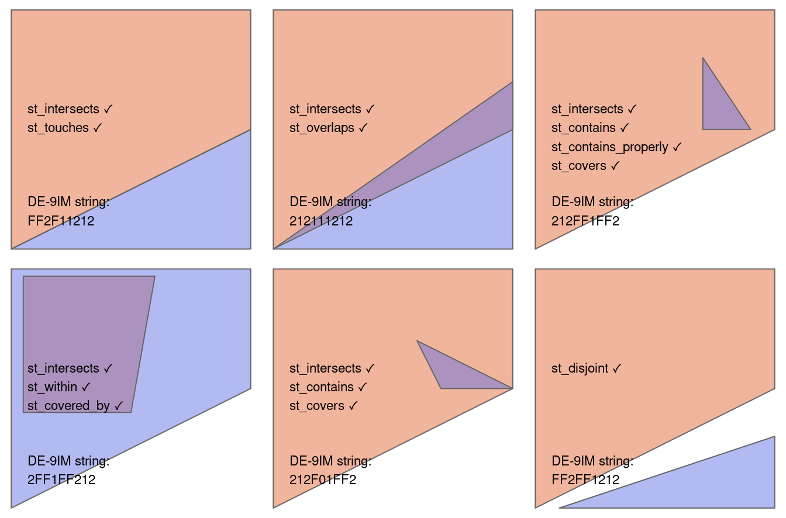
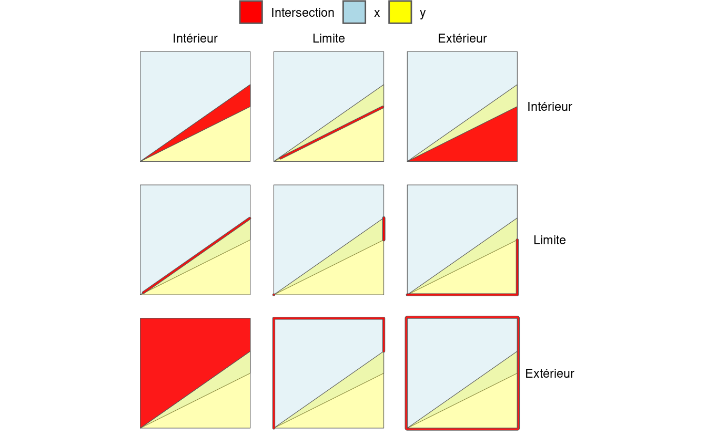
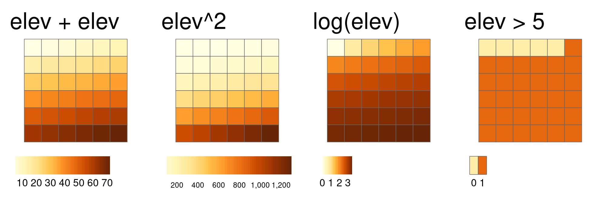

# Géotraitements {#spatial-operations}

## Prérequis {-}

- Ce chapitre nécessité les mêmes paquets que ceux utilisés dans le chapitre \@ref(attr): 


```r
library(sf)
library(terra)
library(dplyr)
library(spData)
```

- Vous devrez également charger deux jeux de  données pour cette section \@ref(spatial-ras)


```r
elev = rast(system.file("raster/elev.tif", package = "spData"))
grain = rast(system.file("raster/grain.tif", package = "spData"))
```


## Introduction

Les opérations spatiales, y compris les jointures spatiales entre les ensembles de données vectorielles et les opérations locales et focales sur les ensembles de données raster, constituent une partie essentielle de la géocomputation\index{geocomputation}.
Ce chapitre montre comment les objets spatiaux peuvent être modifiés d'une multitude de façons en fonction de leur emplacement et de leur forme.
De nombreuses opérations spatiales ont un équivalent non spatial (par exemple via leurs attributs), de sorte que des concepts tels que la sélection et la jonction de jeux de données démontrés dans le chapitre précédent sont applicables ici.
Cela est particulièrement vrai pour les opérations *vectorielles* : La section \@ref(vector-attribute-manipulation) sur la manipulation des tables attributaires fournit la base pour comprendre son équivalent spatial, à savoir la sélection spatial (traitée dans la section \@ref(spatial-subsetting)).
La jointure spatiale (section \@ref(spatial-joining)) et l'agrégation (section \@ref(spatial-aggr)) ont également des contreparties non spatiales, traitées dans le chapitre précédent.

Les opérations spatiales diffèrent toutefois des opérations non spatiales à plusieurs égards :
Les jointures spatiales, par exemple, peuvent être effectuées de plusieurs manières --- y compris la mise en correspondance d'entités qui se croisent ou se trouvent à une certaine distance de l'ensemble de données cible --- alors que les jointures de table attributaire abordées dans la section \@ref(vector-attribute-joining) du chapitre précédent ne peuvent être effectuées que d'une seule manière (sauf lorsqu'on utilise des jointures floues, comme décrit dans la documentation du paquet [**fuzzyjoin**](https://cran.r-project.org/package=fuzzyjoin)).
Le *type* de relation spatiale entre les objets doit être pris en compte lors de l'exécution des opérations spatiales, comme décrit dans la section \@ref(topological-relations), sur les relations topologiques entre les caractéristiques vectorielles.
\index{spatial operations}
Un autre aspect unique des objets spatiaux est la distance : tous les objets spatiaux sont liés par l'espace et les calculs de distance peuvent être utilisés pour explorer la force de cette relation, comme décrit dans le contexte des données vectorielles à la section \@ref(relations-distance).

Les opérations spatiales sur les rasters comprennent la sélection --- traité dans la section \@ref(spatial-raster-subsetting) --- et la fusion de plusieurs " tuiles " raster en un seul objet, comme le montre la section \@ref(merging-rasters).
*L'algèbre de raster* couvre une gamme d'opérations qui modifient les valeurs des cellules, avec ou sans référence aux valeurs des cellules environnantes, ce qui est vital pour de nombreuses applications.
Le concept d'algèbre de raster est présenté dans la section \@ref(map-algebra) ; les opérations d'algèbre de raster locales, focales et zonales sont traitées respectivement dans les sections \@ref(local-operations), \@ref(focal-operations) et \@ref(zonal-operations). Les opérations d'algèbre globales, qui génèrent des statistiques synthétiques représentant l'ensemble d'un jeu de données raster, et les calculs de distance sur les données raster, sont abordés dans la section \@ref(global-operations-and-distances).
Dans la dernière section avant les exercices (\@ref(merging-rasters)), le processus de fusion de deux ensembles de données raster est abordé et démontré à l'aide d'un exemple reproductible.

\BeginKnitrBlock{rmdnote}<div class="rmdnote">Il est important de noter que les opérations spatiales qui utilisent deux objets spatiaux reposent sur le fait que les deux objets ont le même système  de coordonnées de référence, un sujet qui a été introduit dans la section \@ref(crs-intro) et qui sera traité plus en profondeur dans le chapitre \@ref(reproj-geo-data).</div>\EndKnitrBlock{rmdnote}

## Géotraitements sur des données vectorielles {#spatial-vec}

Cette section fournit une vue d'ensemble des opérations spatiales sur les données géographiques vectorielles représentées sous forme de *simple features* du package **sf**.
La section \@ref(spatial-ras) présente les opérations spatiales sur les ensembles de données raster à l'aide des classes et des fonctions du paquet **terra**.

### Sélection spatiale

La sélection spatial est le processus qui consiste à prendre un objet spatial et à renvoyer un nouvel objet contenant uniquement les caractéristiques en relation dans l'espace à un autre objet.
De manière analogue à la  *sélection d'attributs* (traité dans la section \@ref(vector-attribute-subsetting)), des sélection de jeux de données `sf` peuvent être créés avec l'opérateur de crochets (`[`) en utilisant la syntaxe `x[y, , op = st_intersects]`, où `x` est un objet `sf` à partir duquel un sous-ensemble de lignes sera retourné, `y` est l'objet de sous-ensemble et `, op = st_intersects` est un argument optionnel qui spécifie la relation topologique (également connue sous le nom de prédicat binaire) utilisée pour faire la sélection.
La relation topologique par défaut utilisée lorsqu'un argument `op` n'est pas fourni est `st_intersects()` : la commande `x[y, ]` est identique à `x[y, , op = st_intersects]` montrée ci-dessus mais pas à `x[y, , op = st_disjoint]` (la signification de ces relations topologiques et des autres est décrite dans la section suivante).
La fonction `filter()` du **tidyverse**\index{tidyverse (package)} peut également être utilisée mais cette approche est plus verbeuse, comme nous le verrons dans les exemples ci-dessous.
\index{vector!subsetting}
\index{spatial!subsetting}

To demonstrate spatial subsetting, we will use the `nz` and `nz_height` datasets in the **spData** package, which contain geographic data on the 16 main regions and 101 highest points in New Zealand, respectively (Figure \@ref(fig:nz-subset)), in a projected coordinate system.
The following code chunk creates an object representing Canterbury, then uses spatial subsetting to return all high points in the region:


```r
canterbury = nz %>% filter(Name == "Canterbury")
canterbury_height = nz_height[canterbury, ]
```

<div class="figure" style="text-align: center">

<p class="caption">(\#fig:nz-subset)Exemple de sélection spatiale avec des triangles rouges représentant 101 points hauts en Nouvelle-Zélande, regroupés près de la région centrale de Canterbury (à gauche). Les points dans la région de Canterbury ont été créés avec l'opérateur de sélection `[` (surligné en gris, à droite).</p>
</div>

Comme pour la sélection d'attributs, la commande `x[y, ]` (équivalente à `nz_height[canterbury, ]`) sélectionne les caractéristiques d'une *cible* `x` en utilisant le contenu d'un objet *source* `y`.
Cependant, au lieu que `y` soit un vecteur de classe `logical` ou `integer`, pour la sélection spatiale, `x` et `y` doivent être des objets géographiques.
Plus précisément, les objets utilisés pour la sélection spatiale de cette manière doivent avoir la classe `sf` ou `sfc` : `nz` et `nz_height` sont tous deux des jeux de données vectorielles géographiques et ont la classe `sf`, et le résultat de l'opération renvoie un autre objet `sf` représentant les caractéristiques de l'objet cible `nz_height` qui intersectent (dans ce cas, les points hauts qui sont situés dans) la région de `canterbury`.

Diverses *relations topologiques* peuvent être utilisées pour le sélection spatiale. Elles déterminent le type de relation spatiale que les caractéristiques de l'objet cible doivent avoir avec l'objet de  sélection.
Il peut s'agir de *touches* (touche), *crosses* (croisse) ou *within* (dedans), comme nous le verrons bientôt dans la section \@ref(topological-relations). 
Le paramètre par défaut `st_intersects` est une relation topologique 'attrape-tout' qui retournera les éléments de la cible qui *touchent*, *croissent* ou sont *within* (dedans) l'objet source 'sélectionnant'.
Comme indiqué ci-dessus, d'autres opérateurs spatiaux peuvent être spécifiés avec l'argument `op =`, comme le montre la commande suivante qui renvoie l'opposé de `st_intersects()`, les points qui ne sont pas en intersection avec `Canterbury` (voir la section \@ref(topological-relations)) :


```r
nz_height[canterbury, , op = st_disjoint]
```

\BeginKnitrBlock{rmdnote}<div class="rmdnote">Notez que l´argument vide --- dénoté par `, ,` --- dans l´extrait de code précédent est inclus pour mettre en évidence `op`, le troisième argument dans `[` pour les objets `sf`.
On peut l´utiliser pour modifier l´opération de sélection de plusieurs façons.
`nz_height[canterbury, 2, op = st_disjoint]`, par exemple, retourne les mêmes lignes mais n´inclut que la deuxième colonne d´attributs (voir ``sf:::`[.sf`` et le `?sf`` pour plus de détails).</div>\EndKnitrBlock{rmdnote}

Pour de nombreuses applications, c'est tout ce que vous aurez besoin de savoir sur les sélections spatiales avec les données vectorielles !
Si vous êtes impatient d'en savoir plus sur les relations topologiques, au-delà de `st_intersects()` et `st_disjoint()`, passez à la section suivante (\@ref(topological-relations)).
Si vous êtes intéressé par les détails, y compris les autres façons de faire des sélections, c'est par ici.

Une autre façon d'effectuer une sélection spatiale est d'utiliser les objets retournés par les opérateurs topologiques.
Ces objets peuvent être utiles en soi, par exemple lors de l'exploration du réseau de relations entre des régions contiguës, mais ils peuvent également être utilisés pour sélectionner comme le montre le morceau de code ci-dessous :


```r
sel_sgbp = st_intersects(x = nz_height, y = canterbury)
class(sel_sgbp)
#> [1] "sgbp" "list"
sel_sgbp
#> Sparse geometry binary predicate list of length 101, where the
#> predicate was `intersects'
#> first 10 elements:
#>  1: (empty)
#>  2: (empty)
#>  3: (empty)
#>  4: (empty)
#>  5: 1
#>  6: 1
#>  7: 1
#>  8: 1
#>  9: 1
#>  10: 1
sel_logical = lengths(sel_sgbp) > 0
canterbury_height2 = nz_height[sel_logical, ]
```

Le code ci-dessus crée un objet de classe `sgbp` (un prédicat binaire de géométrie "creuse", une liste de longueur `x` dans l'opération spatiale) et le convertit ensuite en un vecteur logique `sel_logical` (contenant seulement les valeurs `TRUE` et `FALSE`, quelque chose qui peut aussi être utilisé par la fonction filtre de **dplyr**).
\index{binary predicate|seealso {topological relations}}
La fonction `lengths()` identifie les éléments de `nz_height` qui ont une intersection avec *tout* objet de `y`.
Dans ce cas, 1 est la plus grande valeur possible, mais pour des opérations plus complexes, on peut utiliser la méthode pour sélectionner uniquement les caractéristiques qui ont une intersection avec, par exemple, 2 caractéristiques ou plus de l'objet source.

\BeginKnitrBlock{rmdnote}<div class="rmdnote">Note : une autre façon de retourner une sortie logique est de mettre `sparse = FALSE` (ce qui signifie retourner une matrice dense et non une matrice 'creuse') dans des opérateurs tels que `st_intersects()`. La commande `st_intersects(x = nz_height, y = canterbury, sparse = FALSE)[, 1]`, par exemple, retournerait une sortie identique à `sel_logical`.
Note : la solution impliquant les objets `sgbp` est cependant plus généralisable, car elle fonctionne pour les opérations *many-to-many* et a des besoins en mémoire plus faibles.</div>\EndKnitrBlock{rmdnote}

Le même résultat peut être obtenu avec la fonction de **sf** `st_filter()` qui a été [créée](https://github.com/r-spatial/sf/issues/1148) pour augmenter la compatibilité entre les objets `sf` et les manipulation de données de **dplyr** :


```r
canterbury_height3 = nz_height %>%
  st_filter(y = canterbury, .predicate = st_intersects)
```


A ce stade, il y a trois versions identiques (à l'exception des noms de lignes) de `canterbury_height`, une créée en utilisant l'opérateur `[`, une créée via un objet de sélection intermédiaire, et une autre utilisant la fonction de commodité de **sf** `st_filter()`.
<!-- RL: commented out for now as old. Todo: if we ever update that vignette uncomment the next line. -->
<!-- To explore spatial subsetting in more detail, see the supplementary vignettes on `subsetting` and [`tidyverse-pitfalls`](https://geocompr.github.io/geocompkg/articles/) on the [geocompkg website](https://geocompr.github.io/geocompkg/articles/). -->
La section suivante explore différents types de relations spatiales, également connues sous le nom de prédicats binaires, qui peuvent être utilisées pour identifier si deux éléments sont spatialement liés ou non.

### Relations topologiques

Les relations topologiques décrivent les relations spatiales entre les objets.
Les "relations topologiques binaires", pour leur donner leur nom complet, sont des énoncés logiques (en ce sens que la réponse ne peut être que `VRAI` ou `FAUX`) sur les relations spatiales entre deux objets définis par des ensembles ordonnés de points (formant typiquement des points, des lignes et des polygones) en deux dimensions ou plus [@egenhofer_mathematical_1990].
Cela peut sembler plutôt abstrait et, en effet, la définition et la classification des relations topologiques reposent sur des fondements mathématiques publiés pour la première fois sous forme de livre en 1966 [@spanier_algebraic_1995], le domaine de la topologie algébrique se poursuivant au 21^e^ siècle [@dieck_algebraic_2008].

Malgré leur origine mathématique, les relations topologiques peuvent être comprises intuitivement en se référant à des visualisations de fonctions couramment utilisées qui testent les types courants de relations spatiales.
La figure \@ref(fig:relations) montre une variété de paires géométriques et leurs relations associées.
Les troisième et quatrième paires de la figure \@ref(fig:relations) (de gauche à droite puis vers le bas) montrent que, pour certaines relations, l'ordre est important : alors que les relations *equals*, *intersects*, *crosses*, *touches* et *overlaps* sont symétriques, ce qui signifie que si `function(x, y)` est vraie, `function(y, x)` le sera aussi, les relations dans lesquelles l'ordre des géométries est important, comme *contains* et *within*, ne le sont pas.
Remarquez que chaque paire de géométries possède une chaîne "DE-9IM" telle que FF2F11212, décrite dans la section suivante.
\index{topological relations}

<div class="figure" style="text-align: center">

<p class="caption">(\#fig:relations)Relations topologiques entre géométries vectorielles, inspirées des figures 1 et 2 d'Egenhofer et Herring (1990). Les relations pour lesquelles la fonction(x, y) est vraie sont imprimées pour chaque paire de géométries, x étant représenté en rose et y en bleu. La nature de la relation spatiale pour chaque paire est décrite par la chaîne de caractères du Dimensionally Extended 9-Intersection Model.</p>
</div>

Dans `sf`, les fonctions testant les différents types de relations topologiques sont appelées binary predicates", comme décrit dans la vignette *Manipulating Simple Feature Geometries*, qui peut être consultée avec la commande [`vignette("sf3")`](https://r-spatial.github.io/sf/articles/sf3.html), et dans la page d'aide [`?geos_binary_pred`](https://r-spatial.github.io/sf/reference/geos_binary_ops.html).
Pour voir comment les relations topologiques fonctionnent en pratique, créons un exemple simple et reproductible, en nous appuyant sur les relations illustrées dans la Figure \@ref(fig:relations) et en consolidant les connaissances sur la représentation des géométries vectorielles acquises dans un chapitre précédent (Section \@ref(geometry)).
Notez que pour créer des données tabulaires représentant les coordonnées (x et y) des sommets du polygone, nous utilisons la fonction R de base `cbind()` pour créer une matrice représentant les points de coordonnées, un `POLYGON`, et enfin un objet `sfc`, comme décrit au chapitre \@ref(spatial-class)) :


```r
polygon_matrix = cbind(
  x = c(0, 0, 1, 1,   0),
  y = c(0, 1, 1, 0.5, 0)
)
polygon_sfc = st_sfc(st_polygon(list(polygon_matrix)))
```

Nous allons créer des géométries supplémentaires pour démontrer les relations spatiales à l'aide des commandes suivantes qui, lorsqu'elles sont tracées sur le polygone créé ci-dessus, se rapportent les unes aux autres dans l'espace, comme le montre la Figure \@ref(fig:relation-objects).
Notez l'utilisation de la fonction `st_as_sf()` et de l'argument `coords` pour convertir efficacement un tableau de données contenant des colonnes représentant des coordonnées en un objet `sf` contenant des points :


```r
line_sfc = st_sfc(st_linestring(cbind(
  x = c(0.4, 1),
  y = c(0.2, 0.5)
)))
# créer des points
point_df = data.frame(
  x = c(0.2, 0.7, 0.4),
  y = c(0.1, 0.2, 0.8)
)
point_sf = st_as_sf(point_df, coords = c("x", "y"))
```

<div class="figure" style="text-align: center">

<p class="caption">(\#fig:relation-objects)Points (`point_df` 1 à 3), ligne et polygones arrangés pour illustrer les relations topologiques.</p>
</div>

Une première question simple pourrait être : quels sont les points de `point_sf` en intersection avec le polygone `polygon_sfc` ?
On peut répondre à cette question par inspection (les points 1 et 3 sont respectivement en contact et à l'intérieur du polygone).
On peut répondre à cette question avec le prédicat spatial `st_intersects()` comme suit:


```r
st_intersects(point_sf, polygon_sfc)
#> Sparse geometry binary predicate... `intersects'
#>  1: 1
#>  2: (empty)
#>  3: 1
```

Le résultat devrait correspondre à votre intuition :
des résultats positifs (`1`) sont retournés pour le premier et le troisième point, et un résultat négatif (représenté par un vecteur vide "(empty)") pour le deuxième  en dehors de la frontière du polygone.
Ce qui peut être inattendu, c'est que le résultat se présente sous la forme d'une liste de vecteurs.
Cette sortie *matrice creuse* n'enregistre une relation que si elle existe, ce qui réduit les besoins en mémoire des opérations topologiques sur les objets avec de nombreuses entités.
Comme nous l'avons vu dans la section précédente, une *matrice dense* composée de valeurs `TRUE` ou `FALSE` est retournée lorsque `sparse = FALSE` :


```r
st_intersects(point_sf, polygon_sfc, sparse = FALSE)
#>       [,1]
#> [1,]  TRUE
#> [2,] FALSE
#> [3,]  TRUE
```

Dans la sortie ci-dessus, chaque ligne représente un élément dans l'objet cible (l'argument `x`) et chaque colonne représente un élément dans l'objet de sélection (`y`). 
Dans ce cas, il n'y a qu'un seul élément dans l'objet `y` `polygon_sfc`, donc le résultat, qui peut être utilisé pour la sélection comme nous l'avons vu dans la section \@ref(spatial-subsetting), n'a qu'une seule colonne.

`st_intersects()` renvoie `TRUE` même dans les cas où les éléments se touchent juste : *intersects* est une opération topologique "fourre-tout" qui identifie de nombreux types de relations spatiales, comme l'illustre la figure \@ref(fig:relations).
Il y a des questions plus restrictives, par exemple  : quels sont les points situés à l'intérieur du polygone, et quelles sont les caractéristiques qui sont sur ou qui contiennent une frontière partagée avec `y` ?
On peut répondre à ces questions de la manière suivante (résultats non montrés) :


```r
st_within(point_sf, polygon_sfc)
st_touches(point_sf, polygon_sfc)
```

Notez que bien que le premier point *touche* la limite du polygone, il n'est pas à l'intérieur de celui-ci ; le troisième point est à l'intérieur du polygone mais ne touche aucune partie de sa frontière.
L'opposé de `st_intersects()` est `st_disjoint()`, qui retourne uniquement les objets qui n'ont aucun rapport spatial avec l'objet sélectionné (ici `[, 1]` convertit le résultat en vecteur) :


```r
st_disjoint(point_sf, polygon_sfc, sparse = FALSE)[, 1]
#> [1] FALSE  TRUE FALSE
```

La fonction `st_is_within_distance()` détecte les éléments qui  touchent *presque* l'objet de sélection. La fonction a un argument supplémentaire `dist`.
Il peut être utilisé pour définir la distance à laquelle les objets cibles doivent se trouver avant d'être sélectionnés.
Remarquez que bien que le point 2 soit à plus de 0,2 unités de distance du sommet le plus proche de `polygon_sfc`, il est quand même sélectionné lorsque la distance est fixée à 0,2. 
En effet, la distance est mesurée par rapport à l'arête la plus proche, dans ce cas la partie du polygone qui se trouve directement au-dessus du point 2 dans la figure \@ref(fig:relation-objets).
(Vous pouvez vérifier que la distance réelle entre le point 2 et le polygone est de 0,13 avec la commande `st_distance(point_sf, polygon_sfc)`).
Le prédicat spatial binaire "is within distance" (es à distance de) est démontré dans l'extrait de code ci-dessous, dont les résultats montrent que chaque point est à moins de 0,2 unité du polygone :


```r
st_is_within_distance(point_sf, polygon_sfc, dist = 0.2, sparse = FALSE)[, 1]
#> [1] TRUE TRUE TRUE
```


\BeginKnitrBlock{rmdnote}<div class="rmdnote">Les fonctions de calcul des relations topologiques utilisent des indices spatiaux pour accélérer considérablement les performances des requêtes spatiales.
Elles y parviennent en utilisant l´algorithme *Sort-Tile-Recursive* (STR).
La fonction `st_join`, mentionnée dans la section suivante, utilise également l´indexation spatiale. 
Vous pouvez en savoir plus à l´adresse suivante https://www.r-spatial.org/r/2017/06/22/spatial-index.html.</div>\EndKnitrBlock{rmdnote}


### Les chaines DE-9IM

Les prédicats binaires présentés dans la section précédente reposent sur le modèle *Dimensionally Extended 9-Intersection Model* (DE-9IM).
Ce modèle était à l'origine intitulé " DE + 9IM " par ses inventeurs, en référence à la " dimension des intersections des limites, des intérieurs et des extérieurs de deux entités " [@clementini_comparison_1995], mais il est désormais désigné par DE-9IM [@shen_classification_2018].
<!-- The model's workings can be demonstrated with reference to two intersecting polygons, as illustrated in Figure \@ref(fig:de-9im). -->


Pour démontrer le fonctionnement des chaînes DE-9IM, examinons les différentes façons dont la première paire de géométries peut-être reliée dans la figure \@ref(fig:relations).
La figure \@ref(fig:de9imgg) illustre le modèle à 9 intersections (9IM).  Elle montre les intersections entre chaque combinaison possible entre l'intérieur, la limite et l'extérieur de chaque objet. Chaque composant du premier objet `x` est disposé en colonnes et que chaque composant de `y` est disposé en lignes, un graphique à facettes est créé avec les intersections entre chaque élément mises en évidence.

<div class="figure" style="text-align: center">

<p class="caption">(\#fig:de9imgg)Illustration du fonctionnement du Modèle Dimensionnel Étendu à 9 Intersections (DE-9IM). Les couleurs qui ne figurent pas dans la légende représentent le chevauchement entre les différentes composantes. Les lignes épaisses mettent en évidence les intersections bidimensionnelles, par exemple entre la limite de l'objet x et l'intérieur de l'objet y, illustrées dans la facette supérieure du milieu.</p>
</div>

Les chaînes DE-9IM sont dérivées de la dimension de chaque type de relation.
Dans ce cas, les intersections rouges de la figure \@ref(fig:de9imgg) ont des dimensions de 0 (points), 1 (lignes) et 2 (polygones), comme le montre le tableau \@ref(tab:de9emtable).


Table: (\#tab:de9emtable)Tableau montrant les relations entre les intérieurs, les limites et les extérieurs des géométries x et y.

|              |Intérieur (x) |Limite (x) |Extérieur (x) |
|:-------------|:-------------|:----------|:-------------|
|Intérieur (y) |2             |1          |2             |
|Limite (y)    |1             |1          |1             |
|Extérieur (y) |2             |1          |2             |

En aplatissant cette matrice "ligne par ligne" (c'est-à-dire en concaténant la première ligne, puis la deuxième, puis la troisième), on obtient la chaîne `212111212`.
Un autre exemple va permettre d'expliciter ce système :
la relation représentée sur la figure \@ref(fig:relations) (la troisième paire de polygones dans la troisième colonne et la première ligne) peut être définie dans le système DE-9IM comme suit :

- Les intersections entre l'*intérieur* du grand objet `x` et l'intérieur, la limite et l'extérieur de `y` ont des dimensions respectives de 2, 1 et 2.
- Les intersections entre la *frontière* du grand objet `x` et l'intérieur, la frontière et l'extérieur de `y` ont des dimensions respectives de F, F et 1, où "F" signifie "faux", les objets sont disjoints.
- Les intersections entre l'*extérieur* de `x` et l'intérieur, la limite et l'extérieur de `y` ont des dimensions respectives de F, F et 2 : l'extérieur du plus grand objet ne touche pas l'intérieur ou la limite de `y`, mais l'extérieur du plus petit et du plus grand objet couvre la même surface.

Ces trois composants, une fois concaténés, créent la chaîne `212`, `FF1`, et `FF2`.
C'est le même résultat que celui obtenu par la fonction `st_relate()` (voir le code source de ce chapitre pour voir comment les autres géométries de la figure \@ref(fig:relations) ont été créées) :


```r
xy2sfc = function(x, y) st_sfc(st_polygon(list(cbind(x, y))))
x = xy2sfc(x = c(0, 0, 1, 1,   0), y = c(0, 1, 1, 0.5, 0))
y = xy2sfc(x = c(0.7, 0.7, 0.9, 0.7), y = c(0.8, 0.5, 0.5, 0.8))
st_relate(x, y)
#>      [,1]       
#> [1,] "212FF1FF2"
```

La compréhension des chaînes DE-9IM permet de développer de nouveaux prédicats spatiaux binaires.
La page d'aide `?st_relate` contient des définitions de fonctions pour les relations "reine" et "tour" dans lesquelles les polygones partagent une frontière ou seulement un point, respectivement.
Les relations "reine" signifient que les relations "frontière-frontière" (la cellule de la deuxième colonne et de la deuxième ligne de la table \@ref(tab:de9emtable), ou le cinquième élément de la chaîne DE-9IM) ne doivent pas être vides, ce qui correspond au *pattern*  `F***T****`, tandis que pour les relations "tour", le même élément doit être 1 (ce qui signifie une intersection linéaire).
Ces relations sont implémentées comme suit :


```r
st_queen = function(x, y) st_relate(x, y, pattern = "F***T****")
st_rook = function(x, y) st_relate(x, y, pattern = "F***1****")
```

A partir de l'objet `x` créé précédemment, nous pouvons utiliser les fonctions nouvellement créées pour trouver quels éléments de la grille sont une 'reine' et une 'tour' par rapport à la case centrale de la grille comme suit :


```r
grid = st_make_grid(x, n = 3)
grid_sf = st_sf(grid)
grid_sf$queens = lengths(st_queen(grid, grid[5])) > 0
plot(grid, col = grid_sf$queens)
grid_sf$rooks = lengths(st_rook(grid, grid[5])) > 0
plot(grid, col = grid_sf$rooks)
```

<div class="figure" style="text-align: center">

<p class="caption">(\#fig:queens)Démonstration de prédicats spatiaux binaires personnalisés permettant de trouver les relations 'reine' (à gauche) et 'tour' (à droite) par rapport à la case centrale dans une grille à 9 géométries.</p>
</div>


<!-- Another of a custom binary spatial predicate is 'overlapping lines' which detects lines that overlap for some or all of another line's geometry. -->
<!-- This can be implemented as follows, with the pattern signifying that the intersection between the two line interiors must be a line: -->


### Jointure spatiale 

La jointure de deux jeux de données non spatiales repose sur une variable "clé" partagée, comme décrit dans la section \@ref(vector-attribute-joining).
La jointure de données spatiales applique le même concept, mais s'appuie sur les relations spatiales, décrites dans la section précédente.
Comme pour les données attributaires, la jointure ajoute de nouvelles colonnes à l'objet cible (l'argument `x` dans les fonctions de jointure), à partir d'un objet source (`y`).
\index{join!spatial}
\index{spatial!join}

Le processus est illustré par l'exemple suivant : imaginez que vous disposez de dix points répartis au hasard sur la surface de la Terre et que vous demandez, pour les points qui se trouvent sur la terre ferme, dans quels pays se trouvent-ils ?
La mise en œuvre de cette idée dans un [exemple reproductible] (https://github.com/Robinlovelace/geocompr/blob/main/code/04-spatial-join.R) renforcera vos compétences en matière de traitement des données géographiques et vous montrera comment fonctionnent les jointures spatiales.
Le point de départ consiste à créer des points dispersés de manière aléatoire sur la surface de la Terre :


```r
set.seed(2018) # définir la seed pour la reproductibilité
(bb = st_bbox(world)) # les limites de la terre
#>   xmin   ymin   xmax   ymax 
#> -180.0  -89.9  180.0   83.6
random_df = data.frame(
  x = runif(n = 10, min = bb[1], max = bb[3]),
  y = runif(n = 10, min = bb[2], max = bb[4])
)
random_points = random_df %>% 
  st_as_sf(coords = c("x", "y")) %>% # définir les coordonnés
  st_set_crs("EPSG:4326") # définir le CRS
```

Le scénario illustré dans la Figure \@ref(fig:spatial-join) montre que l'objet `random_points` (en haut à gauche) n'a pas d'attributs, alors que le `world` (en haut à droite) a des attributs, y compris les noms de pays indiqués pour un échantillon de pays dans la légende.
Les jointures spatiales sont implémentées avec `st_join()`, comme illustré dans l'extrait de code ci-dessous.
La sortie est l'objet `random_joined` qui est illustré dans la Figure \@ref(fig:spatial-join) (en bas à gauche).
Avant de créer l'ensemble de données jointes, nous utilisons la sélection spatiale pour créer `world_random`, qui contient uniquement les pays qui contiennent des points aléatoires, afin de vérifier que le nombre de noms de pays retournés dans l'ensemble de données jointes doit être de quatre (cf. le panneau supérieur droit de la Figure \@ref(fig:spatial-join)).


```r
world_random = world[random_points, ]
nrow(world_random)
#> [1] 4
random_joined = st_join(random_points, world["name_long"])
```

<div class="figure" style="text-align: center">

<p class="caption">(\#fig:spatial-join)Illustration d'une jointure spatiale. Une nouvelle variable attributaire est ajoutée aux points aléatoires (en haut à gauche) de l'objet monde source (en haut à droite), ce qui donne les données représentées dans le dernier panneau.</p>
</div>

Par défaut, `st_join()` effectue une jointure à gauche (*left join*), ce qui signifie que le résultat est un objet contenant toutes les lignes de `x`, y compris les lignes sans correspondance dans `y` (voir la section \@ref(vector-attribute-joining)), mais il peut également effectuer des jointures internes en définissant l'argument `left = FALSE`.
Comme pour les sélections spatiales, l'opérateur topologique par défaut utilisé par `st_join()` est `st_intersects()`, qui peut être modifié en définissant l'argument `join` (cf. `?st_join` pour plus de détails).
L'exemple ci-dessus montre l'ajout d'une colonne d'une couche de polygones à une couche de points, mais la même approche fonctionne indépendamment des types de géométrie.
Dans de tels cas, par exemple lorsque `x` contient des polygones, dont chacun correspond à plusieurs objets dans `y`, les jointures spatiales résulteront en des caractéristiques dupliquées, crée une nouvelle ligne pour chaque correspondance dans `y`.

<!-- Idea: demonstrate what happens when there are multiple matches with reprex (low priority, RL: 2021-12) -->

### Jointure sans chevauchement

Parfois, deux jeux de données géographiques ne se touchent pas mais ont quand même une forte relation géographique.
Les jeux de données `cycle_hire` et `cycle_hire_osm`, présent dans le paquet **spData**, en sont un bon exemple.
Leur tracé montre qu'ils sont souvent étroitement liés mais qu'ils ne se touchent pas, comme le montre la figure \@ref(fig:cycle-hire), dont une version de base est créée avec le code suivant ci-dessous :
\index{join!non-overlapping}


```r
plot(st_geometry(cycle_hire), col = "blue")
plot(st_geometry(cycle_hire_osm), add = TRUE, pch = 3, col = "red")
```

Nous pouvons vérifier si certains points se superposent  avec `st_intersects()` :


```r
any(st_touches(cycle_hire, cycle_hire_osm, sparse = FALSE))
#> [1] FALSE
```


<div class="figure" style="text-align: center">

```{=html}
<div id="htmlwidget-9580c84d0c32f0a22a8c" style="width:100%;height:415.296px;" class="leaflet html-widget"></div>
<script type="application/json" data-for="htmlwidget-9580c84d0c32f0a22a8c">{"x":{"options":{"crs":{"crsClass":"L.CRS.EPSG3857","code":null,"proj4def":null,"projectedBounds":null,"options":{}}},"calls":[{"method":"addCircles","args":[[51.52916347,51.49960695,51.52128377,51.53005939,51.49313,51.51811784,51.53430039,51.52834133,51.5073853,51.50597426,51.52395143,51.52168078,51.51991453,51.52994371,51.51772703,51.52635795,51.5216612,51.51477076,51.52505093,51.52773634,51.53007835,51.5222641,51.51943538,51.51908011,51.5288338,51.52728093,51.51382102,51.52351808,51.513735,51.52915444,51.52953709,51.52469624,51.5341235,51.50173726,51.49159394,51.4973875,51.5263778,51.52127071,51.52001715,51.53099181,51.52026,51.51073687,51.522511,51.507131,51.52334476,51.51248445,51.50706909,51.52867339,51.52671796,51.52295439,51.5099923,51.52174785,51.51707521,51.52058381,51.52334672,51.52452699,51.53176825,51.52644828,51.49738251,51.4907579,51.53089041,51.50946212,51.52522753,51.51795029,51.51882555,51.52059681,51.5262363,51.53136059,51.5154186,51.52352001,51.52572618,51.48591714,51.53219984,51.52559505,51.52341837,51.52486887,51.50069361,51.52025302,51.514274,51.50963938,51.51593725,51.50064702,51.48947903,51.51646835,51.51858757,51.5262503,51.53301907,51.49368637,51.49889832,51.53440868,51.49506109,51.5208417,51.53095071,51.49792478,51.52554222,51.51457763,51.49043573,51.51155322,51.51340693,51.50472376,51.51159481,51.51552971,51.51410514,51.52600832,51.49812559,51.51563144,51.53304322,51.5100172,51.51580998,51.49646288,51.52451738,51.51423368,51.51449962,51.49288067,51.49582705,51.52589324,51.51573534,51.51891348,51.52111369,51.52836014,51.49654462,51.50069491,51.51782144,51.51700801,51.49536226,51.5118973,51.50950627,51.53300545,51.52364804,51.50136494,51.504904,51.52326004,51.51196176,51.49087475,51.51227622,51.49488108,51.52096262,51.51530805,51.49372451,51.4968865,51.48894022,51.50074359,51.48836528,51.51494305,51.49211134,51.48478899,51.49705603,51.51213691,51.49217002,51.51183419,51.50379168,51.49586666,51.49443626,51.50039792,51.49085368,51.51461995,51.50663341,51.49234577,51.51760685,51.4931848,51.515607,51.517932,51.50185512,51.49395092,51.50040123,51.51474612,51.52784273,51.4916156,51.49121192,51.50486,51.512529,51.52174384,51.51791921,51.49616092,51.48985626,51.5129118,51.49941247,51.52202903,51.52071513,51.48805753,51.51733558,51.49247977,51.5165179,51.53166681,51.48997562,51.50311799,51.51251523,51.50581776,51.50462759,51.50724437,51.50368837,51.50556905,51.51048489,51.51492456,51.5225965,51.51236389,51.51821864,51.52659961,51.518144,51.518154,51.50135267,51.52505151,51.49358391,51.51681444,51.49464523,51.50658458,51.50274025,51.52683806,51.51906932,51.49094565,51.51615461,51.48971651,51.49016361,51.49066456,51.49481649,51.50275704,51.49148474,51.51476963,51.50935342,51.50844614,51.52891573,51.50742485,51.50654321,51.50669284,51.49396755,51.51501025,51.50777049,51.53450449,51.49571828,51.51838043,51.5084448,51.5233534,51.52443845,51.50545935,51.52200801,51.49096258,51.51611887,51.4853572,51.52285301,51.530052,51.50645179,51.49859784,51.489932,51.518908,51.5046364,51.53404294,51.53051587,51.52557531,51.51362054,51.52248185,51.50143293,51.50494561,51.5136846,51.5134891,51.49874469,51.51422502,51.52644342,51.51595344,51.50102668,51.49206037,51.49320445,51.50082346,51.4863434,51.53583617,51.50144456,51.50613324,51.49671237,51.52004497,51.50930161,51.50315739,51.5034938,51.51862243,51.490083,51.49580589,51.51906446,51.49914063,51.5272947,51.52367314,51.49236962,51.50923022,51.51678023,51.48483991,51.49888404,51.49815779,51.488226,51.50029631,51.49363156,51.49612799,51.50227992,51.49398524,51.50501351,51.51475963,51.466907,51.50295379,51.51211869,51.48677988,51.51816295,51.50990837,51.49907558,51.50963123,51.4908679,51.51918144,51.53088935,51.51734403,51.50088934,51.52536703,51.49768448,51.49679128,51.51004801,51.52702563,51.49357351,51.49785559,51.526293,51.523196,51.49652013,51.50908747,51.53266186,51.53114,51.53095,51.53589283,51.51641749,51.52085887,51.49334336,51.50860544,51.505044,51.51196803,51.504942,51.51108452,51.51175646,51.5333196,51.51444134,51.50810309,51.53692216,51.528246,51.48802358,51.50013942,51.51217033,51.51196,51.5017154373867,51.529423,51.486965,51.49459148,51.506767,51.486575,51.494412,51.520994,51.51643491,51.49782999,51.49675303,51.50391972,51.536264,51.5291212008901,51.519656,51.530344,51.5109192966489,51.5173721,51.50024195,51.520205,51.49775,51.515208,51.49980661,51.50402793,51.50194596,51.49188409,51.50535447,51.49559291,51.51431171,51.50686435,51.51953043,51.50935171,51.51310333,51.496481,51.51352755,51.49369988,51.51070161,51.51013066,51.521776,51.51066202,51.49942855,51.51733427,51.524826,51.492462,51.51809,51.51348,51.502319,51.52261762,51.517703,51.528187,51.52289229,51.51689296,51.50204238,51.49418566,51.512303,51.51222,51.51994326,51.493146,51.519968,51.49337264,51.488105,51.485821,51.504043,51.504044,51.49456127,51.490491,51.533379,51.493072,51.51397065,51.499917,51.48902,51.534474,51.496957,51.524564,51.488852,51.51824,51.488124,51.5338,51.483145,51.495656,51.510101,51.515256,51.52568,51.52388,51.528936,51.493381,51.50623,51.511088,51.515975,51.504719,51.505697,51.508447,51.487679,51.49447,51.538071,51.542138,51.504749,51.535179,51.516196,51.516,51.541603,51.534776,51.51417,51.53558,51.534464,51.523538,51.521564,51.513757,51.530535,51.533283,51.529452,51.496137,51.498125,51.499041,51.489096,51.49109,51.521889,51.527152,51.5128711,51.487129,51.509843,51.51328,51.528828,51.531127,51.525645,51.511811,51.506946,51.513074,51.508622,51.522507,51.524677,51.50196,51.528169,51.52512,51.527058,51.519265,51.522561,51.502635,51.520893,51.496454,51.520398,51.517475,51.528692,51.519362,51.517842,51.509303,51.511066,51.532091,51.5142228,51.516204,51.500088,51.5112,51.532513,51.528224,51.518811,51.526041,51.534137,51.525941,51.51549,51.511654,51.504714,51.503143,51.503802,51.507326,51.486892,51.508896,51.530326,51.50357,51.528222,51.531864,51.537349,51.51793,51.508981,51.531091,51.528302,51.506613,51.514115,51.509591,51.526153,51.539957,51.517428,51.509474,51.498386,51.49605,51.521564,51.503447,51.511542,51.535678,51.513548,51.502661,51.51601,51.493978,51.501391,51.511624,51.518369,51.51746,51.499286,51.509943,51.521905,51.509158,51.51616,51.53213,51.503083,51.506256,51.539099,51.485587,51.53356,51.497304,51.528869,51.527607,51.511246,51.48692917,51.497622,51.51244,51.490645,51.50964,51.52959,51.487196,51.53256,51.506093,51.5171,51.531066,51.513875,51.493267,51.472817,51.473471,51.494499,51.485743,51.481747,51.514767,51.472993,51.477839,51.538792,51.520331,51.504199,51.468814,51.491093,51.46512358,51.48256792,51.50646524,51.46925984,51.50403821,51.47817208,51.4768851,51.48102131,51.47107905,51.47625965,51.4737636,51.47518024,51.46086446,51.50748124,51.46193072,51.4729184,51.47761941,51.48438657,51.4687905,51.46881971,51.45995384,51.47073264,51.4795017,51.47053858,51.48959104,51.49434708,51.48606206,51.46706414,51.45787019,51.46663393,51.48357068,51.47286577,51.49824168,51.46916161,51.5190427,51.48373225,51.50173215,51.49886563,51.50035306,51.46904022,51.48180515,51.51687069,51.48089844,51.51148696,51.47084722,51.48267821,51.48294452,51.46841875,51.4996806,51.47729232,51.46437067,51.49087074,51.51632095,51.48498496,51.51323001,51.474376,51.46108367,51.49610093,51.5015946,51.49422354,51.47614939,51.46718562,51.475089,51.4646884,51.46517078,51.53546778,51.46348914,51.47787084,51.46866929,51.46231278,51.47453545,51.47768469,51.47303687,51.48810829,51.46506424,51.45475251,51.46067005,51.48814438,51.49760804,51.46095151,51.45922541,51.47047503,51.47946386,51.54211855,51.464786,51.53638435,51.48728535,51.53639219,51.53908372,51.5366541,51.47696496,51.47287627,51.52868155,51.51505991,51.45682071,51.45971528,51.50215353,51.49021762,51.46161068,51.46321128,51.47439218,51.48335692,51.51854104,51.54100708,51.47311696,51.51563007,51.51542791,51.53658514,51.53571683,51.53642464,51.48724429,51.53603947,51.52458353,51.46822047,51.45799126,51.47732253,51.47505096,51.47569809,51.46199911,51.47893931,51.49208492,51.47727637,51.50630441,51.50542628,51.46230566,51.46489445,51.47993289,51.47514228,51.48176572,51.51092871,51.5129814,51.51510818,51.46079243,51.46745485,51.47816972,51.4795738,51.48796408,51.53727795,51.53932857,51.4710956,51.51612862,51.45816465,51.49263658,51.5129006,51.48512191,51.47515398,51.48795853,51.51787005,51.52456169,51.52526975,51.48321729,51.50070305,51.52059714,51.46239255,51.46760141,51.45752945,51.45705988,51.46134382,51.473611,51.491026,51.509224,51.47250956,51.511891,51.470131,51.496664,51.460333,51.4619230679],[-0.109970527,-0.197574246,-0.084605692,-0.120973687,-0.156876,-0.144228881,-0.1680743,-0.170134484,-0.096440751,-0.092754157,-0.122502346,-0.130431727,-0.136039674,-0.123616824,-0.127854211,-0.125979294,-0.109006325,-0.12221963,-0.131161087,-0.135273468,-0.13884627,-0.114079481,-0.119123345,-0.124678402,-0.132250369,-0.11829517,-0.107927706,-0.143613641,-0.193487,-0.093421615,-0.083353323,-0.084439283,-0.129386874,-0.184980612,-0.192369256,-0.197245586,-0.078130921,-0.0755789,-0.083911168,-0.093903825,-0.157183945,-0.144165239,-0.162298,-0.06691,-0.183846408,-0.099141408,-0.145904427,-0.087459376,-0.104298194,-0.094934859,-0.143495266,-0.094475072,-0.086685542,-0.154701411,-0.120202614,-0.079248081,-0.114329032,-0.172190727,-0.089446947,-0.106323685,-0.089782579,-0.124749274,-0.13518856,-0.108657431,-0.108028472,-0.116688468,-0.134407652,-0.117069978,-0.098850915,-0.108340165,-0.088486188,-0.124469948,-0.105480698,-0.144083893,-0.124121774,-0.099489485,-0.102091246,-0.141327271,-0.111257,-0.131510949,-0.111778348,-0.078600401,-0.115156562,-0.079684557,-0.132053392,-0.123509611,-0.139174593,-0.111014912,-0.100440521,-0.109025404,-0.085814489,-0.097340162,-0.078505384,-0.183834706,-0.138231303,-0.158264483,-0.122806861,-0.0929401,-0.076793375,-0.192538767,-0.077121322,-0.190240716,-0.147301667,-0.096317627,-0.132102166,-0.132328837,-0.172528678,-0.157275636,-0.105270275,-0.183289032,-0.158963647,-0.073537654,-0.141423695,-0.114934001,-0.13547809,-0.090847761,-0.093080779,-0.156166631,-0.078869751,-0.104724625,-0.150905245,-0.094524319,-0.096496865,-0.09388536,-0.185296516,-0.137043852,-0.075459482,-0.136792671,-0.074754872,-0.191462381,-0.06797,-0.104708922,-0.097441687,-0.153319609,-0.157436972,-0.117974901,-0.085634242,-0.147203711,-0.198286569,-0.161203828,-0.111435796,-0.202759212,-0.129361842,-0.11614642,-0.138364847,-0.110683213,-0.168917077,-0.201554966,-0.101536865,-0.174292825,-0.11282408,-0.191933711,-0.092921165,-0.193068385,-0.196170309,-0.137841333,-0.131773845,-0.141334487,-0.121328408,-0.167894973,-0.183118788,-0.183716959,-0.159237081,-0.147624377,-0.195455928,-0.165164288,-0.108068155,-0.186753859,-0.173715911,-0.113001,-0.115163,-0.0811189,-0.188098863,-0.140947636,-0.141923621,-0.153645496,-0.152317537,-0.165842551,-0.14521173,-0.140741432,-0.175810943,-0.178433004,-0.164393768,-0.109914711,-0.132845681,-0.153520935,-0.133201961,-0.100186337,-0.091773776,-0.106237501,-0.098497684,-0.111606696,-0.082989638,-0.066078037,-0.161113413,-0.06954201,-0.100791005,-0.112432615,-0.06275,-0.062697,-0.153194766,-0.166304359,-0.165101392,-0.151926305,-0.158105512,-0.199004026,-0.149569201,-0.130504336,-0.088285377,-0.181190899,-0.082422399,-0.170194408,-0.19039362,-0.166485083,-0.13045856,-0.155349725,-0.090220911,-0.188129731,-0.196422,-0.131961389,-0.115480888,-0.134621209,-0.123179697,-0.103137426,-0.17873226,-0.112753217,-0.130699733,-0.106992706,-0.110889274,-0.073438925,-0.067176443,-0.175116099,-0.138019439,-0.10569204,-0.151359288,-0.139625122,-0.128585022,-0.142207481,-0.099994052,-0.168314,-0.170279555,-0.096191134,-0.162727,-0.079249,-0.116542278,-0.086379717,-0.106408455,-0.179592915,-0.116764211,-0.154907218,-0.178656971,-0.123247648,-0.135580879,-0.191351186,-0.103132904,-0.080660083,-0.109256828,-0.169249375,-0.180246101,-0.132224622,-0.144132875,-0.089740764,-0.122492418,-0.156285395,-0.110699309,-0.114686385,-0.20528437,-0.092176447,-0.084985356,-0.191496313,-0.07962099,-0.176645823,-0.162418,-0.127575233,-0.059642081,-0.112031483,-0.174653609,-0.128377673,-0.147478734,-0.151296092,-0.175488803,-0.138089062,-0.165471605,-0.209494128,-0.135635511,-0.092762704,-0.190603326,-0.106000855,-0.074189225,-0.136928582,-0.172729559,-0.148105415,-0.216573,-0.158456089,-0.16209757,-0.115853961,-0.135025698,-0.187842717,-0.085666316,-0.119047563,-0.116911864,-0.140485596,-0.176770502,-0.138072691,-0.083159352,-0.153463612,-0.141943703,-0.093913472,-0.138846453,-0.088542771,-0.139956043,-0.081608045,-0.073955,-0.083067,-0.101384068,-0.129697889,-0.099981142,-0.086016,-0.085603,-0.160854428,-0.179135079,-0.089887855,-0.194757949,-0.193764092,-0.115851,-0.120718759,-0.115533,-0.197524944,-0.119643424,-0.111781191,-0.087587447,-0.12602103,-0.150181444,-0.10102611,-0.166878535,-0.113936001,-0.150481272,-0.142783033,-0.1798541843891,-0.097122,-0.116625,-0.134234258,-0.123702,-0.117286,-0.173881,-0.139016,-0.124332175,-0.135440826,-0.138733562,-0.11342628,-0.133952,-0.171185284853,-0.132339,-0.100168,-0.1511263847351,-0.1642075,-0.15934065,-0.174593,-0.10988,-0.117863,-0.176415994,-0.11386435,-0.194392952,-0.125674815,-0.113656543,-0.179077626,-0.200838199,-0.150666888,-0.13577731,-0.14744969,-0.13121385,-0.192404,-0.130110822,-0.121394101,-0.121723604,-0.155757901,-0.068856,-0.142345694,-0.179702476,-0.103604248,-0.176268,-0.159919,-0.163609,-0.17977,-0.200742,-0.071653961,-0.154106,-0.075375,-0.171681991,-0.158249929,-0.184400221,-0.18267094,-0.159988,-0.160785,-0.170704337,-0.099828,-0.169774,-0.09968067,-0.110121,-0.149004,-0.105312,-0.104778,-0.15393398,-0.149186,-0.139159,-0.129925,-0.09294031,-0.174554,-0.17524,-0.122203,-0.173894,-0.116279,-0.105593,-0.11655,-0.120903,-0.118677,-0.113134,-0.114605,-0.211358,-0.058641,-0.055312,-0.065076,-0.055894,-0.007542,-0.02296,-0.057159,-0.053177,-0.063531,-0.070542,-0.055167,-0.021582,-0.014409,-0.144664,-0.145393,-0.057544,-0.03338,-0.029138,-0.038775,-0.138853,-0.071881,-0.052099,-0.08249,-0.076341,-0.030556,-0.022694,-0.020467,-0.025492,-0.028155,-0.027616,-0.019355,-0.011457,-0.020157,-0.009205,-0.018716,-0.04667,-0.058005,-0.0389866,-0.009001,-0.02377,-0.047784,-0.013258,-0.048017,-0.069543,-0.025626,-0.058681,-0.064094,-0.065006,-0.041378,-0.03562,-0.016251,-0.018703,-0.015578,-0.025296,-0.021345,-0.054883,-0.022702,-0.051394,-0.009506,-0.026768,-0.075855,-0.059091,-0.074431,-0.090075,-0.025996,-0.053558,-0.06142,-0.055656,-0.155525,-0.211316,-0.014438,-0.033085,-0.037471,-0.011662,-0.047218,-0.037366,-0.036017,-0.013475,-0.179668,-0.014293,-0.008428,-0.215808,-0.145827,-0.170983,-0.012413,-0.042744,-0.020068,-0.069743,-0.066035,-0.147154,-0.067937,-0.00699,-0.075901,-0.144466,-0.142844,-0.033828,-0.204666,-0.102208,-0.145246,-0.107987,-0.002275,-0.107913,-0.104193,-0.039264,-0.016233,-0.056667,-0.062546,-0.005659,-0.021596,-0.0985,-0.127554,-0.205991,-0.205921,-0.043371,-0.12335,-0.009152,-0.117619,-0.063386,-0.224103,-0.18697,-0.08299,-0.017676,-0.218337,-0.141728,-0.18119,-0.09315,-0.022793,-0.047548,-0.057133,-0.093051,-0.102996299,-0.125978,-0.19096,-0.014582,-0.08497,-0.0801,-0.179369,-0.16862,-0.2242237,-0.18377,-0.11934,-0.117774,-0.21985,-0.199783,-0.20782,-0.228188,-0.223616,-0.124642,-0.225787,-0.133972,-0.116493,-0.138535,-0.163667,-0.210941,-0.210279,-0.216493,-0.157788279,-0.172078187,-0.208486599,-0.141812513,-0.217400093,-0.144690541,-0.215895601,-0.209973497,-0.207842908,-0.193254007,-0.197010096,-0.167160736,-0.187427294,-0.205535908,-0.180791784,-0.132102704,-0.149551631,-0.20481514,-0.158230901,-0.184318843,-0.190184054,-0.126994068,-0.141770709,-0.163041605,-0.209378594,-0.215804559,-0.214428378,-0.193502076,-0.174691623,-0.169821175,-0.202038682,-0.148059277,-0.117495865,-0.174485792,-0.204764421,-0.223852256,-0.100292412,-0.137424571,-0.217515071,-0.19627483,-0.18027465,-0.213872396,-0.183853573,-0.218190203,-0.17070367,-0.117661574,-0.219346128,-0.199135704,-0.221791552,-0.16478637,-0.174619404,-0.206029743,-0.202608612,-0.167919869,-0.211593602,-0.155442787,-0.191722864,-0.208158259,-0.222293381,-0.236769936,-0.1232585,-0.152248582,-0.201968,-0.173656546,-0.18038939,-0.11619105,-0.182126248,-0.126874471,-0.146544642,-0.211468596,-0.170210533,-0.170329317,-0.214749808,-0.22660621,-0.163750945,-0.195197203,-0.198735357,-0.222456468,-0.21145598,-0.20066766,-0.180884959,-0.152130083,-0.195777222,-0.028941601,-0.215618902,-0.102757578,-0.217995921,-0.112721065,-0.070329419,-0.07023031,-0.174347066,-0.176267008,-0.065550321,-0.10534448,-0.202802098,-0.212145939,-0.083632928,-0.215087092,-0.21614583,-0.215550761,-0.163347594,-0.216305546,-0.034903714,-0.14326094,-0.137235175,-0.049067243,-0.02356501,-0.075885686,-0.060291813,-0.054162264,-0.205279052,-0.026262677,-0.058631453,-0.190346493,-0.184806157,-0.138748723,-0.150908371,-0.20587627,-0.206240805,-0.208485293,-0.229116862,-0.189210466,-0.087262995,-0.150817316,-0.175407201,-0.17302926,-0.19411695,-0.187278987,-0.185273723,-0.214594781,-0.219486603,-0.208565479,-0.212607684,-0.172293499,-0.18243547,-0.17903854,-0.161765173,-0.079201849,-0.074284675,-0.157850096,-0.120909408,-0.20600248,-0.234094148,-0.214762686,-0.174971902,-0.159169801,-0.187404506,-0.201005397,-0.165668686,-0.163795009,-0.211860644,-0.129698963,-0.032566533,-0.16829214,-0.20682737,-0.192165613,-0.200806304,-0.159322467,-0.191803,-0.209121,-0.216016,-0.122831913,-0.107349,-0.20464,-0.223868,-0.167029,-0.165297856693],10,null,null,{"interactive":true,"className":"","stroke":true,"color":"#03F","weight":5,"opacity":0.5,"fill":true,"fillColor":"#03F","fillOpacity":0.2},null,null,null,{"interactive":false,"permanent":false,"direction":"auto","opacity":1,"offset":[0,0],"textsize":"10px","textOnly":false,"className":"","sticky":true},null,null]},{"method":"addCircles","args":[[51.529125213623,51.5340156555176,51.5272903442383,51.5258293151855,51.5300140380859,51.5259437561035,51.5266494750977,51.5208587646484,51.5168228149414,51.5147361755371,51.4941635131836,51.500617980957,51.5178031921387,51.513298034668,51.5140533447266,51.5122489929199,51.4882698059082,51.5008125305176,51.5244827270508,51.500560760498,51.5033798217773,51.4950714111328,51.5074768066406,51.51416015625,51.5164070129395,51.5160675048828,51.5017127990723,51.502010345459,51.4952964782715,51.5189933776855,51.5199699401855,51.5119400024414,51.5217094421387,51.5156631469727,51.5124855041504,51.497802734375,51.5099983215332,51.4907989501953,51.4915580749512,51.5123100280762,51.4915046691895,51.5176963806152,51.5121421813965,51.4901008605957,51.5147857666016,51.4935836791992,51.4990310668945,51.4914512634277,51.5021781921387,51.5250129699707,51.5224571228027,51.522876739502,51.5253219604492,51.5219688415527,51.5164794921875,51.5145263671875,51.5168113708496,51.5358810424805,51.5181121826172,51.5233421325684,51.5256538391113,51.516731262207,51.5283546447754,51.5225028991699,51.530876159668,51.517276763916,51.5119209289551,51.5343589782715,51.5153121948242,51.5273170471191,51.5264739990234,51.5205345153809,51.5330848693848,51.5226020812988,51.5369148254395,51.5146942138672,51.5255584716797,51.5202369689941,51.5140647888184,51.5234184265137,51.5207405090332,51.5251617431641,51.5185699462891,51.5233764648438,51.5014801025391,51.5247001647949,51.4908981323242,51.5139122009277,51.5179023742676,51.5232048034668,51.5187034606934,51.5149116516113,51.5232696533203,51.5239067077637,51.5309143066406,51.5326194763184,51.5245056152344,51.5096054077148,51.5159797668457,51.5060081481934,51.5009002685547,51.5094451904297,51.5194892883301,51.5182151794434,51.5308990478516,51.521785736084,51.5235176086426,51.5269660949707,51.5086212158203,51.5047836303711,51.5065536499023,51.5093650817871,51.5111045837402,51.5031242370605,51.5027618408203,51.5063591003418,51.5027046203613,51.5030288696289,51.5228729248047,51.5071983337402,51.5067367553711,51.5333480834961,51.5329170227051,51.5173492431641,51.5254859924316,51.5202293395996,51.5236930847168,51.5276756286621,51.5300102233887,51.5288047790527,51.5262718200684,51.5092506408691,51.5185928344727,51.533073425293,51.5191764831543,51.5267524719238,51.5128898620605,51.5122489929199,51.5107154846191,51.5118522644043,51.509937286377,51.5099258422852,51.5119094848633,51.5057373046875,51.5053520202637,51.5158920288086,51.5115776062012,51.5170211791992,51.5191650390625,51.5209693908691,51.5216751098633,51.5319747924805,51.4943504333496,51.5294418334961,51.514461517334,51.5161094665527,51.5190467834473,51.5243988037109,51.5250663757324,51.5257682800293,51.5267105102539,51.5210418701172,51.4991226196289,51.4948768615723,51.4920654296875,51.4959564208984,51.4921226501465,51.5308647155762,51.5092468261719,51.5234756469727,51.5154342651367,51.5006256103516,51.4989547729492,51.5036697387695,51.4911231994629,51.5205955505371,51.4908218383789,51.4955253601074,51.5011711120605,51.4939422607422,51.5135307312012,51.4967422485352,51.4979972839355,51.5018653869629,51.4939193725586,51.4941368103027,51.4923629760742,51.507080078125,51.4970092773438,51.4936447143555,51.4965591430664,51.4994621276855,51.4988174438477,51.5012893676758,51.4946479797363,51.4931907653809,51.4924049377441,51.4978790283203,51.4901084899902,51.4899024963379,51.4911193847656,51.4897422790527,51.4880409240723,51.4907531738281,51.5014457702637,51.5119781494141,51.5103721618652,51.4921836853027,51.5150375366211,51.5065040588379,51.5149192810059,51.5050163269043,51.5117492675781,51.5143547058105,51.506591796875,51.5076751708984,51.5074043273926,51.5080032348633,51.5084495544434,51.5090751647949,51.5096893310547,51.5175819396973,51.513744354248,51.514705657959,51.5144729614258,51.5313301086426,51.5283851623535,51.5264587402344,51.5267333984375,51.5304489135742,51.5282669067383,51.528881072998,51.5291633605957,51.5278205871582,51.5318183898926,51.5345153808594,51.5316009521484,51.5344848632812,51.5183601379395,51.5100250244141,51.5299301147461,51.5262222290039,51.5046043395996,51.4964332580566,51.5157890319824,51.5137596130371,51.5159225463867,51.5094718933105,51.4948692321777,51.4958152770996,51.493968963623,51.4961357116699,51.5263519287109,51.4882659912109,51.493221282959,51.4923477172852,51.4936294555664,51.4899444580078,51.5057983398438,51.4853782653809,51.488109588623,51.4898338317871,51.4981575012207,51.5164451599121,51.5305595397949,51.4848556518555,51.5179138183594,51.5148849487305,51.5155792236328,51.5179176330566,51.5156059265137,51.5171279907227,51.5189018249512,51.5142593383789,51.5121574401855,51.5222663879395,51.4986839294434,51.4996109008789,51.500316619873,51.4973487854004,51.4966926574707,51.5003280639648,51.4962997436523,51.5053176879883,51.5006370544434,51.4980773925781,51.5183410644531,51.4937019348145,51.4933166503906,51.4958381652832,51.501407623291,51.518970489502,51.5046882629395,51.5213012695312,51.4974403381348,51.4907531738281,51.4868087768555,51.4862594604492,51.4937286376953,51.489444732666,51.492862701416,51.4848365783691,51.4904365539551,51.4957122802734,51.4889488220215,51.4860305786133,51.4908561706543,51.5000915527344,51.51220703125,51.5017890930176,51.5172843933105,51.5029449462891,51.5115776062012,51.5177955627441,51.5166702270508,51.4986000061035,51.4967498779297,51.5164489746094,51.5197067260742,51.4979667663574,51.5019798278809,51.5204887390137,51.4968948364258,51.5194702148438,51.5209770202637,51.513484954834,51.5129928588867,51.5295066833496,51.5109214782715,51.5181312561035,51.5093536376953,51.5107040405273,51.5068664550781,51.4971313476562,51.4997673034668,51.5023498535156,51.5360565185547,51.5134391784668,51.5176811218262,51.5180625915527,51.5136108398438,51.5100975036621,51.5106239318848,51.4994277954102,51.4917526245117,51.517276763916,51.5125617980957,51.5200080871582,51.5002670288086,51.5226516723633,51.5199127197266,51.5202560424805,51.519889831543,51.5150718688965,51.5041122436523,51.5224304199219,51.5236129760742,51.5246696472168,51.5218658447266,51.5059242248535,51.4934043884277,51.493106842041,51.5321311950684,51.5357322692871,51.5163230895996,51.5344505310059,51.5337982177734,51.4944076538086,51.5264663696289,51.531551361084,51.5303039550781,51.5311050415039,51.510139465332,51.5091667175293,51.5091285705566,51.5117263793945,51.5173530578613,51.5073699951172,51.5064506530762,51.5013732910156,51.5063514709473,51.5334243774414,51.519157409668,51.5282096862793,51.5061111450195,51.5050506591797,51.5048637390137,51.5039672851562,51.5037879943848,51.517147064209,51.5160942077637,51.5123672485352,51.5235061645508,51.5163383483887,51.5112266540527,51.5116233825684,51.5140647888184,51.5175437927246,51.5209159851074,51.525691986084,51.5225563049316,51.5340919494629,51.5289916992188,51.53515625,51.5325050354004,51.533317565918,51.5305099487305,51.5294303894043,51.5288352966309,51.5260200500488,51.4999237060547,51.528678894043,51.5112457275391,51.5142059326172,51.5110816955566,51.5192031860352,51.5088996887207,51.5390510559082,51.5092964172363,51.4875411987305,51.5162467956543,51.5311241149902,51.5309371948242,51.5070762634277,51.4960556030273,51.5289154052734,51.5288238525391,51.5289154052734,51.5288505554199,51.5288276672363,51.5288581848145,51.5287475585938,51.5287551879883,51.4969177246094,51.5017356872559,51.4592666625977,51.4619598388672,51.462329864502,51.4643669128418,51.4646339416504,51.4649353027344,51.5150985717773,51.4933090209961,51.4910316467285,51.5420379638672,51.5342826843262,51.5342788696289,51.5340614318848,51.5340614318848,51.4881706237793,51.5129814147949,51.5363426208496,51.4988250732422,51.5045928955078,51.5261192321777,51.5133056640625,51.5135383605957,51.5095901489258,51.5136680603027,51.5251502990723,51.5159912109375,51.4698219299316,51.4697875976562,51.4699058532715,51.4699401855469,51.488899230957,51.5295372009277,51.513744354248,51.5281829833984,51.5055847167969,51.5053405761719,51.5048713684082,51.5038681030273,51.5182075500488,51.5151634216309,51.5256118774414,51.5275001525879,51.527172088623,51.4920692443848,51.4730491638184,51.5115203857422,51.5215797424316,51.5194625854492,51.5380401611328,51.4958915710449,51.5040321350098,51.5040473937988,51.5041313171387,51.522575378418,51.5047378540039,51.5047645568848,51.5048065185547,51.5048294067383,51.5281829833984,51.4751319885254,51.5346603393555,51.528205871582,51.5468254089355,51.5462989807129,51.500301361084,51.5359039306641,51.5275382995605,51.540283203125,51.5359802246094,51.5118980407715,51.4939308166504,51.4814796447754,51.5410346984863,51.5416946411133,51.4858245849609,51.4675712585449,51.5387687683105,51.5164527893066,51.5039749145508,51.4762268066406,51.4794158935547,51.4799423217773,51.483585357666,51.4839019775391,51.5093116760254,51.5093193054199,51.5093231201172,51.5093383789062,51.5093421936035,51.5098342895508,51.509838104248,51.5099716186523,51.5099754333496,51.5408706665039,51.543083190918,51.5384292602539,51.5224761962891,51.4823341369629,51.5178565979004,51.5178756713867,51.5178985595703,51.5180282592773,51.4926681518555,51.5094337463379,51.5089530944824],[-0.0933877974748611,-0.129309207201004,-0.118235200643539,-0.0908360034227371,-0.121057197451591,-0.103827200829983,-0.112325102090836,-0.089885301887989,-0.158216997981071,-0.122161999344826,-0.182531297206879,-0.094515897333622,-0.0963746979832649,-0.0767054036259651,-0.0735850036144257,-0.0694098994135857,-0.135628700256348,-0.0898251011967659,-0.158880099654198,-0.0785683989524841,-0.0795795023441315,-0.0859436988830566,-0.096405602991581,-0.0806185975670815,-0.0796248018741608,-0.0821207985281944,-0.184889003634453,-0.184379398822784,-0.18527090549469,-0.1247294023633,-0.135864093899727,-0.120736703276634,-0.130427300930023,-0.13221150636673,-0.133161500096321,-0.0816432014107704,-0.157212495803833,-0.196125403046608,-0.186663806438446,-0.159797996282578,-0.192472696304321,-0.128009602427483,-0.162088096141815,-0.190465196967125,-0.16520619392395,-0.190665796399117,-0.0855932980775833,-0.0901288986206055,-0.0742235034704208,-0.166210398077965,-0.154845103621483,-0.171658992767334,-0.153420701622963,-0.151339396834373,-0.164416894316673,-0.15824930369854,-0.151897504925728,-0.160705104470253,-0.144139796495438,-0.183850601315498,-0.143984407186508,-0.175549402832985,-0.170091196894646,-0.162271693348885,-0.176805004477501,-0.175872594118118,-0.174384206533432,-0.168152794241905,-0.147055804729462,-0.174666598439217,-0.172155693173409,-0.154764696955681,-0.172641694545746,-0.161039903759956,-0.150157704949379,-0.148090302944183,-0.179504796862602,-0.157090201973915,-0.147284805774689,-0.175151601433754,-0.145077005028725,-0.135173499584198,-0.176669493317604,-0.124170199036598,-0.110720098018646,-0.0849407985806465,-0.139493301510811,-0.0928172022104263,-0.10842839628458,-0.104731000959873,-0.108025997877121,-0.0661884024739265,-0.120411798357964,-0.122491598129272,-0.0938763990998268,-0.0999554991722107,-0.0792410969734192,-0.0746577978134155,-0.16925460100174,-0.0927129983901978,-0.0834731012582779,-0.124383203685284,-0.119153201580048,-0.0626906976103783,-0.0785432010889053,-0.109234899282455,-0.108374498784542,-0.0886150002479553,-0.193726301193237,-0.192558497190475,-0.198990702629089,-0.196362406015396,-0.197485104203224,-0.153525605797768,-0.149403899908066,-0.170132204890251,-0.155268996953964,-0.191404402256012,-0.0999595001339912,-0.106189802289009,-0.103289797902107,-0.111789003014565,-0.136768698692322,-0.138106092810631,-0.138213202357292,-0.14128689467907,-0.128438904881477,-0.135379806160927,-0.138743206858635,-0.13221900165081,-0.134236499667168,-0.151116207242012,-0.131968900561333,-0.139157295227051,-0.140554800629616,-0.130548700690269,-0.153644695878029,-0.157555893063545,-0.1441929936409,-0.142809197306633,-0.138810202479362,-0.187907293438911,-0.137033000588417,-0.0997940972447395,-0.105653703212738,-0.0930432975292206,-0.0929120033979416,-0.0938486009836197,-0.0882396027445793,-0.0856646969914436,-0.094421498477459,-0.105481497943401,-0.0929258018732071,-0.0833719000220299,-0.0876550003886223,-0.128589496016502,-0.0597107000648975,-0.13815450668335,-0.131151705980301,-0.0884820967912674,-0.0781090036034584,-0.0787594988942146,-0.112052097916603,-0.11793690174818,-0.132180005311966,-0.135328501462936,-0.138317495584488,-0.0899377018213272,-0.0847280994057655,-0.143566697835922,-0.0988024994730949,-0.101928897202015,-0.100190803408623,-0.0984831005334854,-0.0971252992749214,-0.116697296500206,-0.181300804018974,-0.179187700152397,-0.180236399173737,-0.178733006119728,-0.191322594881058,-0.138812601566315,-0.143824398517609,-0.15922899544239,-0.14760759472847,-0.154608502984047,-0.147624105215073,-0.145930394530296,-0.168843403458595,-0.164939492940903,-0.150920301675797,-0.152325302362442,-0.165447399020195,-0.153244093060493,-0.15806670486927,-0.16802279651165,-0.178409799933434,-0.183833494782448,-0.162575304508209,-0.162599697709084,-0.173689395189285,-0.170212998986244,-0.166848197579384,-0.166260406374931,-0.17842809855938,-0.0975117981433868,-0.0829029977321625,-0.101552903652191,-0.11262109875679,-0.123274296522141,-0.116216897964478,-0.172720402479172,-0.119723200798035,-0.118467800319195,-0.131739303469658,-0.131008505821228,-0.134654104709625,-0.125960305333138,-0.131887093186378,-0.129745304584503,-0.131469696760178,-0.121338799595833,-0.135445103049278,-0.137537002563477,-0.141436398029327,-0.117013201117516,-0.101044498383999,-0.10912349820137,-0.104285500943661,-0.106341503560543,-0.104715898633003,-0.115418702363968,-0.109950698912144,-0.108051002025604,-0.114294797182083,-0.109049297869205,-0.109813898801804,-0.10696080327034,-0.0730184018611908,-0.143455997109413,-0.123548701405525,-0.123461499810219,-0.0917520001530647,-0.101619601249695,-0.105260796844959,-0.107882797718048,-0.111751697957516,-0.119044497609138,-0.130570992827415,-0.127540901303291,-0.136847898364067,-0.140881896018982,-0.125988394021988,-0.129254505038261,-0.14417290687561,-0.141303792595863,-0.140054807066917,-0.132818803191185,-0.136564701795578,-0.142174899578094,-0.140596807003021,-0.142041102051735,-0.131944105029106,-0.179172202944756,-0.167493104934692,-0.138083204627037,-0.187978401780128,-0.188125595450401,-0.183117806911469,-0.183628305792809,-0.190236896276474,-0.086660198867321,-0.156065493822098,-0.200990095734596,-0.201490193605423,-0.11407820135355,-0.103923097252846,-0.197503104805946,-0.193005800247192,-0.197288200259209,-0.205240100622177,-0.195428803563118,-0.105878598988056,-0.112193301320076,-0.202580004930496,-0.209433004260063,-0.100676998496056,-0.198381707072258,-0.194729894399643,-0.191833004355431,-0.191565096378326,-0.0788919031620026,-0.123250603675842,-0.0845493003726006,-0.0895150005817413,-0.106222197413445,-0.115849301218987,-0.122282296419144,-0.111050099134445,-0.115093097090721,-0.114959798753262,-0.110633701086044,-0.122760303318501,-0.111009202897549,-0.111419402062893,-0.124379597604275,-0.116879597306252,-0.113917402923107,-0.150479704141617,-0.179724097251892,-0.164408206939697,-0.158520206809044,-0.0769961029291153,-0.0900261998176575,-0.179517894983292,-0.0962169021368027,-0.0939660966396332,-0.124270096421242,-0.132357105612755,-0.135017797350883,-0.194334402680397,-0.0973121002316475,-0.161378994584084,-0.135711193084717,-0.138918504118919,-0.130049198865891,-0.131127893924713,-0.0970930978655815,-0.151217997074127,-0.134945601224899,-0.147493600845337,-0.142176300287247,-0.15065510571003,-0.19227659702301,-0.176309496164322,-0.200730696320534,-0.133782297372818,-0.17974080145359,-0.154045194387436,-0.163533195853233,-0.193469405174255,-0.155691504478455,-0.121644802391529,-0.17970509827137,-0.125699892640114,-0.103563599288464,-0.115013100206852,-0.09218680113554,-0.09272850304842,-0.0715885013341904,-0.169783800840378,-0.174565702676773,-0.17051850259304,-0.118133701384068,-0.217499002814293,-0.0417601987719536,-0.0749483034014702,-0.0356981009244919,-0.0466320998966694,-0.0706816986203194,-0.0998281985521317,-0.0998431965708733,-0.0613513998687267,-0.0627153962850571,-0.0984753966331482,-0.122087001800537,-0.118647001683712,-0.173518195748329,-0.0286301001906395,-0.0661886036396027,-0.0427928008139133,-0.0479843989014626,-0.211451902985573,-0.224229201674461,-0.219624802470207,-0.205994099378586,-0.123187303543091,-0.145741403102875,-0.143008604645729,-0.205932304263115,-0.218409404158592,-0.0932016000151634,-0.147731497883797,-0.0373585000634193,-0.114680297672749,-0.115952901542187,-0.115394696593285,-0.113868497312069,-0.113037802278996,-0.183437004685402,-0.187355905771255,-0.190958499908447,-0.0305780004709959,-0.0291713997721672,-0.0929962024092674,-0.068986102938652,-0.111169598996639,-0.107948698103428,-0.0513298995792866,-0.0552406013011932,-0.0548060983419418,-0.0373180992901325,-0.0558837987482548,-0.0334074012935162,-0.0329675003886223,-0.0281582996249199,-0.0254478007555008,-0.0276004001498222,-0.0477617010474205,-0.0358303003013134,-0.174587905406952,-0.0874010026454926,-0.0140482001006603,-0.0336204990744591,-0.0573639012873173,-0.0213794000446796,-0.0124099003151059,-0.141626298427582,-0.0258732996881008,-0.116860397160053,-0.155214801430702,-0.0859581008553505,-0.0855529978871346,-0.0668997019529343,-0.104211002588272,-0.0133453998714685,-0.013314500451088,-0.0133053995668888,-0.0133092002943158,-0.0133496997877955,-0.0133453998714685,-0.0133426999673247,-0.0133788995444775,-0.173877105116844,-0.100308798253536,-0.180845305323601,-0.180836006999016,-0.175301000475883,-0.174712300300598,-0.173866093158722,-0.172882899641991,-0.105443403124809,-0.219121798872948,-0.216540202498436,-0.0288302004337311,-0.0863690003752708,-0.0864045023918152,-0.0863825976848602,-0.0863469988107681,-0.222301796078682,-0.0640854984521866,-0.102562800049782,-0.137372195720673,-0.116579502820969,-0.0469631999731064,-0.0479707010090351,-0.116719298064709,-0.0846550986170769,-0.117624796926975,-0.015591099858284,-0.120800897479057,-0.140801593661308,-0.140767604112625,-0.140485495328903,-0.140521302819252,-0.105547197163105,-0.0800985991954803,-0.0204048994928598,-0.0754837989807129,-0.111793100833893,-0.113653101027012,-0.112904697656631,-0.113424003124237,-0.116502098739147,-0.0584450997412205,-0.0695533007383347,-0.0570680983364582,-0.0579186007380486,-0.229122996330261,-0.214725703001022,-0.0567092001438141,-0.0223765000700951,-0.0744313970208168,-0.144642606377602,-0.172876805067062,-0.217456996440887,-0.217363193631172,-0.217405200004578,-0.041015300899744,-0.0675463974475861,-0.0675292015075684,-0.0677891001105309,-0.0677718967199326,-0.0697977989912033,-0.159299001097679,-0.124966099858284,-0.0694345012307167,-0.0145474001765251,-0.0100236004218459,-0.159067794680595,-0.156053707003593,-0.134881302714348,-0.0216605998575687,-0.0266005005687475,-0.107156299054623,-0.127467095851898,-0.138067096471786,-0.143167093396187,-0.139073401689529,-0.148810297250748,-0.206682801246643,-0.138449296355247,-0.11837849766016,-0.0132076004520059,-0.193282201886177,-0.195741400122643,-0.194131806492805,-0.202047005295753,-0.197559401392937,-0.0259233005344868,-0.0258118994534016,-0.0257335007190704,-0.0257322005927563,-0.0258220005780458,-0.0237387008965015,-0.0237748995423317,-0.0236888006329536,-0.0237250998616219,-0.0107442997395992,-0.00798430014401674,-0.0118950000032783,-0.0417247004806995,-0.136271804571152,-0.0432214997708797,-0.0431764982640743,-0.04341059923172,-0.0432161018252373,-0.0923537015914917,-0.00241909991018474,-0.0069093001075089],10,null,null,{"interactive":true,"className":"","stroke":true,"color":"red","weight":5,"opacity":0.5,"fill":true,"fillColor":"red","fillOpacity":0.2},null,null,null,{"interactive":false,"permanent":false,"direction":"auto","opacity":1,"offset":[0,0],"textsize":"10px","textOnly":false,"className":"","sticky":true},null,null]}],"limits":{"lat":[51.45475251,51.5468254089355],"lng":[-0.236769936,-0.002275]}},"evals":[],"jsHooks":[]}</script>
```

<p class="caption">(\#fig:cycle-hire)La distribution spatiale des points de location de vélos à Londres, basée sur les données officielles (bleu) et les données OpenStreetMap (rouge).</p>
</div>

Imaginons que nous ayons besoin de joindre la variable "capacité" de `cycle_hire_osm` aux données officielles "cible" contenues dans `cycle_hire`.
Dans ce cas, une jointure sans chevauchement est nécessaire.
La méthode la plus simple est d'utiliser l'opérateur topologique `st_is_within_distance()`, comme démontré ci-dessous en utilisant une distance seuil de 20 m (notez que cela fonctionne avec des données projetées et non projetées).


```r
sel = st_is_within_distance(cycle_hire, cycle_hire_osm, dist = 20)
summary(lengths(sel) > 0)
#>    Mode   FALSE    TRUE 
#> logical     304     438
```


Cela montre qu'il y a 438 des points dans l'objet cible `cycle_hire` dans la distance seuil (20 m) de `cycle_hire_osm`.
Comment récupérer les *valeurs* associées aux points respectifs de `cycle_hire_osm` ?
La solution est à nouveau avec `st_join()`, mais avec un argument `dist` supplémentaire (fixé à 20 m en dessous) :


```r
z = st_join(cycle_hire, cycle_hire_osm, st_is_within_distance, dist = 20)
nrow(cycle_hire)
#> [1] 742
nrow(z)
#> [1] 762
```

Remarquez que le nombre de lignes dans le résultat joint est supérieur à la cible.
Cela est dû au fait que certaines stations de location de vélos dans `cycle_hire` ont plusieurs correspondances dans `cycle_hire_osm`.
Pour agréger les valeurs des points qui se chevauchent et renvoyer la moyenne, nous pouvons utiliser les méthodes d'agrégation apprises au chapitre \@ref(attr), ce qui donne un objet avec le même nombre de lignes que la cible :


```r
z = z %>% 
  group_by(id) %>% 
  summarize(capacity = mean(capacity))
nrow(z) == nrow(cycle_hire)
#> [1] TRUE
```

La capacité des stations proches peut être vérifiée en comparant les cartes de la capacité des données source `cycle_hire_osm` avec les résultats dans ce nouvel objet (cartes non montrées) :


```r
plot(cycle_hire_osm["capacity"])
plot(z["capacity"])
```

Le résultat de cette jointure a utilisé une opération spatiale pour modifier les données attributaires associées aux entités simples ; la géométrie associée à chaque entité est restée inchangée.

### Agrégats spatiaux {#spatial-aggr}

Comme pour l'agrégation de données attributaires, l'agrégation de données spatiales *condense* les données : les sorties agrégées comportent moins de lignes que les entrées non agrégées.
Les *fonctions d'agrégation* statistiques, telles que la moyenne ou la somme, résument plusieurs valeurs \index{statistiques} d'une variable et renvoient une seule valeur par *variable de regroupement*.
La section \@ref(vector-attribute-aggregation) a montré comment `aggregate()` et `group_by() %>% summarize()` condensent les données basées sur des variables d'attributs, cette section montre comment les mêmes fonctions fonctionnent avec des objets spatiaux.
\index{aggregation!spatial}

Pour revenir à l'exemple de la Nouvelle-Zélande, imaginez que vous voulez connaître la hauteur moyenne des points hauts de chaque région : c'est la géométrie de la source (`y` ou `nz` dans ce cas) qui définit comment les valeurs de l'objet cible (`x` ou `nz_height`) sont regroupées.
Ceci peut être fait en une seule ligne de code avec la méthode `aggregate()` de la base R :


```r
nz_agg = aggregate(x = nz_height, by = nz, FUN = mean)
```

Le résultat de la commande précédente est un objet `sf` ayant la même géométrie que l'objet d'agrégation (spatiale) (`nz`), ce que vous pouvez vérifier avec la commande `identical(st_geometry(nz), st_geometry(nz_agg))`.
Le résultat de l'opération précédente est illustré dans la Figure \@ref(fig:spatial-aggregation), qui montre la valeur moyenne des caractéristiques de `nz_height` dans chacune des 16 régions de la Nouvelle-Zélande.
Le même résultat peut également être généré en passant la sortie de `st_join()` dans les fonctions 'tidy' `group_by()` et `summarize()` comme suit :

<div class="figure" style="text-align: center">

<p class="caption">(\#fig:spatial-aggregation)Hauteur moyenne des 101 points culminants par régions de la Nouvelle-Zélande.</p>
</div>


```r
nz_agg2 = st_join(x = nz, y = nz_height) %>%
  group_by(Name) %>%
  summarize(elevation = mean(elevation, na.rm = TRUE))
```


Les entités `nz_agg` résultants ont la même géométrie que l'objet d'agrégation `nz` mais avec une nouvelle colonne résumant les valeurs de `x` dans chaque région en utilisant la fonction `mean()`.
D'autres fonctions peuvent, bien sûr, remplacer `mean()` comme la `median()`, `sd()` et d'autres fonctions qui retournent une seule valeur par groupe.
Remarque : une différence entre les approches `aggregate()` et `group_by() %>% summarize()` est que la première donne des valeurs `NA` pour les noms de régions non correspondantes, tandis que la seconde préserve les noms de régions.
L'approche "tidy" est plus flexible en termes de fonctions d'agrégation et de noms de colonnes des résultats.
Les opérations d'agrégation créant  de nouvelles géométries sont décrites dans la section \@ref(geometry-unions). 

### Jointure de couches sans superposition parfaite  {#incongruent}

La congruence spatiale\index{congruence spatiale} est un concept important lié à l'agrégation spatiale.
Un *objet d'agrégation* (que nous appellerons `y`) est *congruent* avec l'objet cible (`x`) si les deux objets ont des frontières communes.
C'est souvent le cas des données sur les limites administratives, où des unités plus grandes --- telles que les Middle Layer Super Output Areas ([MSOAs](https://www.ons.gov.uk/methodology/geography/ukgeographies/censusgeography)) au Royaume-Uni ou les districts dans de nombreux autres pays européens --- sont composées de nombreuses unités plus petites.

Les objets d'agrégation *non congruent*, en revanche, ne partagent pas de frontières communes avec la cible [@qiu_development_2012].
C'est un problème pour l'agrégation spatiale (et d'autres opérations spatiales) illustrée dans la figure \@ref(fig:areal-example) : agréger le centroïde de chaque sous-zone ne donnera pas de résultats précis.
L'interpolation surfacique résout ce problème en transférant les valeurs d'un ensemble d'unités surfaciques à un autre, à l'aide d'une gamme d'algorithmes comprenant des approches simples de pondération de la surface et des approches plus sophistiquées telles que les méthodes " pycnophylactiques " [@tobler_smooth_1979].

<div class="figure" style="text-align: center">

<p class="caption">(\#fig:areal-example)Illustration des entités surfaciques congruentes (à gauche) et non congruentes (à droite) par rapport à des zones d'agrégation plus grandes (bordures bleues translucides).</p>
</div>

Le paquet **spData** contient un jeux de données nommé `incongruent` (polygones colorés avec des bordures noires dans le panneau de droite de la Figure \@ref(fig:areal-example)) et un ensemble de données nommé `aggregating_zones` (les deux polygones avec la bordure bleue translucide dans le panneau de droite de la Figure \@ref(fig:areal-example)).
Supposons que la colonne `valeur` de `incongruent` se réfère au revenu régional total en millions d'euros.
Comment pouvons-nous transférer les valeurs des neuf polygones spatiaux sous-jacents dans les deux polygones de `aggregating_zones` ?

La méthode la plus simple est l'interpolation spatiale pondérée par la surface, qui transfère les valeurs de l'objet `non congruent` vers une nouvelle colonne dans `aggregating_zones` proportionnellement à la surface de recouvrement : plus l'intersection spatiale entre les caractéristiques d'entrée et de sortie est grande, plus la valeur correspondante est grande.
Ceci est implémenté dans `st_interpolate_aw()`, comme démontré dans le morceau de code ci-dessous.


```r
iv = incongruent["value"] # garde uniquement les valeurs à transférer
agg_aw = st_interpolate_aw(iv, aggregating_zones, ext = TRUE)
#> Warning in st_interpolate_aw.sf(iv, aggregating_zones, ext = TRUE):
#> st_interpolate_aw assumes attributes are constant or uniform over areas of x
agg_aw$value
#> [1] 19.6 25.7
```

Dans notre cas, il est utile d'additionner les valeurs des intersections qui se trouvent dans les zones d'agrégation, car le revenu total est une variable dite spatialement extensive (qui augmente avec la superficie), en supposant que le revenu est réparti uniformément dans les zones plus petites (d'où le message d'avertissement ci-dessus).
Il en va différemment pour les variables spatialement [intensives](https://geodacenter.github.io/workbook/3b_rates/lab3b.html#spatially-extensive-and-spatially-intensive-variables) telles que le revenu *moyen* ou les pourcentages, qui n'augmentent pas avec la superficie.
`st_interpolate_aw()` fonctionne également avec des variables spatialement intensives : mettez le paramètre `extensive` à `FALSE` et il utilisera une moyenne plutôt qu'une fonction de somme pour faire l'agrégation.

### Les relations de distance 

Alors que les relations topologiques sont binaires --- une caractéristique est soit en intersection avec une autre ou non --- les relations de distance sont continues.
La distance entre deux objets est calculée avec la fonction `st_distance()`.
Ceci est illustré dans l'extrait de code ci-dessous, qui trouve la distance entre le point le plus élevé de Nouvelle-Zélande et le centroïde géographique de la région de Canterbury, créé dans la section \@ref(spatial-subsetting) :
\index{sf!distance relations}


```r
nz_heighest = nz_height %>% top_n(n = 1, wt = elevation)
canterbury_centroid = st_centroid(canterbury)
st_distance(nz_heighest, canterbury_centroid)
#> Units: [m]
#>        [,1]
#> [1,] 115540
```

Il y a deux choses potentiellement surprenantes dans ce résultat :

- Il a des `unités`, ce qui nous indique que la distance est de 100 000 mètres, et non de 100 000 pouces, ou toute autre mesure de distance.
- Elle est retournée sous forme de matrice, même si le résultat ne contient qu'une seule valeur.

Cette deuxième caractéristique laisse entrevoir une autre fonctionnalité utile de `st_distance()`, sa capacité à retourner des *matrices de distance* entre toutes les combinaisons de caractéristiques dans les objets `x` et `y`.
Ceci est illustré dans la commande ci-dessous, qui trouve les distances entre les trois premières caractéristiques de `nz_height` et les régions d'Otago et de Canterbury en Nouvelle-Zélande représentées par l'objet `co`.


```r
co = filter(nz, grepl("Canter|Otag", Name))
st_distance(nz_height[1:3, ], co)
#> Units: [m]
#>        [,1]  [,2]
#> [1,] 123537 15498
#> [2,]  94283     0
#> [3,]  93019     0
```

Remarquez que le distance entre les deuxième et troisième éléments de `nz_height` et le deuxième élément de `co` est de zéro.
Cela démontre le fait que les distances entre les points et les polygones se réfèrent à la distance à *n'importe quelle partie du polygone* :
Les deuxième et troisième points dans `nz_height` sont *dans* Otago, ce qui peut être vérifié en les traçant (résultat non montré) :


```r
plot(st_geometry(co)[2])
plot(st_geometry(nz_height)[2:3], add = TRUE)
```

## Opérations spatiales sur les données raster {#spatial-ras}

Cette section s'appuie sur la section \@ref(manipulating-raster-objects), qui met en évidence diverses méthodes de base pour manipuler des jeux de données raster. Elle illustre des opérations raster plus avancées et explicitement spatiales, et utilise les objets `elev` et `grain` créés manuellement dans la section \@ref(manipulating-raster-objects).
Pour la commodité du lecteur, ces jeux de données se trouvent également dans le paquet **spData**.

### Sélection spatiale {#spatial-raster-subsetting}

Le chapitre précédent (Section \@ref(manipulating-raster-objects)) a montré comment extraire les valeurs associées à des ID de cellules spécifiques ou à des combinaisons de lignes et de colonnes.
Les objets raster peuvent également être extraits par leur emplacement (coordonnées) et via d'autres objets spatiaux.
Pour utiliser les coordonnées pour la sélection, on peut "traduire" les coordonnées en un ID de cellule avec la fonction **terra** `cellFromXY()`.
Une alternative est d'utiliser `terra::extract()` (attention, il existe aussi une fonction appelée `extract()` dans le **tidyverse**\index{tidyverse (package)}) pour extraire des valeurs.
Les deux méthodes sont démontrées ci-dessous pour trouver la valeur de la cellule qui couvre un point situé aux coordonnées 0,1, 0,1.
\index{raster!subsetting}
\index{spatial!subsetting}


```r
id = cellFromXY(elev, xy = matrix(c(0.1, 0.1), ncol = 2))
elev[id]
# the same as
terra::extract(elev, matrix(c(0.1, 0.1), ncol = 2))
```

<!--jn:toDo-->
<!-- to update? -->
<!-- It is convenient that both functions also accept objects of class `Spatial* Objects`. -->
Les objets raster peuvent également être sélectionnés avec un autre objet raster, comme le montre le code ci-dessous :


```r
clip = rast(xmin = 0.9, xmax = 1.8, ymin = -0.45, ymax = 0.45,
            resolution = 0.3, vals = rep(1, 9))
elev[clip]
# on peut aussi utiliser extract
# terra::extract(elev, ext(clip))
```

Cela revient à récupérer les valeurs du premier objet raster (dans ce cas, `elev`) qui se trouvent dans l'étendue d'un second objet raster (ici : `clip`), comme illustré dans la figure \@ref(fig:raster-subset).

<div class="figure" style="text-align: center">

<p class="caption">(\#fig:raster-subset)Raster originale (à gauche). Masque raster (au milieu). Résultat du clip (à droite).</p>
</div>

L'exemple ci-dessus a retourné les valeurs de cellules spécifiques, mais dans de nombreux cas, ce sont des sorties spatiales qui sont nécessaires.
Cela peut être fait en utilisant l'opérateur `[`, avec `drop = FALSE`, comme indiqué dans la section \@ref(manipulating-raster-objects), qui montre également comment les objets raster peuvent être sélectionnés par divers objets.
Le code ci-dessous en est un exemple  en retournant les deux premières cellules (de la ligne supérieure) de `elev` en tant qu'objet raster  (seules les 2 premières lignes de la sortie sont montrées) :


```r
elev[1:2, drop = FALSE]    # sélection spatiale par ID
#> class       : SpatRaster 
#> dimensions  : 1, 2, 1  (nrow, ncol, nlyr)
#> ...
```


Un autre cas d'utilisation courante de sélection spatiale est celle où une image raster avec des valeurs `logiques` (ou `NA`) est utilisée pour masquer une autre image raster avec la même étendue et la même résolution, comme illustré dans la Figure \@ref(fig:raster-subset).
Dans ce cas, les fonctions `[` et `mask()` peuvent être utilisées (résultats non montrés) :


```r
# créer un masque raster
rmask = elev
values(rmask) = sample(c(NA, TRUE), 36, replace = TRUE)
```

Dans le morceau de code ci-dessus, nous avons créé un objet masque appelé `rmask` avec des valeurs assignées aléatoirement à `NA` et `TRUE`.
Ensuite, nous voulons garder les valeurs de `elev` qui sont `TRUE` dans `rmask`.
En d'autres termes, nous voulons masquer `elev` avec `rmask`.


```r
# sélection spatiale
elev[rmask, drop = FALSE]           # avec l'opérateur [ 
mask(elev, rmask)                   # avec mask()
```

L'approche ci-dessus peut également être utilisée pour remplacer certaines valeurs (par exemple, celles qui seraient fausses) par NA.  


```r
elev[elev < 20] = NA
```

Ces opérations sont en fait des opérations booléennes locales puisque nous comparons deux rasters par cellule.
La sous-section suivante explore ces opérations et d'autres opérations connexes plus en détail.

### Algèbre raster

\index{map algebra}
Le terme "algèbre raster" a été inventé à la fin des années 1970 pour décrire un "ensemble de conventions, de capacités et de techniques" pour l'analyse des données géographiques raster *et* (bien que moins marquées) vectorielles [@tomlin_map_1994].
<!-- Although the concept never became widely adopted, the term usefully encapsulates and helps classify the range operations that can be undertaken on raster datasets. -->
Dans ce contexte, nous définissons l'algèbre raster plus strictement, comme des opérations qui modifient ou résument les valeurs des cellules raster, en référence aux cellules environnantes, aux zones ou aux fonctions statistiques s'appliquant à chaque cellule.

Les opérations d'algèbre raster ont tendance à être rapides, car les jeux de données raster ne stockent qu'implicitement les coordonnées, d'où le [vieil adage](https://geozoneblog.wordpress.com/2013/04/19/raster-vs-vector/) "raster is faster but vector is corrector".
La position des cellules dans les jeux de données raster peut être calculée à l'aide de leur position matricielle, de la résolution et de l'origine du jeu de données (stockées dans l'en-tête).
Pour le traitement, cependant, la position géographique d'une cellule n'est guère pertinente tant que nous nous assurons que la position de la cellule est toujours la même après le traitement.
De plus, si deux ou plusieurs jeux de données raster partagent la même étendue, projection et résolution, on peut les traiter comme des matrices pour le traitement.

C'est de cette manière que l'algèbre raster fonctionne avec le paquet **terra**.
Premièrement, les en-têtes des jeux de données raster sont interrogés et (dans les cas où les opérations d'algèbre raster fonctionnent sur plus d'un ensemble de données) vérifiés pour s'assurer que les jeux de données sont compatibles.
Deuxièmement, l'algèbre raster conserve ce que l'on appelle la correspondance de localisation une à une, ce qui signifie que les cellules ne peuvent pas se déplacer.
Cela diffère de l'algèbre matricielle, dans laquelle les valeurs changent de position, par exemple lors de la multiplication ou de la division de matrices.

L'algèbre raster (ou modélisation cartographique avec des données raster) divise les opérations sur des rasters en quatre sous-classes [@tomlin_geographic_1990], chacune travaillant sur une ou plusieurs grilles simultanément :

1. Opérations *locales* ou par cellule
2. Les opérations *Focales* ou de voisinage.
Le plus souvent la valeur de la cellule de sortie est le résultat d'un bloc de cellules d'entrée de 3 x 3 cellules
3. Les opérations *Zonales* sont similaires aux opérations focales, mais la grille de pixels environnante sur laquelle les nouvelles valeurs sont calculées peut avoir des tailles et des formes irrégulières.
4. Les opérations *Globales* ou par-raster ; cela signifie que la cellule de sortie dérive potentiellement sa valeur d'un ou de plusieurs rasters entiers.

Cette typologie classe les opérations d'algèbre raster en fonction du nombre de cellules utilisées pour chaque étape de traitement des pixels et du type de sortie.
Par souci d'exhaustivité, nous devons mentionner que les opérations sur des rasters peuvent également être classées par discipline, comme le terrain, l'analyse hydrologique ou la classification des images.
Les sections suivantes expliquent comment chaque type d'opérations d'algèbre raster peut être utilisé, en se référant à des exemples documentés.

### Opérations locales

\index{map algebra!local operations}
Les opérations **locales** comprennent toutes les opérations cellule par cellule dans une ou plusieurs couches.
Elles ont un cas typique d'algèbre raster et comprennent l'ajout ou la soustraction de valeurs d'une image raster, l'élévation au carré et la multiplication d'images raster.
L'algèbre raster permet également des opérations logiques telles que la recherche de toutes les cellules qui sont supérieures à une valeur spécifique (5 dans notre exemple ci-dessous).
Le paquet **terra** prend en charge toutes ces opérations et bien plus encore, comme le montre la figure ci-dessous (\@ref(fig:04-local-operations)):


```r
elev + elev
elev^2
log(elev)
elev > 5
```

<div class="figure" style="text-align: center">

<p class="caption">(\#fig:04-local-operations)Exemples de différentes opérations locales de l'objet raster elev : additionner deux rasters, élever au carré, appliquer une transformation logarithmique et effectuer une opération logique.</p>
</div>

Un autre bon exemple d'opérations locales est la classification d'intervalles de valeurs numériques en groupes, comme le regroupement d'un modèle numérique d'élévation en altitudes basses (classe 1), moyennes (classe 2) et hautes (classe 3).
En utilisant la commande `classify()`, nous devons d'abord construire une matrice de classification, où la première colonne correspond à l'extrémité inférieure et la deuxième colonne à l'extrémité supérieure de la classe.
La troisième colonne représente la nouvelle valeur pour les plages spécifiées dans les colonnes un et deux.


```r
rcl = matrix(c(0, 12, 1, 12, 24, 2, 24, 36, 3), ncol = 3, byrow = TRUE)
rcl
#>      [,1] [,2] [,3]
#> [1,]    0   12    1
#> [2,]   12   24    2
#> [3,]   24   36    3
```

Ici, nous affectons les valeurs du raster dans les plages 0--12, 12--24 et 24--36 et les *reclassons* pour prendre les valeurs 1, 2 et 3, respectivement.


```r
recl = classify(elev, rcl = rcl)
```

La fonction `classify()` peut également être utilisée lorsque nous voulons réduire le nombre de classes dans nos rasters catégorisés.
Nous effectuerons plusieurs reclassements supplémentaires dans le chapitre \@ref(location)'.

En dehors des opérateurs arithmétiques, on peut aussi utiliser les fonctions `app()`, `tapp()` et `lapp()`.
Elles sont plus efficaces, et donc préférables pour les grands jeux de données raster. 
De plus, elles vous permettent d'enregistrer directement un fichier de sortie.
La fonction `app()` applique une fonction à chaque cellule d'une couche matricielle et est utilisée pour résumer (par exemple, en calculant la somme) les valeurs de plusieurs couches en une seule couche.
`tapp()` est une extension de `app()`, nous permettant de sélectionner un sous-ensemble de couches (voir l'argument `index`) pour lesquelles nous voulons effectuer une certaine opération.
Enfin, la fonction `lapp()` permet d'appliquer une fonction à chaque cellule en utilisant les couches comme arguments -- une application de `lapp()` est présentée ci-dessous.

Le calcul du *normalized difference vegetation index* (NDVI) est une opération raster locale (pixel par pixel) bien connue.
Elle produit un raster dont les valeurs sont comprises entre -1 et 1 ; les valeurs positives indiquent la présence de plantes vivantes (le plus souvent > 0,2).
Le NDVI est calculé à partir des bandes rouge et proche infrarouge (NIR) d'images de télédétection, généralement issues de systèmes satellitaires tels que Landsat ou Sentinel.
La végétation absorbe fortement la lumière dans le spectre de la lumière visible, et surtout dans le canal rouge, tout en réfléchissant la lumière NIR, ce qui explique la formule du NDVI :

$$
\begin{split}
NDVI&= \frac{\text{NIR} - \text{Red}}{\text{NIR} + \text{Red}}\\
\end{split}
$$

Calculons le NDVI pour l'image satellite multispectrale du parc National de Zion.


```r
multi_raster_file = system.file("raster/landsat.tif", package = "spDataLarge")
multi_rast = rast(multi_raster_file)
```

L'objet raster comporte quatre bandes de satellite - bleu, vert, rouge et proche infrarouge (NIR).
Notre prochaine étape va être d'implémenter la formule NDVI dans une fonction R :


```r
ndvi_fun = function(nir, red){
  (nir - red) / (nir + red)
}
```

Cette fonction accepte deux arguments numériques, `nir` et `red`, et retourne un vecteur numérique avec les valeurs NDVI.
Elle peut être utilisée comme argument `fun` de `lapp()`.
Nous devons juste nous rappeler que notre fonction n'a besoin que de deux bandes (et non de quatre comme dans le raster original), et qu'elles doivent être dans l'ordre NIR puis `red`.
C'est pourquoi nous sélection la grille d'entrée avec `multi_rast[[c(4, 3)]]` avant d'effectuer tout calcul.


```r
ndvi_rast = lapp(multi_rast[[c(4, 3)]], fun = ndvi_fun)
```

Le résultat, présenté sur le panneau de droite de la figure \@ref(fig:04-ndvi), peut être comparé à l'image RVB de la même zone (panneau de gauche de la même figure).
Il nous permet de constater que les plus grandes valeurs de NDVI sont liées aux zones de forêt dense dans les parties nord de la zone, tandis que les valeurs les plus faibles sont liées au lac au nord et aux crêtes montagneuses enneigées.

<div class="figure" style="text-align: center">

<p class="caption">(\#fig:04-ndvi)Image RVB (à gauche) et valeurs NDVI (à droite) calculées pour l'exemple de l'image satellite du parc National de Zion.</p>
</div>

La cartographie prédictive est une autre application intéressante des opérations raster locales.
La variable de réponse correspond à des points mesurés ou observés dans l'espace, par exemple, la richesse des espèces, la présence de glissements de terrain, les maladies des arbres ou le rendement des cultures.
Par conséquent, nous pouvons facilement récupérer des variables prédictives spatiales ou aériennes à partir de divers rasters (élévation, pH, précipitations, température, couverture végétale, classe de sol, etc.)
Ensuite, nous modélisons notre réponse en fonction de nos prédicteurs en utilisant `lm()`, `glm()`, `gam()` ou une technique d'apprentissage automatique. 
Les prédictions spatiales sur les objets raster peuvent donc être réalisées en appliquant des coefficients estimés aux valeurs de chaque cellule, et en additionnant les valeurs raster de sortie (voir chapitre \@ref(eco)).

### Operations focales

\index{map algebra!focal operations}
Alors que les fonctions locales opèrent sur une cellule, bien que pouvant provenir de plusieurs couches, les opérations **focales** prennent en compte une cellule centrale (focale) et ses voisines.
Le voisinage (également appelé noyau, filtre ou fenêtre mobile) utilisé est généralement de le taille 3 par 3 cellules (c'est-à-dire la cellule centrale et ses huit voisines), mais peut prendre toute autre forme (pas nécessairement rectangulaire) définie par l'utilisateur.
Une opération focale applique une fonction d'agrégation à toutes les cellules du voisinage spécifié, utilise la sortie correspondante comme nouvelle valeur pour la cellule centrale, puis passe à la cellule centrale suivante (figure \@ref(fig:focal-example)).
Cette opération est également appelée filtrage spatial et convolution [@burrough_principles_2015].

Dans R, nous pouvons utiliser la fonction `focal()` pour effectuer un filtrage spatial. 
Nous définissons la forme de la fenêtre mobile avec une `matrice` dont les valeurs correspondent aux poids (voir le paramètre `w` dans le code ci-dessous).
Ensuite, le paramètre `fun` nous permet de spécifier la fonction que nous souhaitons appliquer à ce voisinage.
Ici, nous choisissons le minimum, mais toute autre fonction de résumé, y compris `sum()`, `mean()`, ou `var()` peut être utilisée.


```r
r_focal = focal(elev, w = matrix(1, nrow = 3, ncol = 3), fun = min)
```

Cette fonction accepte également des arguments supplémentaires, par exemple, si elle doit supprimer les NAs dans le processus (`na.rm = TRUE`) ou non (`na.rm = FALSE`).

<div class="figure" style="text-align: center">

<p class="caption">(\#fig:focal-example)Raster d'entrée (gauche) et raster de sortie (droite) suite à une opération focale - trouver la valeur minimale dans des fenêtres mobiles 3 par 3.</p>
</div>

Nous pouvons rapidement vérifier si le résultat correspond à nos attentes.
En effet, dans notre exemple, la valeur minimale doit toujours se situer dans le coin supérieur gauche de la fenêtre mobile (rappelez-vous que nous avons créé le raster d'entrée en incrémentant les valeurs des cellules d'une unité par ligne, en commençant par le coin supérieur gauche).
Dans cet exemple, la matrice de pondération est composée uniquement de 1, ce qui signifie que chaque cellule a le même poids sur la sortie, mais cela peut être modifié.

Les fonctions ou filtres focaux jouent un rôle dominant dans le traitement des images.
Les filtres "passe-bas" (*low-pass*) ou de lissage utilisent la fonction moyenne pour éliminer les valeurs extrêmes.
Dans le cas de données catégorielles, on peut remplacer la moyenne par le mode, qui est la valeur la plus courante.
En revanche, les filtres "passe-haut" accentuent les entités.
Les filtres Laplace et Sobel de détection de lignes peuvent servir d'exemple ici.
Consultez la page d'aide `focal()` pour savoir comment les utiliser dans R (ils seront également utilisés dans les exercices à la fin de ce chapitre).

Le traitement des données numériques de terrain, le calcul des caractéristiques topographiques telles que la pente, l'aspect et les directions d'écoulement, repose sur des fonctions focales.
La fonction de **terra** `terrain()` peut être utilisé pour calculer ces métriques, bien que certains algorithmes de traitement des données numériques de terrain, y compris la méthode de Zevenbergen et Thorne pour calculer la pente, n'y soient pas implémentés.
De nombreux autres algorithmes --- notamment les courbures, les zones contributives et les indices d'humidité --- sont mis en œuvre dans des logiciels libres de systèmes d'information géographique (SIG) de bureau.
Le chapitre \@ref(gis) montre comment accéder à ces fonctionnalités SIG à partir de R.

### Opérations Zonales

\index{map algebra!zonal operations}
Tout comme les opérations focales, les opérations *zonales* appliquent une fonction d'agrégation à plusieurs cellules.
Cependant, un deuxième raster, généralement avec des valeurs catégorielles, définit les *filtres zonaux* (ou 'zones') dans le cas des opérations zonales, en opposition à une fenêtre de voisinage prédéfinie dans le cas de l'opération focale.
Par conséquent, les cellules  définissant le filtre zonal ne doivent pas nécessairement être voisines.
Notre raster `grain` en est un bon exemple, comme l'illustre le panneau de droite de la figure \@ref(fig:cont-raster) : différentes tailles de granulométrie sont réparties de manière irrégulière dans le raster.
Enfin, le résultat d'une opération zonale est un tableau récapitulatif groupé par zone, c'est pourquoi cette opération est également connue sous le nom de *statistiques zonales* dans le monde des SIG\index{GIS}. 
Ceci est à l'opposé des opérations focales qui retournent un objet matriciel.

Le  code suivant utilise la fonction `zonal()` pour calculer l'altitude moyenne associée à chaque classe de taille de grain.


```r
z = zonal(elev, grain, fun = "mean")
z
#>   grain elev
#> 1  clay 14.8
#> 2  silt 21.2
#> 3  sand 18.7
```

ceci renvoie les statistiques\index{statistics} pour chaque catégorie, ici l'altitude moyenne pour chaque classe de granulométrie.
Remarque : il est aussi possible d'obtenir un raster avec les statistiques calculées pour chaque zone en mettant l'argument `as.raster` à `TRUE`.

### Opérations globales et distances

Les opérations *globales* sont un cas particulier des opérations zonales, l'ensemble des données raster représentant une seule zone.
Les opérations globales les plus courantes sont des statistiques descriptives pour l'ensemble des données raster, telles que le minimum ou le maximum, que nous avons déjà abordées dans la section \@ref(summarizing-raster-objects).

En dehors de cela, les opérations globales sont également utiles pour le calcul des rasters de distance et de poids.
Dans le premier cas, on peut calculer la distance entre chaque cellule et une cellule cible spécifique.
Par exemple, on peut vouloir calculer la distance à la côte la plus proche (voir aussi `terra::distance()`).
On peut aussi vouloir prendre en compte la topographie, c'est-à-dire qu'on n'est pas seulement intéressé par la distance pure mais qu'on voudrait aussi éviter de traverser des chaînes de montagnes en allant vers la côte.
Pour ce faire, nous pouvons pondérer la distance par l'altitude de sorte que chaque mètre d'altitude supplémentaire "prolonge" la distance euclidienne.
Les calculs de visibilité et de bassin visuel appartiennent également à la famille des opérations globales (dans les exercices du chapitre \@ref(gis), vous calculerez un raster de bassin visuel).

### Les contreparties de l'algèbre raster dans le traitement vectoriel

De nombreuses opérations d'algèbre raster ont une contrepartie dans le traitement vectoriel [@liu_essential_2009].
Le calcul d'une distance raster (opération globale) en ne considérant qu'une distance maximale (opération focale logique) est l'équivalent d'une opération de mise en mémoire tampon vectorielle (section \@ref(clipping)).
Le reclassement de données raster (fonction locale ou zonale selon l'entrée) est équivalent à la dissolution de données vectorielles (section \@ref(spatial-joining)). 
La superposition de deux données matricielles (opération locale), dont l'une contient des valeurs `NULL` ou `NA` représentant un masque, est similaire au découpage vectoriel (Section `@ref(clipping)).
L'intersection de deux couches est tout à fait similaire au détourage spatial (section \@ref(spatial-subsetting)). 
La différence est que ces deux couches (vectorielles ou matricielles) partagent simplement une zone de chevauchement (voir la figure \@ref(fig:venn-clip) pour un exemple).
Cependant, faites attention à la formulation.
Parfois, les mêmes mots ont des significations légèrement différentes pour les modèles de données rasters et vectorielles.
Dans le cas des données vectorielles, l'agrégation consiste à dissoudre les polygones, tandis que dans le cas des données rasters, elle consiste à augmenter la résolution.
En fait, on pourrait considérer que dissoudre ou agréger des polygones revient à diminuer la résolution. 
Cependant, les opérations zonales semble être le meilleur équivalent raster par rapport à la modification de la résolution des cellules. 
Les opérations zonales peuvent dissoudre les cellules d'un raster en fonction des zones (catégories) d'un autre raster en utilisant une fonction d'agrégation (voir ci-dessus).

### Fusionner des rasters

\index{raster!merge}
Supposons que nous voulions calculer le NDVI (voir la section \@ref(local-operations)), et que nous voulions en plus calculer les attributs du terrain à partir des données d'altitude pour des observations dans une zone d'étude.
Ces calculs reposent sur des informations de télédétection. 
L'imagerie correspondante est souvent divisée en tuiles couvrant une étendue spatiale spécifique, et fréquemment, une zone d'étude couvre plus d'une tuile.
Dans ce cas, nous devons fusionner les tuiles couvertes par notre zone d'étude. 
Le plus simple est alors de fusionner ces scènes, c'est-à-dire les mettre côte à côte.
Cela est possible, par exemple, avec les données numériques d'altitude (SRTM, ASTER).
Dans l'extrait de code suivant, nous téléchargeons d'abord les données d'élévation SRTM pour l'Autriche et la Suisse (pour les codes pays, voir la fonction **geodata** `country_codes()`).
Dans une seconde étape, nous fusionnons les deux rasters en un seul.


```r
aut = geodata::elevation_30s(country = "AUT", path = tempdir())
ch = geodata::elevation_30s(country = "CHE", path = tempdir())
aut_ch = merge(aut, ch)
```

La commande `merge()` de **terra** combine deux images, et dans le cas où elles se chevauchent, elle utilise la valeur du premier raster.
<!--jn:toDo-->
<!-- gdalUtils is slower (for this files): -->
<!-- two_rast = c(terra::sources(aut)$source, terra::sources(ch)$source) -->
<!-- tf = tempfile(fileext = ".tif") -->
<!-- bench::mark({gdalUtils::mosaic_rasters(two_rast, tf)}) -->
<!-- You can do exactly the same with `gdalUtils::mosaic_rasters()` which is faster, and therefore recommended if you have to merge a multitude of large rasters stored on disk. -->

cette approche de fusion est peu utile lorsque les valeurs qui se chevauchent ne correspondent pas les unes aux autres.
C'est souvent le cas lorsque vous voulez combiner des images spectrales provenant de scènes qui ont été prises à des dates différentes.
La commande `merge()` fonctionnera toujours mais vous verrez une frontière nette dans l'image résultante.
D'autre part, la commande `mosaic()` vous permet de définir une fonction pour la zone de recouvrement. 
Par exemple, nous pourrions calculer la valeur moyenne -- cela pourrait lisser la bordure claire dans le résultat fusionné, mais ne la fera probablement pas disparaître.
<!-- The following sentences have been commented out and can be removed because the packages, and info, is now out of date -->
<!-- See https://github.com/Robinlovelace/geocompr/pull/424 for discussion -->
<!-- To do so, we need a more advanced approach.  -->
<!-- Remote sensing scientists frequently apply histogram matching or use regression techniques to align the values of the first image with those of the second image. -->
<!-- The packages **landsat** (`histmatch()`, `relnorm()`, `PIF()`), **satellite** (`calcHistMatch()`) and **RStoolbox** (`histMatch()`, `pifMatch()`) provide the corresponding functions for the **raster**'s package objects. -->
Pour une introduction plus détaillée à la télédétection avec R, il est possible de consulter @wegmann_remote_2016.
<!--jn:toDo-->
<!--update the above reference to the 2nd edition-->

## Exercises


```r
library(sf)
library(dplyr)
data(nz, package = "spData")
data(nz_height, package = "spData")
```

E1. Il a été établi dans la section \@ref(spatial-vec) que Canterbury était la région de Nouvelle-Zélande contenant la plupart des 100 points les plus élevés du pays.
Combien de ces points culminants en contient-elle ?

**Bonus:** Représentez le résultat en utilisant la fonction `plot()` en montrant toute la Nouvelle-Zélande, la région `canterbury` surlignée en jaune, les points hauts de Canterbury représentés par des points noirs


E2. Dans quelle région se trouve le deuxième plus grand nombre de points `nz_height`, et combien en compte-t-elle ?


E3. En généralisant la question à toutes les régions : combien les 16 régions de la Nouvelle-Zélande contiennent des points qui font partie des 100 plus hauts points du pays ? Quelles régions ?

- Bonus: créer un tableau listant ces régions dans l'ordre du nombre de points et de leurs noms.


E4. Testez vos connaissances des prédicats spatiaux en découvrant et en représentant graphiquement les relations entre les États américains et d'autres objets spatiaux.

Le point de départ de cet exercice est de créer un objet représentant l'état du Colorado aux USA. Faites-le avec la commande 
`colorado = us_states[us_states$NAME == "Colorado",]` (base R) ou avec la fonction `filter()` (tidyverse) et affichez l'objet résultant dans le contexte des états américains. 

- Créez un nouvel objet représentant tous les états qui ont une intersection géographique avec le Colorado et tracez le résultat (astuce : la façon la plus concise de le faire est d'utiliser la méthode de sous-ensemble `[`).
- Créez un autre objet représentant tous les objets qui touchent (ont une frontière commune avec) le Colorado et tracez le résultat (conseil : n'oubliez pas que vous pouvez utiliser l'argument `op = st_intersects` et d'autres relations spatiales pendant les opérations de sous-ensembles spatiaux dans R de base).
- Bonus : créez une ligne droite du centroïde du District de Columbia, près de la côte Est, au centroïde de la Californie, près de la côte Ouest des Etats-Unis (astuce : les fonctions `st_centroid()`, `st_union()` et `st_cast()` décrites au Chapitre 5 peuvent vous aider) et identifiez les états que cette longue ligne Est-Ouest traverse.


E5. Utilisez le `dem = rast(system.file("raster/dem.tif", package = "spDataLarge"))`, et reclassifiez l'altitude en trois classes : basse (<300), moyenne et haute (>500).
Ensuite, Chargez le raster NDVI (`ndvi = rast(system.file("raster/ndvi.tif", package = "spDataLarge"))`) et calculez le NDVI moyen et l'altitude moyenne pour chaque classe altitudinale.


E6. Appliquez un filtre de détection de ligne à `rast(system.file("ex/logo.tif", package = "terra"))`.
Affichez le résultat.
Astuce : lisez `?terra::focal()`.


E7. Calculez l'indice  *Normalized Difference Water Index* (NDWI ; `(green - nir)/(green + nir)`) d'une image Landsat. 
Utilisez l'image Landsat fournie par le paquet **spDataLarge** (`system.file("raster/landsat.tif", package = "spDataLarge")`).
Calculez également une corrélation entre le NDVI et le NDWI pour cette zone.


E8. Un billet de [StackOverflow](https://stackoverflow.com/questions/35555709/global-raster-of-geographic-distances) montre comment calculer les distances à la côte la plus proche en utilisant `raster::distance()`.
Essayez de faire quelque chose de similaire mais avec `terra::distance()` : récupérez le modèle numérique de terrain espagnole, et obtenez un raster qui représente les distances à la côte à travers le pays (astuce : utilisez `geodata::elevation_30s()`).
Convertissez les distances résultantes de mètres en kilomètres.
Remarque : il peut être judicieux d'augmenter la taille des cellules de l'image matricielle d'entrée pour réduire le temps de calcul pendant cette opération.


E9. Essayez de modifier l'approche utilisée dans l'exercice ci-dessus en pondérant le raster de distance avec le raster d'altitude ; chaque 100 mètres d'altitude devrait augmenter la distance à la côte de 10 km.
Ensuite, calculez et visualisez la différence entre le raster créé en utilisant la distance euclidienne (E7) et le raster pondéré par l'altitude.
