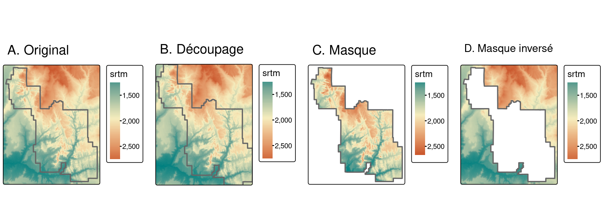
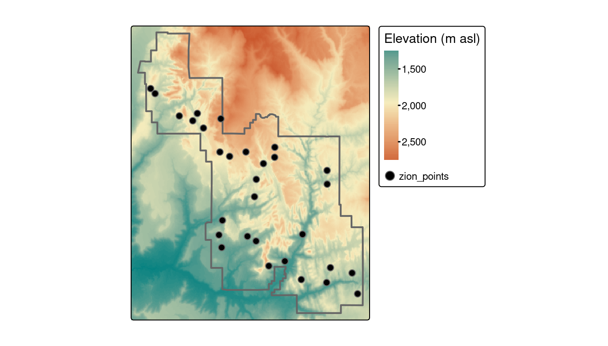
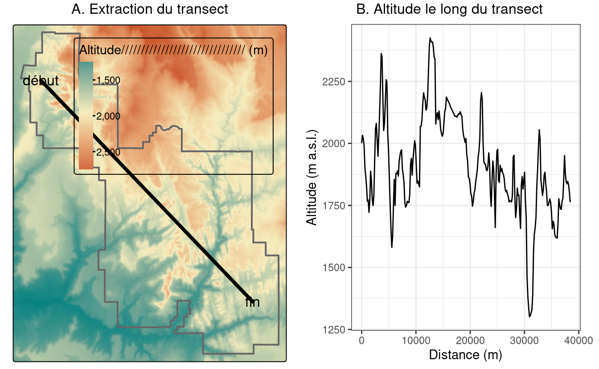
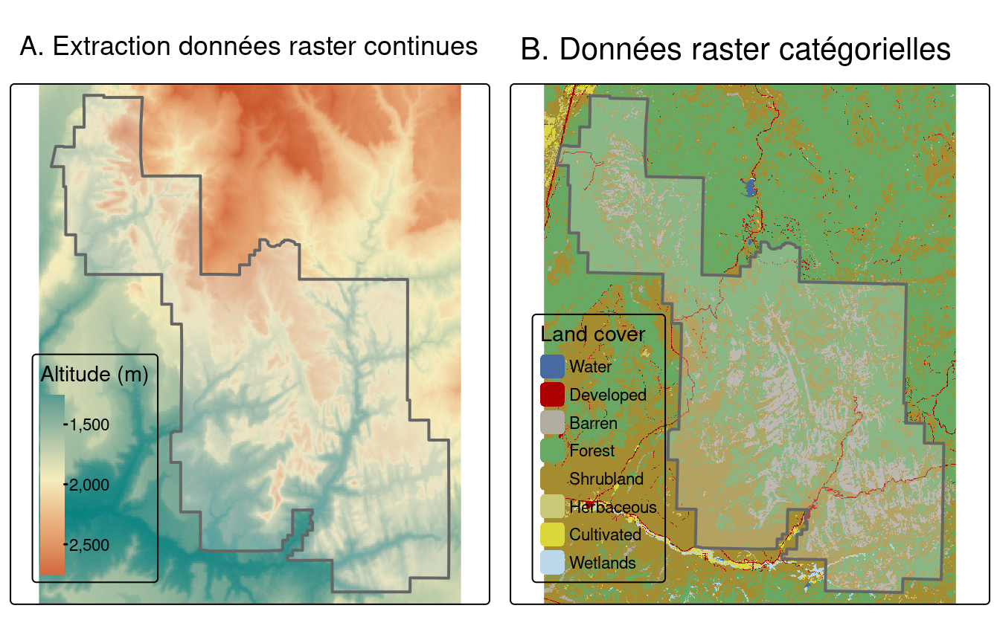
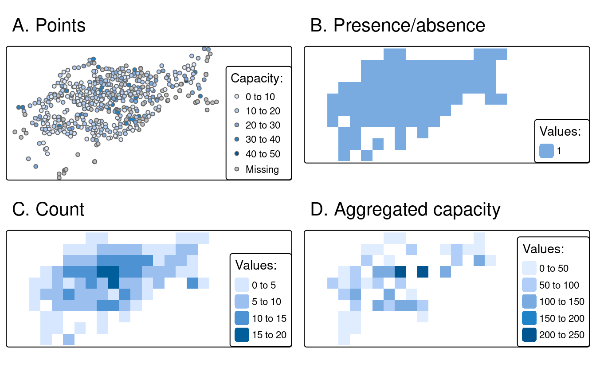
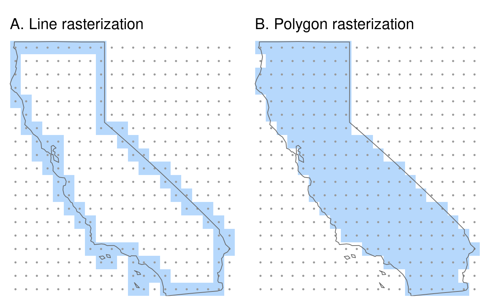
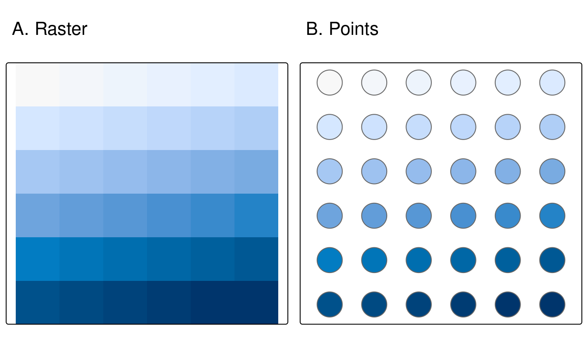
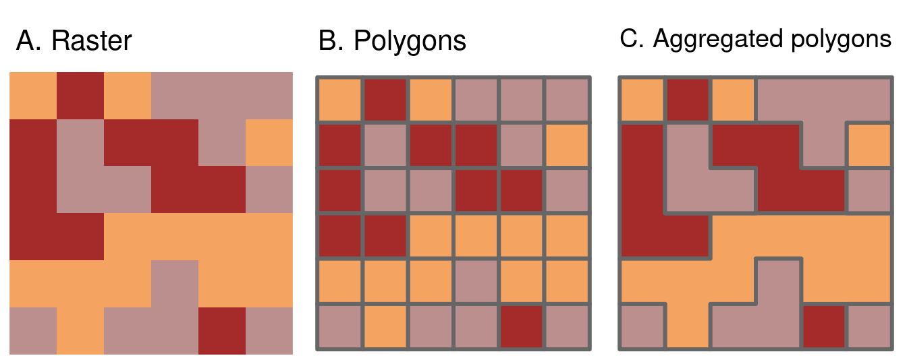

# Interactions raster-vecteur {#raster-vector}

Ce chapitre nécessite les paquets suivants :


```r
library(dplyr)
library(terra)
library(sf)
```

## Introduction

\index{interactions matricielles-vectorielles} 
Ce chapitre porte sur les interactions entre les modèles de données géographiques raster et vectorielles, introduites au chapitre \@ref(spatial-class).
Il comprend quatre techniques principales :
le découpage et les masques de données raster à l'aide d'objets vectoriels (chapitre \@ref(raster-cropping)) ;
l'extraction de valeurs raster à l'aide de différents types de données vectorielles (section \@ref(raster-extraction)) ;
et la conversion raster-vecteur (sections \@ref(rasterization) et \@ref(spatial-vectorization)).
Les concepts ci-dessus sont démontrés à l'aide des données utilisées dans les chapitres précédents afin de comprendre leurs applications potentielles dans le monde réel.

## Découpage de raster

\index{raster-vector!raster cropping} 
De nombreux projets de données géographiques impliquent l'intégration de données provenant de nombreuses sources différentes, telles que des images de télédétection (rasters) et des limites administratives (vecteurs).
Souvent, l'étendue des jeux de données raster en entrée est plus grande que la zone d'intérêt.
Dans ce cas, le **cropping** (découpage) et le **masking** (masque) sont utiles pour unifier l'étendue spatiale des données d'entrée.
Ces deux opérations réduisent l'utilisation de la mémoire des objets et les ressources informatiques associées pour les étapes d'analyse ultérieures, et peuvent constituer une étape de prétraitement nécessaire avant de créer des cartes attrayantes impliquant des données rasters.

Nous allons utiliser deux objets pour illustrer le recadrage d'un raster :

- Un objet `SpatRaster` `srtm` représentant l'altitude (mètres au-dessus du niveau de la mer) dans le sud-ouest de l'Utah.
- Un objet vectoriel (`sf`) `zion` représentant le parc national de Zion.

Les objets cibles et les objets de recadrage doivent avoir la même projection.
L'extrait de code suivant lit donc les jeux de données du paquet **spDataLarge** (installé au chapitre \@ref(spatial-class))  puis il reprojette `zion` (voir le chapitre \@ref(reproj-geo-data) pour en savoir plus sur la reprojection) :


```r
srtm = rast(system.file("raster/srtm.tif", package = "spDataLarge"))
zion = read_sf(system.file("vector/zion.gpkg", package = "spDataLarge"))
zion = st_transform(zion, crs(srtm))
```

Nous allons utiliser `crop()` du paquet **terra** pour découper le raster `srtm`.
Elle réduit l'étendue rectangulaire de l'objet, passé en premier argument, en fonction de l'étendue de l'objet passé en second argument.
Vous trouverez ci-dessous une illustration de `crop` (génèrant la figure \@ref(fig:cropmask)(B) :


```r
srtm_cropped = crop(srtm, zion)
```

\index{raster-vector!raster masking} 
La fonction **terra** `mask()` est liée à `crop()`, qui définit les valeurs situées en dehors des limites de l'objet passé en second argument à `NA`.
La commande suivante masque donc toutes les cellules situées à l'extérieur des limites du parc national de Zion (figure \@ref(fig:cropmask)(C)) :


```r
srtm_masked = mask(srtm, zion)
```

La fonction **terra** `mask()` est liée à `crop()`, elle définit les valeurs situées en dehors des limites de l'objet passé en second argument à `NA`.
La commande suivante masque donc toutes les cellules situées à l'extérieur des limites du parc national de Zion (figure \@ref(fig:cropmask)(C)) :


```r
srtm_cropped = crop(srtm, zion)
srtm_final = mask(srtm_cropped, zion)
```

En modifiant les paramètres de `mask()`, on obtient des résultats différents.
En réglant `updatevalue = 0`, par exemple, tous les pixels à l'extérieur du parc national seront mis à 0.
Si vous définissez `inverse = TRUE`, vous masquerez tout ce qui se trouve *à l'intérieur* des limites du parc (voir `?mask` pour plus de détails) (Figure \@ref(fig:cropmask)(D)).


```r
srtm_inv_masked = mask(srtm, zion, inverse = TRUE)
```

<div class="figure" style="text-align: center">

<p class="caption">(\#fig:cropmask)Illustration du découpage et de l'application de masque sur des rasters.</p>
</div>

## Extraction de raster

\index{raster-vector!raster extraction} 
L'extraction de raster est le processus d'identification et de retour des valeurs associées d'une image raster "cible" à des emplacements spécifiques, en fonction d'un objet "sélecteur" géographique (généralement vectoriel).
Les résultats dépendent du type de sélecteur utilisé (points, lignes ou polygones) et des arguments passés à la fonction `terra::extract()`, qui sera utilisée pour démontrer l'extraction raster.
L'inverse de l'extraction raster --- l'attribution de valeurs de cellules basées sur des objets vectoriels --- est la rasterisation, décrite dans la section \@ref(rasterization)'.

L'exemple le plus simple consiste à extraire la valeur d'une cellule matricielle à des **points** spécifiques.
Dans ce but, nous utiliserons `zion_points`, qui contient un échantillon de 30 emplacements dans le Parc National de Zion (Figure \@ref(fig:pointextr)). 
La commande suivante extrait les valeurs d'élévation de `srtm` et crée un cadre de données avec les ID des points (une valeur par ligne du vecteur) et les valeurs `srtm` associées pour chaque point.
Maintenant, nous pouvons ajouter l'objet résultant à notre jeu de données `zion_points` avec la fonction `cbind()` :


```r
data("zion_points", package = "spDataLarge")
elevation = terra::extract(srtm, zion_points)
zion_points = cbind(zion_points, elevation)
```


<div class="figure" style="text-align: center">

<p class="caption">(\#fig:pointextr)Localisation des points utilisés pour l'extraction de la trame.</p>
</div>

L'extraction raster fonctionne également avec des sélecteurs de type **ligne**.
Elle extrait alors une valeur pour chaque cellule matricielle touchée par une ligne.
Cependant, elle n'est pas recommandée pour obtenir des valeurs le long des transects car il est difficile d'obtenir la distance correcte entre chaque paire de valeurs extraites.

Dans ce cas, une meilleure approche consiste à diviser la ligne en plusieurs points, puis à extraire les valeurs de ces points.
Pour le démontrer, le code ci-dessous crée `zion_transect`, une ligne droite allant du nord-ouest au sud-est du parc national de Zion, illustrée sur la figure \@ref(fig:lineextr)(A) (voir la section \@ref(vector-data) pour un récapitulatif du modèle de données vectorielles) :

<!--toDo:jn-->
<!--fix pipes-->


```r
zion_transect = cbind(c(-113.2, -112.9), c(37.45, 37.2)) |>
  st_linestring() |> 
  st_sfc(crs = crs(srtm)) |> 
  st_sf(geometry = _)
```


L'utilité de l'extraction des hauteurs à partir d'un sélecteur linéaire est illustrée en imaginant que vous planifiez une randonnée.
La méthode présentée ci-dessous fournit un "profil d'élévation" de l'itinéraire (la ligne n'a pas besoin d'être droite), utile pour estimer la durée de la randonnée en cas de longues montées.

La première étape est d'ajouter un `id` unique pour chaque transect.
Ensuite, avec la fonction `st_segmentize()`, nous pouvons ajouter des points le long de nos lignes en spécifiant une densité de points  (`dfMaxLength`) et les convertir en points avec `st_cast()`.


```r
zion_transect$id = 1:nrow(zion_transect)
zion_transect = st_segmentize(zion_transect, dfMaxLength = 250)
zion_transect = st_cast(zion_transect, "POINT")
```

Maintenant, nous avons un grand nombre de points et nous voulons calculer la distance entre le premier point de nos transects et chacun des points suivants. 
Dans ce cas, nous n'avons qu'un seul transect, mais le code, en principe, devrait fonctionner sur n'importe quel nombre de transects :


```r
zion_transect = zion_transect |> 
  group_by(id) |> 
  mutate(dist = st_distance(geometry)[, 1]) 
```

Enfin, nous pouvons extraire les valeurs d'élévation pour chaque point de nos transects et combiner ces informations avec notre objet principal.


```r
zion_elev = terra::extract(srtm, zion_transect)
zion_transect = cbind(zion_transect, zion_elev)
```

Le `zion_transect` résultant peut être utilisé pour créer des profils d'élévation, comme illustré sur la figure \@ref(fig:lineextr)(B).

<div class="figure" style="text-align: center">

<p class="caption">(\#fig:lineextr)Location of a line used for raster extraction (left) and the elevation along this line (right).</p>
</div>

Le dernier type d'objet vectoriel géographique pour l'extraction de raster est le **polygone**.
Comme les lignes, les polygones ont tendance à retourner de nombreuses valeurs matricielles par polygone.
Ceci est démontré dans la commande ci-dessous, qui résulte en un jeux de données avec les noms de colonnes `ID` (le numéro de ligne du polygone) et `srtm` (valeurs d'élévation associées)

<!--toDo:jn-->
<!--fix pipes-->


```r
zion_srtm_values = terra::extract(x = srtm, y = zion)
```

Ces résultats peuvent être utilisés pour générer des statistiques synthétiques pour les valeurs matricielles par polygone, par exemple pour caractériser une seule région ou pour comparer plusieurs régions.
La génération de statistiques résumées est démontrée dans le code ci-dessous, qui crée l'objet `zion_srtm_df` contenant des statistiques résumées pour les valeurs d'élévation dans le Parc National de Zion (voir Figure \@ref(fig:polyextr)(A)) :


```r
group_by(zion_srtm_values, ID) |> 
  summarize(across(srtm, list(min = min, mean = mean, max = max)))
#> # A tibble: 1 × 4
#>      ID srtm_min srtm_mean srtm_max
#>   <dbl>    <int>     <dbl>    <int>
#> 1     1     1122     1818.     2661
```

<!--jn:toDo -->
<!--should we use the tidyverse name or dplyr here?-->
<!--btw we could also add reference to the tidyverse paper somewhere in the book-->

L'extrait de code précédent a utilisé le **tidyverse**\index{tidyverse (package)} pour fournir des statistiques sommaires pour les valeurs des cellules par ID de polygone, comme décrit dans le chapitre \@ref(attr).
Les résultats fournissent des résumés utiles, par exemple que la hauteur maximale dans le parc est d'environ 2 661 mètres au-dessus du niveau de la mer (d'autres statistiques sommaires, comme l'écart-type, peuvent également être calculées de cette manière).
Étant donné qu'il n'y a qu'un seul polygone dans l'exemple, un tableau de données avec une seule ligne est renvoyé ; cependant, la méthode fonctionne lorsque plusieurs polygones sélecteurs sont utilisés.

La même approche fonctionne pour compter les occurrences de valeurs raster catégorielles dans les polygones.
Ceci est illustré avec un jeu de données de couverture du sol (`nlcd`) du paquet **spDataLarge** dans la Figure \@ref(fig:polyextr)(B), et démontré dans le code ci-dessous :


```r
nlcd = rast(system.file("raster/nlcd.tif", package = "spDataLarge"))
zion2 = st_transform(zion, st_crs(nlcd))
zion_nlcd = terra::extract(nlcd, zion2)
zion_nlcd |>
  group_by(ID, levels) |>
  count()
#> # A tibble: 7 × 3
#> # Groups:   ID, levels [7]
#>      ID levels         n
#>   <dbl> <fct>      <int>
#> 1     1 Developed   4205
#> 2     1 Barren     98285
#> 3     1 Forest    298299
#> 4     1 Shrubland 203701
#> # … with 3 more rows
```

<div class="figure" style="text-align: center">

<p class="caption">(\#fig:polyextr)Extraction de données raster continues (à gauche) et catégorielles (à droite).</p>
</div>

Bien que le paquet **terra** offre une extraction rapide des valeurs matricielles dans les polygones, `extract()` peut toujours être un goulot d'étranglement lors du traitement des jeux de données contenant de nombreux polygones.
Le paquet **exactextractr** offre une [alternative nettement plus rapide] (https://github.com/Robinlovelace/geocompr/issues/813) pour l'extraction des valeurs de pixels par la fonction `exact_extract()`. 
La fonction `exact_extract()` calcule également, par défaut, la fraction de chaque pixel recouverte par le polygone, ce qui est plus précis (voir la note ci-dessous pour plus de détails).

\BeginKnitrBlock{rmdnote}<div class="rmdnote">Les polygones ont généralement des formes irrégulières, et par conséquent, un polygone ne peut recouvrir que certaines parties des cellules d´un raster. 
Pour obtenir des résultats plus détaillés, la fonction `extract()` possède un argument appelé `exact`. 
Avec `exact = TRUE`, nous obtenons une colonne supplémentaire `fraction` dans le cadre de données de sortie, qui contient une fraction de chaque cellule qui est couverte par le polygone.
Cela peut être utile pour calculer une moyenne pondérée pour des rasters continus ou une couverture plus précise pour des rasters catégoriels.
Par défaut, c´est `FALSE` car cette opération nécessite plus de calculs.
La fonction `exactextractr::exact_extract()` calcule toujours la fraction de couverture du polygone dans chaque cellule.</div>\EndKnitrBlock{rmdnote}


<!--toDo:JN-->
<!-- mention https://github.com/isciences/exactextractr -->

## Rasterisation {#rasterization}

\index{raster-vector!rasterization} 
La rastérisation est la conversion d'objets vectoriels en objets rasters.
En général, le raster produit est utilisé pour l'analyse quantitative (par exemple, les analyses de terrain) ou la modélisation.
Comme nous l'avons vu au chapitre \@ref(spatial-class), le modèle de données raster possède certaines caractéristiques qui le rendent propice à certaines méthodes.
En outre, le processus de rastérisation peut contribuer à simplifier les jeux de données car les valeurs résultantes ont toutes la même résolution spatiale : la rastérisation peut être considérée comme un type particulier d'agrégation de données géographiques.

Le paquet **terra** contient la fonction `rasterize()` pour effectuer ce travail.
Ses deux premiers arguments sont, `x`, un objet vectoriel à rasteriser et, `y`, un objet 'template raster' définissant l'étendue, la résolution et le CRS de la sortie.
La résolution géographique de l'objet raster en entrée a un impact majeur sur les résultats : si elle est trop faible (la taille de la cellule est trop grande), le résultat peut manquer toute la variabilité géographique des données vectorielles ; si elle est trop élevée, les temps de calcul peuvent être excessifs.
Il n'existe pas de règles simples à suivre pour décider de la résolution géographique appropriée, qui dépend fortement de l'utilisation prévue des résultats.
Souvent, la résolution cible est imposée à l'utilisateur, par exemple lorsque le résultat d'une rastérisation doit être aligné sur des rasters existants.

Pour mieux expliciter la rastérisation, nous allons utiliser un modèle de raster qui a la même étendue et le même CRS que les données vectorielles d'entrée `cycle_hire_osm_projected` (un ensemble de données sur les points de location de vélos à Londres est illustré dans la Figure \@ref(fig:vector-rasterization1)(A)) et une résolution spatiale de 1000 mètres :


```r
cycle_hire_osm = spData::cycle_hire_osm
cycle_hire_osm_projected = st_transform(cycle_hire_osm, "EPSG:27700")
raster_template = rast(ext(cycle_hire_osm_projected), resolution = 1000,
                       crs = st_crs(cycle_hire_osm_projected)$wkt)
```

La rastérisation est une opération très flexible : les résultats dépendent non seulement de la nature du modèle de raster, mais aussi du type de vecteur d'entrée (par exemple, points, polygones) et d'une variété d'arguments pris par la fonction `rasterize()`.

Pour illustrer cette flexibilité, nous allons essayer trois approches différentes de la rastérisation.
Premièrement, nous créons un raster représentant la présence ou l'absence de points d'attache de vélos (connu sous le nom de rasters de présence/absence).
Dans ce cas, `rasterize()` ne requiert qu'un seul argument en plus de `x` et `y` (les objets vecteur et raster mentionnés plus haut) : une valeur à transférer dans toutes les cellules non vides spécifiées par `field` (résultats illustrés Figure : \@ref(fig:vector-rasterization1)(B)).


```r
ch_raster1 = rasterize(cycle_hire_osm_projected, raster_template,
                       field = 1)
```

L'argument `fun` spécifie des statistiques résumées utilisées pour convertir plusieurs observations proches en cellules associées dans l'objet raster.
Par défaut, `fun = "last"` est utilisé mais d'autres options telles que `fun = "length"` peuvent être utilisées, dans ce cas pour compter le nombre de points de locations de vélos dans chaque cellule de la grille (les résultats de cette opération sont illustrés dans la figure \@ref(fig:vector-rasterization1)(C)).


```r
ch_raster2 = rasterize(cycle_hire_osm_projected, raster_template, 
                       fun = "length")
```

La nouvelle sortie, `ch_raster2`, montre le nombre de points de location de vélos dans chaque cellule de la grille.
Les points de location de vélos ont des nombres différents de vélos décrits par la variable `capacité`, ce qui soulève la question suivante : quelle est la capacité de chaque cellule de la grille ?
Pour le calculer, nous devons "additionner" le champ (`"capacité"`), ce qui donne la sortie illustrée dans la Figure \@ref(fig:vector-rasterization1)(D), calculée avec la commande suivante (d'autres fonctions de résumé telles que la `moyenne` peuvent être utilisées) :


```r
ch_raster3 = rasterize(cycle_hire_osm_projected, raster_template, 
                       field = "capacity", fun = sum)
```

<div class="figure" style="text-align: center">

<p class="caption">(\#fig:vector-rasterization1)Exemples de rastérisation de points.</p>
</div>

Un autre jeu de données basé sur les polygones et les frontières de la Californie (créé ci-dessous) illustre la rastérisation des lignes.
Après avoir transformé les objets de type polygone dans un multilinestring, un modèle de raster est créé avec une résolution de 0,5 degré :


```r
california = dplyr::filter(us_states, NAME == "California")
california_borders = st_cast(california, "MULTILINESTRING")
raster_template2 = rast(ext(california), resolution = 0.5,
                        crs = st_crs(california)$wkt)
```

Lorsque l'on considère la rasterisation de lignes ou de polygones, un argument supplémentaire utile est `touches`.
Par défaut, il est `FALSE`, mais lorsqu'il est changé en `TRUE` -- toutes les cellules qui sont touchées par une ligne ou une bordure de polygone obtiennent une valeur.
La rastérisation de lignes avec `touches = TRUE` est démontré dans le code ci-dessous (Figure \@ref(fig:vector-rasterization2)(A)).


```r
california_raster1 = rasterize(california_borders, raster_template2,
                               touches = TRUE)
```

Comparez-la à une rastérisation de polygone, avec `touches = FALSE` par défaut, qui ne sélectionne que les cellules dont les centroïdes sont à l'intérieur du polygone de sélection, comme illustré sur la figure \@ref(fig:vector-rasterization2)(B).


```r
california_raster2 = rasterize(california, raster_template2) 
```

<div class="figure" style="text-align: center">

<p class="caption">(\#fig:vector-rasterization2)Examples of line and polygon rasterizations.</p>
</div>

## Vectorisation spatiale

\index{raster-vector!vectorisation spatiale} 
La vectorisation spatiale est le pendant de la rastérisation (section \@ref(rasterization)), mais dans le sens inverse.
Elle consiste à convertir des données matricielles spatialement continues en données vectorielles spatialement discrètes telles que des points, des lignes ou des polygones.

\BeginKnitrBlock{rmdnote}<div class="rmdnote">Faites attention à la formulation !
Dans R, la vectorisation fait référence à la possibilité de remplacer les boucles `for` et autres en faisant des choses comme `1:10 / 2` (voir aussi @wickham_advanced_2019).</div>\EndKnitrBlock{rmdnote}

La forme la plus simple de vectorisation consiste à convertir les centroïdes des cellules matricielles en points.
`as.points()` fait exactement cela pour toutes les cellules de grille raster non-`NA` (Figure `@ref(fig:raster-vectorization1)).
Notez qu'ici nous avons également utilisé `st_as_sf()` pour convertir l'objet résultant en classe `sf`.


```r
elev = rast(system.file("raster/elev.tif", package = "spData"))
elev_point = as.points(elev) |> 
  st_as_sf()
```


<div class="figure" style="text-align: center">

<p class="caption">(\#fig:raster-vectorization1)Raster and point representation of the elev object.</p>
</div>

Un autre type courant de vectorisation spatiale est la création de courbes de niveau représentant des lignes de hauteur continue ou des températures (isothermes) par exemple.
Nous utiliserons un vrai modèle numérique d'élévation (MNE) car le raster artificiel `elev` produit des lignes parallèles (tâche pour le lecteur : vérifier cela et expliquer pourquoi cela se produit).
Les lignes de contour peuvent être créées avec la fonction **terra** `as.contour()`, qui est elle-même une fonction wrapper autour de `filled.contour()`, comme démontré ci-dessous (non montré) :


```r
dem = rast(system.file("raster/dem.tif", package = "spDataLarge"))
cl = as.contour(dem)
plot(dem, axes = FALSE)
plot(cl, add = TRUE)
```

Les contours peuvent également être ajoutés aux tracés existants avec des fonctions telles que `contour()`, `rasterVis::contourplot()` ou `tmap::tm_iso()`.
Comme l'illustre la figure \@ref(fig:contour-tmap), les isolignes peuvent être étiquetées.

\index{hillshade}

<div class="figure" style="text-align: center">

<p class="caption">(\#fig:contour-tmap)MNE avec ombrage des collines, montrant le flanc sud du Mont Mongon superposé avec des lignes de contour.</p>
</div>

Le dernier type de vectorisation implique la conversion de rasters en polygones.
Ceci peut être fait avec `terra::as.polygons()`, qui convertit chaque cellule matricielle en un polygone composé de cinq coordonnées, qui sont toutes stockées en mémoire (ce qui explique pourquoi les matrices sont souvent rapides comparées aux vecteurs !)

Ceci est illustré ci-dessous en convertissant l'objet `grain` en polygones et en dissolvant ensuite les frontières entre les polygones ayant les mêmes valeurs d'attributs (voir aussi l'argument `dissolve` dans `as.polygons()`).


```r
grain = rast(system.file("raster/grain.tif", package = "spData"))
grain_poly = as.polygons(grain) |> 
  st_as_sf()
```

Les polygones agrégés pour le jeux de données `grain` ont des limites rectilignes qui proviennent du fait qu'ils sont définis par la connexion de pixels rectangulaires.
Le paquet **smoothr** décrit dans le chapitre \@ref(geometry-operations) peut être utilisé pour lisser les bords des polygones.
Comme le lissage supprime les arêtes vives des limites des polygones, les polygones lissés n'auront pas la même couverture spatiale exacte que les pixels d'origine (voir le site **smoothr** [website](https://strimas.com/smoothr/) pour des exemples).
Il convient donc d'être prudent lors de l'utilisation des polygones lissés pour une analyse ultérieure.

<div class="figure" style="text-align: center">

<p class="caption">(\#fig:06-raster-vector-40)Illustration de la vectorisation d'un raster (à gauche) en polygone (au centre) et de l'agrégation de polygones (à droite).</p>
</div>

## Exercises


Some of the exercises use a vector (`zion_points`) and raster dataset (`srtm`) from the **spDataLarge** package.
They also use a polygonal 'convex hull' derived from the vector dataset (`ch`) to represent the area of interest:

```r
library(sf)
library(terra)
library(spData)
zion_points_path = system.file("vector/zion_points.gpkg", package = "spDataLarge")
zion_points = read_sf(zion_points_path)
srtm = rast(system.file("raster/srtm.tif", package = "spDataLarge"))
ch = st_combine(zion_points) %>%
  st_convex_hull() %>% 
  st_as_sf()
```

E1. Crop the `srtm` raster using (1) the `zion_points` dataset and (2) the `ch` dataset.
Are there any differences in the output maps?
Next, mask `srtm` using these two datasets.
Can you see any difference now?
How can you explain that?


E2. Firstly, extract values from `srtm` at the points represented in `zion_points`.
Next, extract average values of `srtm` using a 90 buffer around each point from `zion_points` and compare these two sets of values. 
When would extracting values by buffers be more suitable than by points alone?


E3. Subset points higher than 3100 meters in New Zealand (the `nz_height` object) and create a template raster with a resolution of 3 km for the extent of the new point dataset. 
Using these two new objects:

- Count numbers of the highest points in each grid cell.
- Find the maximum elevation in each grid cell.


E4. Aggregate the raster counting high points in New Zealand (created in the previous exercise), reduce its geographic resolution by half (so cells are 6 by 6 km) and plot the result.

- Resample the lower resolution raster back to the original resolution of 3 km. How have the results changed?
- Name two advantages and disadvantages of reducing raster resolution.


E5. Polygonize the `grain` dataset and filter all squares representing clay.


- Name two advantages and disadvantages of vector data over raster data.
- When would it be useful to convert rasters to vectors in your work?
